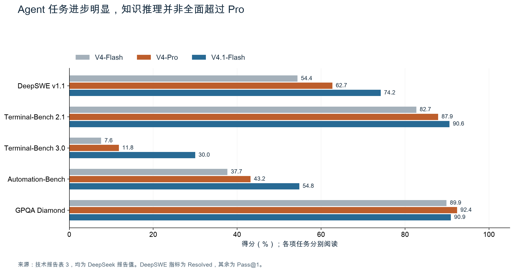
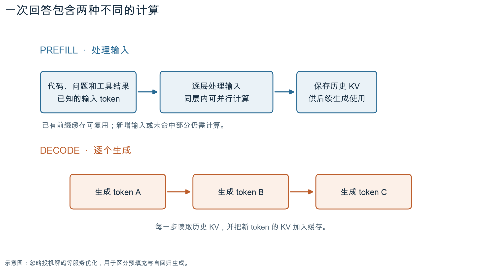
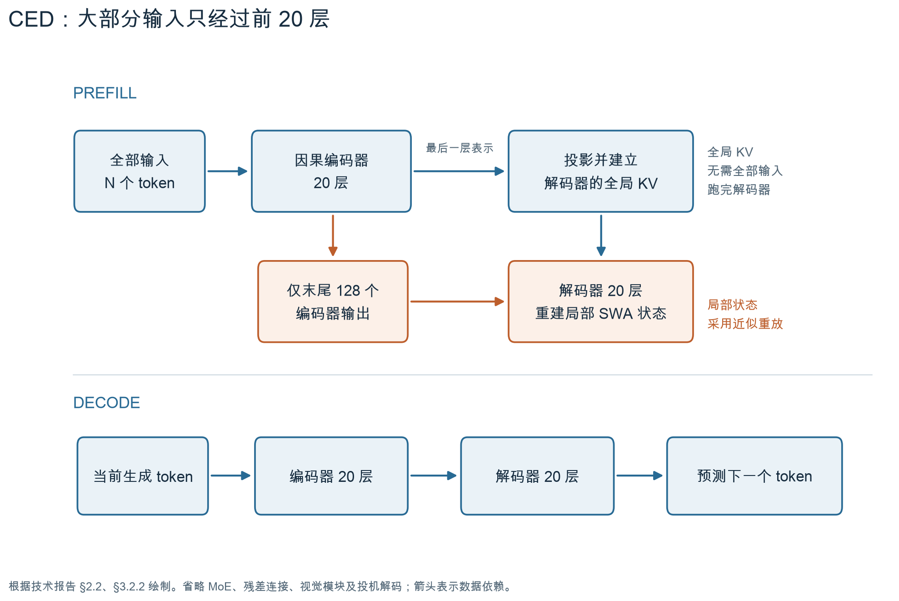
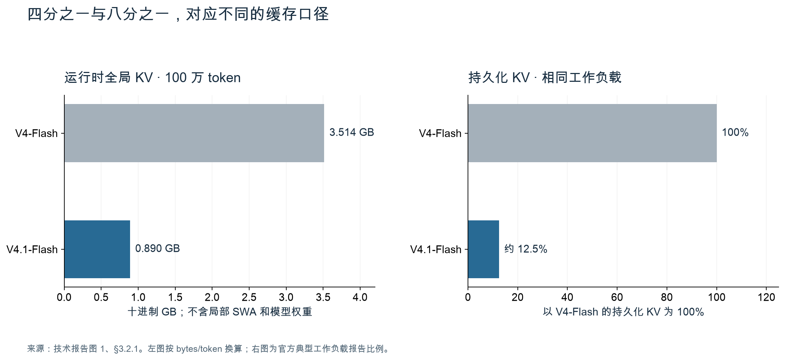
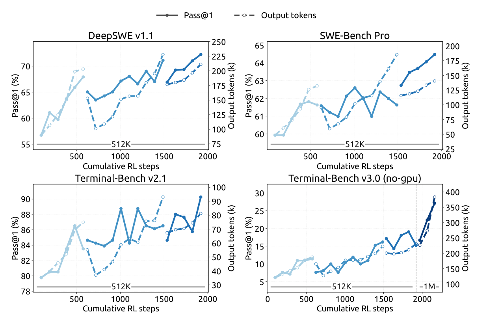
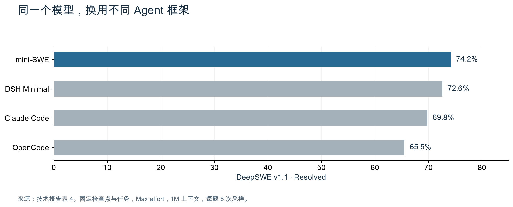
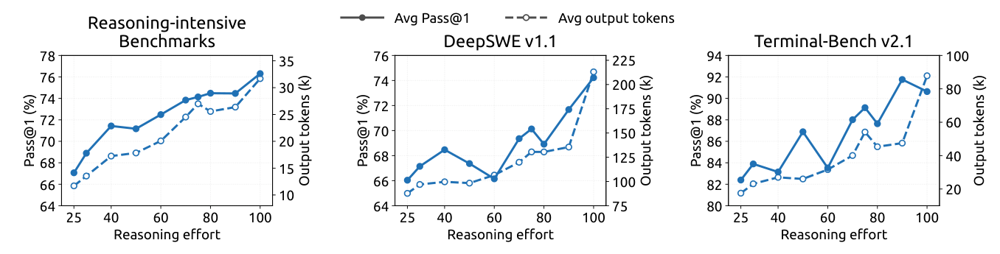

9 月 10 日，DeepSeek 发布并开源了 DeepSeek-V4.1-Flash。单看名字，很容易把它当成 V4 系列的一次常规更新。读完技术报告，我觉得这个版本号有些低估了改动的幅度。[发布博客][blog]、[官方更新日志][changelog]

DeepSeek 把语言主干分成了 20 层因果编码器和 20 层解码器，让大部分输入 token 只需经过前半段网络。同时，它还重新安排了各层保存和读取上下文的方式，大幅缩小了缓存。

[Sebastian Raschka](https://x.com/rasbt/status/2098142625819672603) 对这次更新的评价很直接：

> Big overhaul on DeepSeek V4.1 using an encoder-decoder setup. Tbh they should have called it DeepSeek V5! Super cool and refreshing, though!

他觉得，这样的架构改动，干脆叫 V5 也不为过。我更想弄清楚的是，编码器和解码器在这里各自做了什么，以及这种分工为什么适合反复读取代码、日志和工具结果的 Agent。[引文来源][tweet]

下面先看模型取得了哪些进步，再从预填充与解码讲起，拆开这套设计。最后回到训练和评测，看看哪些收益能归因于架构，哪些还需要更多证据。

## 先看进步发生在哪里

V4.1 Flash 是一个多模态混合专家模型，可以接收图像和文本，生成文本，支持最长一百万 token 的上下文。技术报告列出 552B 主干参数，另有 196B Engram 条件记忆参数。B 表示十亿，两个数字分别约为 5520 亿和 1960 亿。[技术报告 §2.1][report]

这里的 Flash 容易让人误会。它的完整参数量相当大，只是每个 token 不会动用所有参数。混合专家模型会选择部分专家参与计算，V4.1 Flash 进一步区分了两个阶段：预填充时，每个 token 激活约 8B 参数；解码时，约 16B。

先看成绩。下面选了技术报告同一张表里的五项评测，与上一代 V4-Flash、V4-Pro 对照。

*图 1：数据来自技术报告表 3，均为 DeepSeek 报告值，使用 Max 推理档位。DeepSWE 的指标为问题解决率，其余为 Pass@1。不同评测分别阅读，不能把这些分数当作同一把尺子。*

DeepSWE v1.1 从 54.4% 提高到 74.2%，Automation-Bench 从 37.7% 提高到 54.8%。这两项都需要模型在工具环境中执行任务，进步相当明显。GPQA Diamond 则从 89.9% 提高到 90.9%，仍低于 V4-Pro 的 92.4%。

与其他模型比较也要分任务看。同一张表里，V4.1 Flash 的 DeepSWE 为 74.2%，Opus-5 为 74.0%。但到了 Terminal-Bench 3.0，两个模型分别是 30.0% 和 43.3%。前一项的接近，不能推出所有复杂任务上的接近，0.2 个百分点也不足以单独证明稳定领先。

我更愿意把这组结果理解为：DeepSeek 显著改善了一个面向日常 Agent 工作的模型，同时保留了较低的激活参数量。至于最困难的任务，领先模型之间的差距仍然存在。

基座模型的对照也有类似差异。在相同评测设置下，V4.1-Flash-Base 的 HumanEval 为 79.4%，高于 V4-Pro-Base 的 76.8%；SimpleQA-Verified 却是 42.3% 对 55.2%。这是后训练之前的能力差异。不过，两个模型的数据、结构和参数量都不同，仅凭这张表，还不能认定事实问答的差距完全由参数量造成。[技术报告表 1][report]

## 读输入与写输出，成本并不一样

理解架构之前，先看一次模型调用。

假设我们让一个编程 Agent 修复程序。它先读问题和相关代码，执行测试，再把测试结果送回模型。下一轮可能只生成几行修改建议，输入却包含一大段源码和日志。任务继续，上下文还会增长。

模型通常分两个阶段处理这类请求。

预填充（prefill）处理已经给出的输入。输入 token 都已知，同一层内可以并行计算多个位置，但仍需按照网络的层次逐层执行。在这个过程中，模型还会建立后续生成需要的 KV 缓存。

解码（decode）逐个生成后续 token。每一步都依赖前面已经生成的内容，直到回答完成。

*图 2：预填充与解码的概念示意。图中省略了投机解码等优化；已有前缀缓存命中时，可以复用相应状态。*

KV 中的 K 和 V，分别是注意力机制使用的键和值。当前 token 产生查询 Q，与历史 K 比较，再按相关程度汇总 V。把历史 K、V 保存下来，后续生成就可以直接使用，省去反复计算。

因此，长上下文至少带来两笔开销：处理新输入的计算，以及保存和读取历史 KV 的成本。前缀缓存可以减轻第一笔开销，但新日志、新文件和未命中的内容仍然需要预填充。缓存本身也占空间，需要在设备之间搬运。

稀疏注意力降低了长序列的计算开销，也让缓存容量和搬运带宽的限制更突出。V4.1 Flash 因而同时调整计算路径与存储布局。具体哪个环节最慢，仍要看请求长度、缓存命中情况和硬件配置。

传统 decoder-only Transformer 通常让输入经过全部 Transformer 层，每层建立自己后续要用的状态。V4.1 Flash 修改的正是这条依赖：如果后半段网络需要的全局 KV，能够由前半段直接提供，大部分输入就不必把后半段再跑一遍。

## CED 怎样省下后半段计算

DeepSeek 把这套结构称为 Causal Encoder-Decoder，简称 CED。整个语言主干有 40 层，前 20 层作为因果编码器，后 20 层作为解码器。[技术报告 §2.2][report]

### 因果约束仍然保留

熟悉早期 Transformer 的读者，可能会想到机器翻译模型：编码器读完源句，解码器根据源句的表示生成译文。经典设计中的编码器可以同时利用源句前后的信息。

CED 的编码器有因果约束，一个位置只能使用当前位置及之前的信息。后面的解码器同样遵守因果约束，整个模型仍然按顺序预测下一个 token。这样，编码器处理过的历史状态可以随着序列增长继续复用，无须因为多了一个新 token 而重新编码整段历史。

所以，理解 CED 时，更有用的着眼点是全局 KV 从哪里来。

### 解码器直接使用编码器生成的全局 KV

在常规设计里，每一层根据自身输入的隐藏状态，计算这一层的 K 和 V。要建立第 35 层的缓存，通常得先把相关输入送到第 35 层。

CED 改了后半段的规则。解码器的全局 KV 直接从编码器最后一层的隐藏状态投影得到。完整模型又结合跨层复用，让多个解码器层共同使用这组全局 KV。

这意味着，模型把输入送过前 20 层，已经拿到了建立后半段全局缓存所需的信息。对于大部分历史输入，没有必要再运行后 20 层的完整计算。

*图 3：依据技术报告 §2.2、§3.2.2 绘制。上半部分表示预填充，下半部分表示逐 token 解码。图中只保留解释计算路径所需的组件，末尾 128 个位置的作用见下文。*

生成阶段仍然经过完整网络。新生成的 token 进入前 20 层，更新相关状态，再经过后 20 层，得到预测下一个 token 所需的输出。8B 与 16B 的区别，主要来自这两条计算路径。

这也解释了 CED 为什么适合输入很长的任务。读完一大段材料、只生成少量新内容时，省下的输入计算占比较大。如果任务主要在生成很长的推理过程，解码开销仍然在那里。

### 这条思路有一个明确的前身

技术报告明确提到，CED 受到 2024 年 [YOCO 论文][yoco]的启发。YOCO 将网络分为 self-decoder 和 cross-decoder：下半部分生成全局 KV，上半部分通过交叉注意力复用它，预填充因而可以提前结束。两部分都使用因果掩码。

V4.1 Flash 在这个基础上保留了逐层生成的局部注意力状态，并结合稀疏注意力与跨层共享，调整了 KV 的生成深度和存储方式。因而，这次更新可以理解为把已有的架构思路继续做深，并落实到一个大规模多模态模型中。

但逐层保留局部状态，也让事情复杂了一点。

## 局部注意力让“跳过一半”需要一个补充步骤

V4.1 Flash 的注意力包含全局与局部两条路径。全局分支从较远的历史中选择信息，局部分支使用滑动窗口注意力，即 SWA，直接查看附近的 token。它的窗口大小是 128。

与共享的全局 KV 不同，SWA 的 K、V 仍然来自各层自身的隐藏状态。前 20 层的输出，无法直接提供后 20 层所有局部缓存。假如预填充到编码器就结束，解码器刚开始生成时便缺少这部分状态。

一个直接的办法，是把输入末尾足够长的一段重新送过解码器，重建局部缓存。这里的“足够长”却可能比 128 长得多。因为局部窗口在层间叠加：第 20 层看到的某个位置，已经包含了第 19 层从更早位置取得的信息。精确恢复这条依赖，需要往前追溯多个窗口。

DeepSeek 采用了一个近似方案，叫 SWA Bounded Replay，也就是有界重放：只把最后 128 个位置送过解码器，并把重放时的局部注意力限制在这段范围内。[技术报告 §3.2.2][report]

代价是，重建状态与完整计算得到的状态不再数学等价。DeepSeek 报告称，在其评测中，这种近似对回答质量的影响很小，并在后训练时模拟了同样的重放过程，让模型适应这条推理路径。

用一个简化的计算来理解收益。假设没有可复用的前缀缓存，输入长度为 N，总层数为 40，先忽略不同层的具体算子差异：

- 全部输入走完网络，工作量约为 `40 × N`。
- CED 的主要预填充工作量约为 `20 × N + 20 × 128`。

如果 N 是 100,000，两个数分别为 4,000,000 和 2,002,560。按“token 经过一层”计数，后者约为前者的 50.06%。这只是用来解释计算路径的算例，不能当作 FLOPs 实测，更不能据此承诺首 token 延迟减半。

输入越长，重放末尾 128 个位置的开销占比越小。真实速度还取决于算子实现、通信、缓存命中和服务负载。

这也是我读这篇报告时最想继续验证的地方。作者在局限性章节中提到，缓存恢复边界上的近似状态，以及未覆盖的极端输入，仍可能带来能力退化。用真实长任务测试这些边界，比只确认平均分有没有下降更有说服力。

## 全局缓存为什么能缩到 890 字节

CED 解释了输入为什么可以少算一段。接下来是另一个问题：留下的历史状态，能不能少存一些？

V4.1 Flash 使用 Compressed Sparse Attention 2，简称 CSA2。它延续了压缩与稀疏选择的思路，并进一步让不同层复用全局缓存。[技术报告 §2.3][report]

压缩指把多个 token 的表示合成一条缓存记录，稀疏选择则让当前查询只读取选中的部分记录。具体配置中，编码器的 CSA2 每两个 token 生成一条压缩记录，解码器的压缩率为一，保留逐位置的全局记录。两边随后都可以跨层复用缓存。[技术报告 §4.2.1][report]

### 共享 KV，不等于共享整层计算

一个直观的想法是：相邻层都要读取历史，是否有必要各自保留一份全局 KV？CSA2 把各层预先分配成三种模式。

| 模式 | 全局 KV 与索引 K | 选取哪些历史位置 |
| --- | --- | --- |
| Full | 本层生成 | 本层重新计算 |
| Reindex | 复用前面层的缓存 | 用本层索引查询重新选择 |
| Reuse | 复用前面层的缓存 | 连同最近一次选择结果一起复用 |

三种模式下，每一层仍然计算自己的注意力查询 Q 和局部 SWA，并产生新的注意力输出。共享 KV 减少的是重复存储；复用索引结果，还能少做一些选择历史位置的计算。

例如，两层使用同一组全局 K、V，但查询 Q 不同，对这些 V 的加权就仍然可以不同。模型并没有因为共享缓存而反复执行同一个注意力结果。

实际配置能让这件事更直观。40 层的分配如下：[技术报告 §4.2.1][report]

| 位置 | 层数与模式 | 独立的全局缓存组数 | 每条记录对应的 token 数 |
| --- | --- | --- | --- |
| 编码器前两层 | 2 层纯 SWA | 0 | 不适用 |
| 编码器其余部分 | 3 组，每组 1 层 Full＋5 层 Reuse | 3 | 2 |
| 解码器首组 | 1 层 Full＋3 层 Reuse | 1 | 1 |
| 解码器后四组 | 每组 1 层 Reindex＋3 层 Reuse | 0，沿用首组缓存 | 1 |

整个主干共 4 层 Full、4 层 Reindex、30 层 Reuse，以及 2 层纯 SWA。全局缓存只需保留四组，而非为每个使用全局注意力的层各存一组；所有层自己的局部 SWA 状态仍然存在。

解码器还使用分层稀疏索引。第一个索引器扫描因果可见的历史，建立最多 16,384 个位置的候选池；后面的索引器在候选池内选择自己的 Top-512。这样，后续索引器需要评分的位置数有了上限。

这个上限只适用于后续索引器。第一个索引器仍然扫描可见历史，因此不能把它解释为整套注意力与上下文长度完全无关。

这些候选限制在后训练中就已加入，推理时沿用同样的搜索范围。模型因此有机会适应这种受限检索。报告图 2 估算，上下文从 4K 增至 1M，单 token 解码计算量只增加约 25%。这一口径按 BF16、FP8、FP4 分别赋予 1、0.5、0.25 的权重，反映整套架构的综合效果，不能直接换成延迟增幅。

### 再把每条记录存得更紧凑

除了跨层复用，DeepSeek 还把主 KV 缓存量化到 FP4，每个数值主体只占 4 bit，另加缩放因子。索引缓存也使用 FP4；局部 SWA 对量化更敏感，仍保留 FP8。[技术报告 §2.4.4][report]

主 KV 在参与注意力计算前会先反量化。这里使用 FP4，主要为了少存数据，并不要求注意力矩阵乘法直接用这种 FP4 格式执行。这让存储格式的选择少受硬件矩阵乘法支持范围的限制。

结合层配置，还能把 890 字节复算出来。一条 512 维主 KV 记录，4 bit 数值占 256 字节，每 16 维附一个 1 字节缩放因子，共 288 字节。配套的 128 维索引 K，每 32 维附一个 1 字节缩放因子，共 68 字节。两者合计 356 字节。[技术报告 §2.4.4、§4.2.1][report]、[参考推理代码][inference]

编码器的三组缓存，各将两个 token 合成一条记录；解码器的一组缓存，每个 token 对应一条记录。按原始 token 折算：

`356 ×（3 ÷ 2＋1）＝890 字节 / token`

这个数同时取决于记录大小、序列压缩率和独立缓存的组数。跨层复用与低精度存储共同贡献了节省。

与上一代 V4-Flash 的每 token 3,514 字节相比，全局缓存约降至四分之一。按十进制单位换算，一百万 token 对应约 0.890 GB 的全局缓存。

*图 4：左图根据技术报告图 1 的 bytes/token 换算，右图来自 §3.2.1 的部署报告。左图不包含模型权重、局部 SWA、临时张量或服务开销；右图描述相同工作负载下的持久化缓存比例。两个比例的统计对象不同。*

0.890 GB 这个数字很小，但它只是全局缓存。552B 主干参数和 196B Engram 参数仍然需要存储和访问，不能把它当成运行整个模型只需不到 1 GB 显存。

### 八分之一来自不同的存储策略

为了复用过去请求的前缀，服务系统还会把部分 KV 长期保存在 SSD 或主机内存里。这是持久化缓存，与 GPU 正在处理请求时的缓存用途不同。

DeepSeek 报告称，在上一代的典型工作负载中，SWA 状态约占持久化 KV 容量的一半。但两类缓存的有效寿命不同：全局前缀可能在很久以后再次命中，局部 SWA 状态主要服务于活跃会话内的短期续写。两者共用长时间保留策略，会让大量不再使用的局部状态继续占空间。

V4.1 Flash 因而把全局 KV 留在持久化缓存中，将编码器的 SWA 状态放进保留时间只有几分钟的主机内存池。局部状态过期、而全局前缀仍然命中时，再用有界重放补回来。这里采用的是 Encoder SWA Bounded Replay，与前面为解码器准备局部状态的用途不同。[技术报告 §3.2.1、§3.2.2][report]

编码器重放的输入，是已命中前缀的最后 128 个 token 加上未缓存的新后缀。重放的前缀只重建局部 SWA，已有全局 KV 保持不变；新后缀则同时生成自己的全局和局部状态。

这也带来一个具体的复现边界：重建的前缀状态是近似的，新后缀又依赖这些状态，因此同一份输入在不同缓存命中位置上，得到的后缀 KV 可能不再数学等价。它不意味着最终答案一定改变，但检验结果是否可复现时，除了提示词和采样设置，还应控制缓存恢复的位置。

长期留下的全局 KV 本身又缩到了约四分之一。按报告中的缓存构成估算，一半乘以四分之一，整体约为旧持久化缓存的八分之一。

这里体现了一笔具体的取舍：重算很短的一段输入，换取少存大量长期用不到的局部状态。它会增加一点计算，却能减轻存储和数据搬运的负担。

## Engram 与 DSpark 各自解决另一类开销

CED 和 CSA2 已经足以解释这次更新的主线。报告中另外两个组件，也有助于理解 DeepSeek 怎样分配计算。

Engram 是条件记忆模块。它根据 token 的短序列，也就是 N-gram，通过哈希查表取得学习到的表示，再结合当前上下文融入网络。V4.1 Flash 为它分配了 196B 参数，分布在两个模块中。[技术报告 §2.4.2][report]

这类查找与 Transformer 层中的密集计算有不同的访存特征。报告介绍了从主机内存预取 Engram 表项的实现，使数据传输与其他计算重叠。这里保存的是模型训练得到的参数，不是用户对话的长期记忆，也不等同于去外部文档库执行 RAG。

DSpark 则用于投机解码。它用一个较小的草稿模块，提前提出多个候选 token，再交给主模型验证。它的目标，是让主模型的一次验证尽可能推进多个输出位置。

具体到 V4.1 Flash，DSpark 的草稿模块包含三个 Transformer block，一次前向计算五个草稿位置的基础 logits，再由轻量模块建模这些位置之间的依赖。调度器结合接受概率和当前服务吞吐情况，选择每次验证多少个位置。[技术报告 §2.4.3][report]

所以，读到“Flash 更快”时，要记得速度来自多个组件共同作用。CED 减少预填充计算，CSA2 缩减缓存和索引开销，DSpark 加速输出生成。仅凭最终速度，无法判断其中一个组件贡献了多少。

## 更好的 Agent 成绩，还要回到训练

读完新架构，很容易把成绩上涨也顺手归因于架构。技术报告的后训练章节却提供了另一个解释。

DeepSeek 明确写道，这次后训练没有引入新的算法。整体仍然沿用监督微调、强化学习和 on-policy distillation，也就是基于当前策略生成样本的蒸馏。工作重点放在训练数据与环境的构建上。[技术报告 §5.1][report]

这段话的适用范围是后训练。它并不否定前面那些架构创新，而是在说明，后训练阶段的主要进步从哪里来。

### 一道 Agent 训练题，需要可运行的环境

对于普通问答，训练样本可能是一段问题和答案。对于 Agent，“给一道题”还不够，它必须有工具可用，操作之后也要能判断成功与否。

报告把任务写成一个三元组：问题、环境、验证系统。以修复代码为例，环境需要能够安装依赖和运行项目，验证系统需要确认该修好的测试确实通过，同时已有功能仍然正常。

DeepSeek 从实际交互中的复杂任务、失败案例，以及公开代码仓库出发构建训练环境。专门的 Agent 负责准备环境与测试，另一些 Agent 尝试解决问题，再由独立检查环节寻找题目错误、验证漏洞和难度不合适的任务。

这里费功夫的是让任务可以可靠地评判。测试写错了，模型可能因为正确修改而受罚；验证过于宽松，模型又可能学会绕过检查。更多训练只有配合可信的反馈，才可能稳定转化为能力。

*图 5：截取自技术报告图 7。实线为任务成绩，虚线为输出 token 数，横轴为累计 RL 步数。曲线断开处涉及检查点合并后重新开始训练，部分阶段也调整了上下文长度，不能将整张图视为只有训练步数变化的严格消融实验。*

这些曲线能支持一个相对有限的判断：在作者使用的训练流程中，扩大 RL 与环境训练规模，伴随着更好的 Agent 成绩。它们并不能回答，把 CED 单独加到旧模型上，成绩会提高多少。

同时，V4.1 Flash 的预训练使用了 45T token 的多模态语料，即 45 万亿 token。数据、模型结构和后训练都发生了变化。要量化其中一个因素的贡献，需要控制其他条件做对照。

### 同一个模型，换框架也会换分数

模型在训练中接触了多种工具环境，部署时能否适应不同的 Agent 框架？V4.1 Flash 报告里有一个比较直接的实验。

Harness，也常称为 scaffold，可以理解为包在模型外面的 Agent 运行框架。它负责系统提示、工具定义、执行工具以及管理上下文。用户看到的是模型与这套程序一起工作的结果。

DeepSeek 固定模型检查点、任务集和解码配置，换用不同框架，得到下面的 DeepSWE v1.1 成绩。

*图 6：数据来自技术报告表 4，均为官方评测。使用 Max effort、1M 上下文，每题采样 8 次；温度为 1.0，top-p 为 0.95。图中只选取四种配置。Claude Code 对应报告中的 v2.1.251。*

mini-SWE 的 74.2% 与 OpenCode 的 65.5%，相差 8.7 个百分点。同一个模型，仅改变外面的程序与交互方式，成绩就会出现这样的差距。

因此，“模型在 DeepSWE 上得到 74.2%”还少了条件。更完整的说法，是它在指定框架、推理档位、上下文长度和采样设置下得到这个结果。这也意味着，把模型接进自己已有的编程工具后，体验需要重新验证。

## 输出要算多久，也可以单独调节

前面主要讨论输入与缓存的成本。但模型修复一个复杂问题，可能生成很长的推理与工具交互记录。即使输入已经很便宜，输出仍然是一笔开销。

按本次核对的官方非高峰单价，一百万个缓存命中的输入 token 收费 0.003 美元，一万个输出 token 收费 0.006 美元。输出数量只有输入的百分之一，费用却是输入的两倍。这个算例假设输入全部命中缓存，仅比较模型 token 费用。[官方定价页][pricing]

V4.1 Flash 为此训练了一个取值为 1 到 100 的 reasoning effort 控制量。训练时，模型接收目标 effort，同一问题在同一 effort 下的回答互相比较；随着 effort 提高，奖励中的长度惩罚减弱，模型可以花更多 token 探索和验证。模型通过训练学会了适应不同计算预算，这个控制量的作用超出了限制输出长度。[技术报告 §5.1.4][report]

*图 7：截取自技术报告图 9。实线使用左轴，表示成绩；虚线使用右轴，表示输出 token 数。DeepSWE 使用 mini-SWE，Terminal-Bench 使用 DeepSeek Harness Minimal，三个面板的坐标范围不同。*

报告给出的整体趋势是：effort 从 25 提高到 100，八项推理评测的平均 Pass@1 从 67.1% 提高到 76.3%，DeepSWE 从 66.0% 提高到 74.2%，代价是输出 token 数约增至原来的 2.5 倍。作者指出，主要收益集中在较低至中等档位，最后继续提高 effort，往往要付出更多 token，换取较小的成绩提升。[技术报告 §5.3.2][report]

不过，图中的成绩曲线并不处处向上。附录 B.2 的跨框架实验也明确写道：输出长度随 effort 增加，成功率却会在中间档位出现平台或回落。选择 effort 时，需要看具体任务与框架的结果，不能把“多生成一些”当成“每次都更正确”。

论文将公开 API 的 low、high、max 三档分别映射到 50、75、100。对日常任务，我会先比较中等档位与最高档完成同一批任务的成功率和总费用，再决定哪些任务值得用最高档。输入端省下来的成本，仍可能被过长的输出消耗掉。

## 我怎么看这次架构变化

Raschka 那句“应该叫 V5”，表达的是他对架构改动幅度的判断。我赞同其中的技术兴趣：它重新审视了大模型推理里一条长期沿用的路径，输入是否都需要经过完整网络，以及每层是否都需要保存自己的全局 KV。

V4.1 Flash 给出的答案相当具体。编码器提供足够深的历史表示，解码器复用这些表示建立全局缓存。少量局部状态通过有界重放补齐，再用跨层共享和低精度格式压缩长期保存的数据。

我尤其看重这种围绕实际工作负载做设计的方式。Agent 的输入经常远多于输出，一些上下文要反复使用，另一些状态只对眼前这轮交互有价值。区分这些需求之后，模型架构与缓存系统都有了继续优化的空间。

官方模型仓库以 MIT 许可证开放权重与代码，并提供提示编码、最小推理实现和 DeepSWE 评测复现资料。研究者因此有机会检查这些机制，继续测长上下文检索、缓存恢复边界以及不同框架中的表现。[模型仓库][model]

这里还要区分参考代码与生产实现。我查看的公开 `inference/model.py` 中，主干的 `forward` 仍然逐层运行整个网络。复现论文所描述的预填充跳层与有界重放收益，还需要相应的部署实现；直接运行最小参考脚本，不足以验证这些优化带来的速度提升。[参考推理代码][inference]

接下来，我最想看到的是同等条件下的长任务对照：固定 Agent 框架与任务，记录成功率、输入输出 token、实际缓存命中和端到端耗时，再看完成一件任务究竟花多少钱。全局 KV 压到 890 字节已经给出了一项清楚的工程结果；它能为具体工作省下多少，还要用任务本身来回答。

---

资料核对日期：2026 年 9 月 24 日。本文根据官方技术报告、发布资料、参考代码及 YOCO 原论文核对机制；评测成绩和质量损失描述均为作者报告，未独立复现。图 1、图 4、图 6 根据报告数据重绘，图 2、图 3 为机制示意，图 5、图 7 截取自原论文。缓存与价格算例按公开配置及单价计算，不代表部署或账单实测。

主要资料：

- [DeepSeek-V4.1-Flash 官方发布博客][blog]。
- [DeepSeek-V4.1-Flash 技术报告][report]。本文主要引用 §2、§3.2、§4.2.1、§5.1、§5.3，以及表 1、表 3、表 4 和附录 B.2。
- [DeepSeek-V4.1-Flash 官方模型仓库][model]。
- [DeepSeek API 官方定价页][pricing]。价格可能调整，算例使用资料核对时的非高峰单价。
- [YOCO：You Only Cache Once，2024][yoco]。用于解释 CED 的技术来源。
- [Sebastian Raschka 关于 V4.1 Flash 的帖子][tweet]。

[blog]: https://www.deepseek.com/en/news/deepseek-v4-1-flash/
[changelog]: https://api-docs.deepseek.com/updates/#date-2026-09-10
[report]: https://huggingface.co/deepseek-ai/DeepSeek-V4.1-Flash/blob/main/DeepSeek_V41_Tech_Report.pdf
[model]: https://huggingface.co/deepseek-ai/DeepSeek-V4.1-Flash
[inference]: https://huggingface.co/deepseek-ai/DeepSeek-V4.1-Flash/blob/main/inference/model.py
[pricing]: https://api-docs.deepseek.com/quick_start/pricing/
[yoco]: https://arxiv.org/html/2405.05254v1
[tweet]: https://x.com/rasbt/status/2098142625819672603
