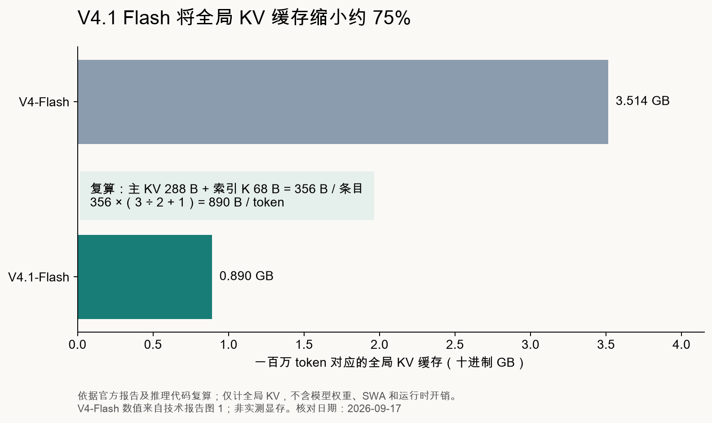
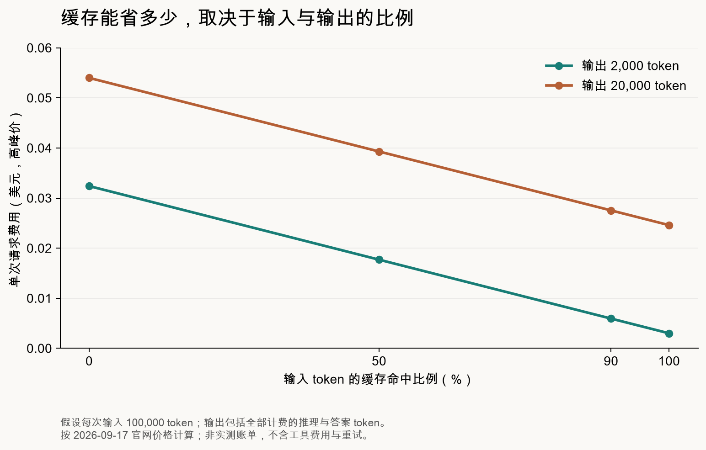

资料核对日期：2026 年 9 月 17 日。

2026 年 9 月 9 日，DeepSeek 官网公布了 V4.1 Flash。发布公告直接把它与上一代旗舰 V4-Pro 作比较，称多方测试显示，Flash 在性能、成本、速度和总耗时上综合超过了 Pro。公告还列出了逐步停用 Pro 的计划。[7]

技术报告的标题则直接点出了 KV 缓存压缩：《Pushing the Limits of KV Cache Compression》。今年 4 月，V4 系列已经把百万 token 上下文作为标准配置；V4.1 Flash 接着要解决的，是长上下文用起来有多贵。[1][8]

顺着这个问题，本文会拆开输入计算和缓存存储，看看成本省在哪里，再按官方价格算一笔请求费用。至于"综合超过 Pro"，还要回到具体任务的成绩上判断。

本文核对了官方技术报告、模型卡、API 文档和推理代码。缓存布局根据公开配置复算，费用按官方价格计算；模型成绩均来自 DeepSeek 的评测，没有新增模型实测。

先看 Agent 怎么用模型。它读完代码、执行测试，接着要把测试日志送回模型。代码和历史对话留在上下文里，输入会越积越长。已经缓存的前缀可以复用，新增内容和未命中的部分仍要处理。一件任务来回执行多轮，就可能反复付出处理长输入的成本。

V4.1 Flash 把处理输入和生成输出的计算量分开了：每个输入 token 激活约 8B 参数，每个输出 token 激活约 16B。对输入远多于输出的 Agent 任务，这个区别很有用。[1][2]

通常，模型收到输入后，先经过预填充（prefill），建立后续生成所需的状态，再进入逐个生成 token 的解码（decode）阶段。传统 decoder-only Transformer 要逐层计算输入的表示。V4.1 Flash 则让大部分输入 token 省去后半段模型的完整计算。

这里用到的是因果编码器—解码器架构，简称 CED。前 20 层是因果编码器，后 20 层是解码器，共 40 层。解码器需要的全局 KV，可以直接由编码器最后一层的隐藏状态投影得到。也就不必让每个输入 token 继续走完解码器，才能建立这部分缓存。[1，§2.2]

不过，解码器还不能完全跳过。它有一条滑动窗口注意力（SWA）分支，局部 KV 依赖各层自身的隐藏状态。DeepSeek 为此引入有界重放（Bounded Replay）：只把输入末尾的 128 个 token 送过解码器，重建开始生成时所需的局部状态。

设输入长度为 N、总层数为 L，报告给出的计算量变化是：

`O(N × L)` → `O(N × L / 2 + 128 × L / 2)`

N 远大于 128 时，重放末尾这段输入的成本相对较小，prefill 的主要计算量就接近减半。8B 输入、16B 输出，背后是这条计算路径的变化。[1，§2.2、§3.2.2]

有界重放会带来近似误差：重建的 SWA 状态，与完整执行所有相关 token 得到的状态，在数学上并不等价。DeepSeek 报告的实验中，质量损失很小；换到其他任务，这个近似是否仍然可靠，还要再测。

报告中的"接近减半"还有一个前提：输入足够长。输入较短，重放开销所占的比例就会上升。至于用户要等多久，还受缓存命中、设备通信和服务排队影响，不能直接从计算量推导出首 token 延迟也减半。

8B 和 16B 说的是激活量，规划部署时得看完整模型。V4.1 Flash 是一个混合专家模型（MoE），技术报告列出 552B 主干参数，另有 196B Engram 条件记忆参数。每个 MoE 层有一个共享专家和 384 个路由专家，每个 token 选择其中六个路由专家。单个 token 只用到一部分参数，完整权重和 Engram 的存储、访问成本仍然要算。[1，§2.1、§4.2.1]

再看报告标题里的 KV 缓存。它保存历史 token 在注意力计算中需要的键和值，供后续生成反复使用，省去重算。上下文越长，同时运行的请求越多，缓存占用的空间也越大。V4.1 Flash 把这部分全局缓存从每 token 3,514 字节降到了 890 字节，约为 V4-Flash 的四分之一。[1，图 1]

一部分节省来自跨层复用。V4.1 Flash 使用的压缩稀疏注意力 CSA2，把各层静态分配为 Full、Reindex 和 Reuse 三种模式。Full 层建立主 KV 和索引 K，再选择本层要关注的位置。Reindex 层沿用已有缓存，重新选择位置；Reuse 层把位置选择结果也一并复用。每层依然计算自己的查询和局部 SWA，产生新的注意力输出。[1，§2.3.1]

这样既少存了缓存副本，也少做了重复索引。解码器还缩小了后续索引的搜索范围：第一个索引器扫描可见上下文，建立最多含 16,384 个位置的候选池，后续索引器在池内重新选择。最终注意力读取的 Top-K 为 512。后续索引的工作量因此受候选池大小约束，但第一次扫描仍然要遍历可见范围。[1，§2.3.2、§4.2.1]

另一部分节省来自量化：主 KV 和索引 K 都用 4 bit 数值，再加上各自的缩放因子。把报告的层配置与推理代码放在一起，就能算出 890 字节到底由什么组成。[1][4]

| 一条全局缓存记录 | 数值本体 | 缩放因子 | 合计 |
| --- | --- | --- | --- |
| 512 维主 KV | 512 × 4 bit ÷ 8＝256 字节 | 每 16 维一个 1 字节因子，共 32 字节 | 288 字节 |
| 128 维索引 K | 128 × 4 bit ÷ 8＝64 字节 | 每 32 维一个 1 字节因子，共 4 字节 | 68 字节 |
| 合计 |  |  | 356 字节 |

编码器保存三组独立的全局缓存，每组将两个 token 压缩成一条记录；解码器只保存一组全局缓存，压缩比为一。按原始 token 折算：

`356 ×（3 ÷ 2 + 1）＝890 字节 / token`

正好是报告中的 890 字节。按十进制单位计算，一百万 token 对应约 0.890 GB 的全局缓存，V4-Flash 则为 3.514 GB，减少约 74.7%。

图 1：依据官方报告及代码复算，仅统计全局主 KV 与索引 K。不含模型权重、局部 SWA、临时张量和服务系统开销，不能当作模型的完整显存需求。

这次复算对上的是存储布局。公开的最小推理代码采用 fake quantization，模拟量化后的数值，缓存张量并非全部按这种紧凑格式实际存储。代码中也没有实现报告描述的 prefill 跳层和有界重放。直接运行这个参考脚本、观察显存占用，验证不了生产实现的 890 字节。[4]

发布材料里还有一个"八分之一"，说的是持久化 KV 缓存。报告称，相同工作负载下，旧模型的持久化缓存约一半来自 SWA。采用有界重放后，这些状态可以在需要时重建，不必长期写入 SSD；留下的全局 KV 又缩小到约四分之一，整体占用就降到 V4-Flash 的八分之一左右。这里既压缩了缓存，也减少了需要长期保存的内容，比例取决于旧缓存的构成和工作负载。[1，§3.2.1、§3.2.2；2]

存储量算清了，接着算用户的账单。2026 年 9 月 17 日核对到的官方美元高峰价如下：[3]

| 每百万 token | 价格 |
| --- | --- |
| 输入，缓存未命中 | 0.30 美元 |
| 输入，缓存命中 | 0.006 美元 |
| 输出 | 1.20 美元 |

非高峰价格为以上价格的一半。高峰时段是周一至周五 UTC 01:00—04:00、06:00—10:00；北京时间对应 09:00—12:00、14:00—18:00。

未命中的输入单价是命中的 50 倍。差距确实很大，但还有输出要付费，整次请求能省多少，要看输入和输出各占多少。

假设一次请求有 100,000 个输入 token，输出 2,000 个计费 token，包含推理与最终答案。完全未命中缓存时，高峰费用为：

`0.1 × 0.30 + 0.002 × 1.20＝0.0324 美元`

若 90% 的输入命中缓存，费用变成：

`0.01 × 0.30 + 0.09 × 0.006 + 0.002 × 1.20＝0.00594 美元`

相对于同一请求完全未命中缓存的情况，费用下降约 81.7%。把输出增加到 20,000 token、其余条件不变，费用则从 0.054 美元降到 0.02754 美元，下降约 49.0%。

图 2：按官方价格计算的假设场景。线条连接各个计算点，不代表实测命中率或账单；不含工具费用与重试。

只改了输出长度，节省比例就从八成降到了五成左右。对反复读取同一批文档、每次只给出简短答案的任务，低价缓存很合算。Agent 如果每轮都生成大量推理内容，输出费用就会占去更大的比例。**输入单价低，未必意味着整个任务同样便宜。**

至于实际能不能命中 90%，要看请求记录。官方缓存文档要求请求匹配已经持久化的前缀单元，并不保证一定命中。响应里的 `prompt_cache_hit_tokens` 和 `prompt_cache_miss_tokens` 能给出实际数量，算账时用这两个字段。[5]

算完成本，回到开头那句"综合超过 Pro"。官方给出了很强的判断，具体得看落在哪些任务上。下面几项成绩选自同一张官方对比表：[1，表 3；2]

| 评测及指标 | V4-Flash | V4-Pro | V4.1 Flash | Opus-5 |
| --- | --- | --- | --- | --- |
| GPQA Diamond，Pass@1 | 89.9 | 92.4 | 90.9 | 93.4 |
| DeepSWE v1.1，Resolved | 54.4 | 62.7 | 74.2 | 74.0 |
| Terminal-Bench 2.1，Pass@1 | 82.7 | 87.9 | 90.6 | 89.1 |
| Terminal-Bench 3.0，Pass@1 | 7.6 | 11.8 | 30.0 | 43.3 |
| Terminal-Bench 4.0，Pass@1 | 7.0 | 12.4 | 31.2 | 51.8 |

成绩单位为百分比，各模型使用报告标注的最高推理档位，来自开发方评测，没有经过本文的同预算复测。不同版本的 Terminal-Bench 是不同测试，90.6 和 30.0 应分别在各自那一行比较。

这张表里，Agent 项目的进步相当明确：V4.1 Flash 在列出的项目上都超过了 V4-Flash 和 V4-Pro。第一行却是另一种情况，GPQA Diamond 仍低于 V4-Pro。**表中的 Agent 成绩给了升级的理由，却不足以说明 Flash 能全面替代 Pro。**

与 Opus-5 相比，差别更明显。V4.1 Flash 的 DeepSWE v1.1 成绩只高 0.2 个百分点，Terminal-Bench 3.0 和 4.0 却落后不少。没有逐题结果和误差估计，那 0.2 个百分点很难说明领先是否稳定。

能力提升也不能全算在缓存压缩头上。V4.1 Flash 原生接收图像和文本，以自回归方式生成文本，最长支持 1M token 上下文。图像通过 DeepSeek-ViT 和投影层转成视觉嵌入，从语言模型预训练阶段就与文本一起参与训练。报告称，模型使用了 45T token 的多模态语料，稀疏注意力先按 64K 序列长度训练，累计训练到 34T token 时再扩展到 1M。[1，§2.1.1、§4.2.2]

后训练沿用 SFT、RL 和 on-policy distillation 的流程，重点扩展任务数据合成、环境构建和 rollout 规模。架构和训练同时变化，单靠版本间总分差异，分不出 CED 或其他某个模块贡献了多少。[1，§5]

报告中另一组对照更直接地关系到日常使用：同一个 V4.1 Flash，换个 Agent 框架，成绩能差多少？DeepSWE 从 OpenCode 的 65.5 到 mini-SWE 的 74.2，相差 8.7 个百分点。Terminal-Bench 2.1 在所列框架中的最大分差也有 6.5 个百分点。

图 3：依据官方报告表 4 重绘。最高推理档位，1M 上下文，最多 500 次模型生成；DeepSWE 每题采样八次，Terminal-Bench 每题采样三次，Terminal-Bench 禁用网络。本文没有新增模型运行或显著性检验。

这 8.7 个百分点，出现在同一个模型身上。工具结果怎样送回，出错后怎样继续，上下文什么时候压缩，都由 Agent 框架参与决定。只记下模型名和分数，会漏掉这些条件。拿官方成绩作参考时，最好先看一眼自己用的框架是不是同一个。

还要核对推理档位。模型内部支持 1～100 的 effort，官方 API 提供 `low`、`high`、`max`，报告分别映射为 50、75、100。API 默认 `high`，主评测用的是最高档。用默认配置接入后，结果未必能达到表中的成绩。[1，§5.1；6]

两份官方材料里的采样参数也没完全对上。模型卡把 instruct 评测概括为 `top_p=0.95`，技术报告的推理任务段落写的是 `top_p=1.0`，Agent 部分则都写为 0.95。当前 API 的 thinking mode 会忽略 `temperature`，小于 0.95 的 `top_p` 也会被提升到 0.95。复现前得确认服务实际采用什么配置，不能只看请求里填了什么。[1，§5.3.1；2；6]

至于发布时提出的 Pro 退场计划，文档已经有了变化。公告原定 9 月 14 日把 V4 Pro 请求转给 V4.1 Flash，核对当天的定价页却写明"应用户需求"，继续提供 V4 Pro 服务，计费保持不变。计划已经调整，页面没有说明更具体的决策过程。[3][7]

如果线上服务依赖这些名称，要以实际路由为准。`deepseek-flash` 对应 V4.1 Flash，旧的 `deepseek-v4-flash` 别名也已经转向它。名字还在，背后的模型可能已经换了；拿旧别名直接比较升级前后，会先遇到比较对象不固定的问题。[3]

读完这些材料，我会把 V4.1 Flash 优先放进反复读取长上下文的 Agent 工作流里试。它减少输入计算和缓存占用的路径很清楚，账单能省多少则取决于实际命中率和输出长度。接下来值得做的是同一批真实任务的对照：分别用 `high` 和 `max`，记录完成率、总计费 token、总耗时和缓存命中量。能以更低的总成本完成同样的任务，才是这次更新对使用者的价值。

## 参考资料

- [1] DeepSeek，[DeepSeek-V4.1-Flash Technical Report](https://huggingface.co/deepseek-ai/DeepSeek-V4.1-Flash/blob/main/DeepSeek_V41_Tech_Report.pdf)。架构、训练、评测及配置以所引章节为准。
- [2] DeepSeek，[官方模型卡](https://huggingface.co/deepseek-ai/DeepSeek-V4.1-Flash)。
- [3] DeepSeek API，[Models & Pricing](https://api-docs.deepseek.com/quick_start/pricing)。价格与服务状态已于 2026 年 9 月 17 日核对。
- [4] DeepSeek，[inference/config.json](https://huggingface.co/deepseek-ai/DeepSeek-V4.1-Flash/blob/main/inference/config.json)、[inference/model.py](https://huggingface.co/deepseek-ai/DeepSeek-V4.1-Flash/blob/main/inference/model.py)、[inference/kernel.py](https://huggingface.co/deepseek-ai/DeepSeek-V4.1-Flash/blob/main/inference/kernel.py)。维度取发布配置，量化布局通过 Indexer、Attention 及量化内核核查。model.py 的默认维度用于小型测试，不作为发布模型配置。
- [5] DeepSeek API，[Context Caching](https://api-docs.deepseek.com/guides/kv_cache)。
- [6] DeepSeek API，[Thinking Mode](https://api-docs.deepseek.com/guides/thinking_mode)。
- [7] DeepSeek，[V4.1 Flash 发布公告](https://www.deepseek.com/en/news/deepseek-v4-1-flash/)。服务计划与当前定价页有差异，见正文说明。
- [8] DeepSeek，[V4 Preview 发布公告](https://www.deepseek.com/en/news/v4-preview/)。用于核对 V4 系列的发布时间与百万 token 上下文配置。
