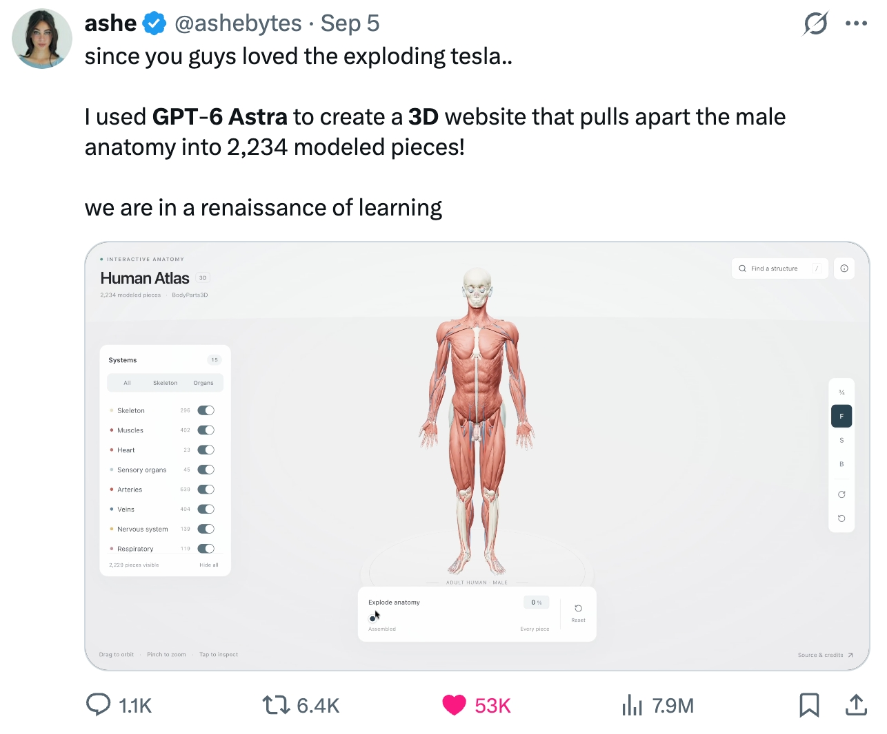
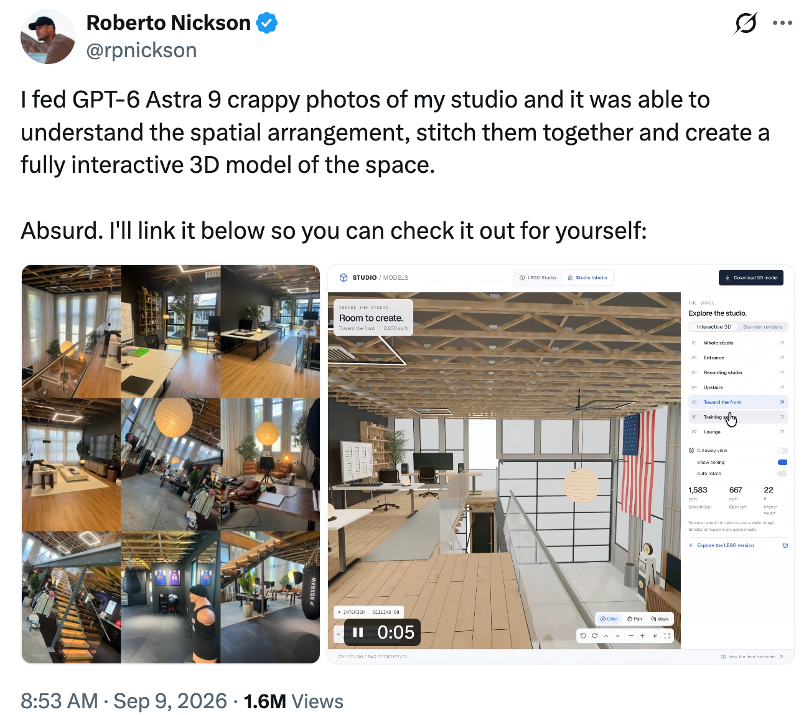
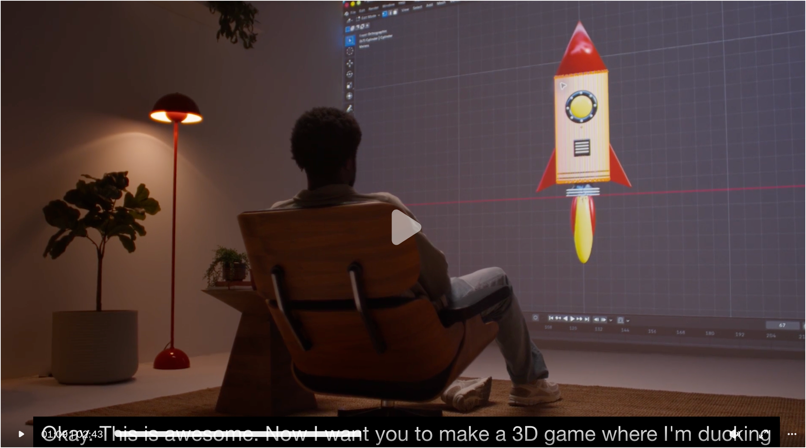
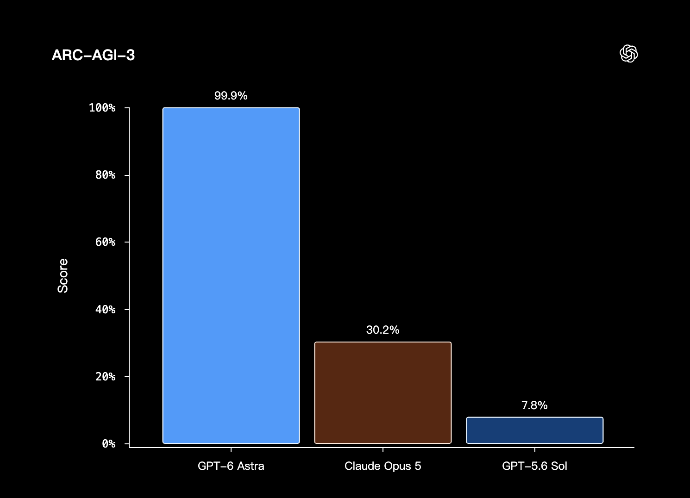

过去几周 AI 圈发生了不少事，眼下大家最关注的想必就是 OpenAI 刚推出的 GPT-6 Astra。围绕这款模型，讨论主要集中在以下几个方面：
 - GPT-6 Astra 的实际性能表现
 - 所谓的循环 Transformer（Looped Transformer）架构
 - 以及坊间传闻的 Astra 是否在“隐藏”自己的推理轨迹（即思维链 Chain of Thought, CoT）

所以，在本篇文章中，我们将逐步探讨下这几方面的内容。

## GPT-6 Astra 使用体验及社区反馈

在深入探讨架构传闻和学术文献之前，我想先简单总结一下 GPT-6 Astra 的实际表现和一些细节观察。

自上周 OpenAI 发布 GPT-6 Astra 以来，深度使用了几天，表现确实很出色，大概是我到目前为止用过的最强的模型，从社区的反馈来看也是如此。

那这次的GPT-6 Astra，究竟在哪些方面实现了进一步加强，又是如何做到的呢？我们来一探究竟。

### 社区热议：3D 渲染和动画类任务

先说说社区对 GPT-6 Astra 反映最强烈的一点：3D 渲染、建模以及交互式动画任务的能力。

如果只看传统的文字问答、代码生成，模型之间的差距有时候并不容易直观感受到。但一旦把任务从“生成一段代码”升级到“理解一个复杂的视觉需求，最终生成一个可以直接交互的 3D 应用”，模型之间的差距就会被明显放大。

而 GPT-6 Astra 最近在这一类任务中，频繁出现了一些非常惊艳的案例。

最火的一个案例，是有人让 GPT-6 Astra 制作了一个[人体解剖 3D 交互网站](https://x.com/ashebytes/status/2096221988763173186)，将人体结构拆解成了 2234 个独立的模型块。用户可以在网页中对不同的人体结构进行查看、选择和交互，从而实现类似 3D 人体图谱的效果，作者还将代码开源到了 [Github](https://github.com/ashemag/human-atlas)。

看起来，GPT-6 Astra 可以开始能够处理一个更加完整的空间+代码+视觉+交互问题。它不仅需要理解人体结构，还需要理解不同 3D 对象之间的层级关系、空间关系和交互逻辑，然后把这些理解转换成实际可运行的程序。

另一个更加直观的案例，是[有人给 GPT-6 Astra 输入了 9 张质量很差的工作室照片，它竟然可以理解空间布局，把这些照片拼接起来，并生成了一个完全可以交互的 3D 空间模型](https://x.com/rpnickson/status/2097488440489116111)。

这里有一个非常值得注意的区别，过去我们更习惯让 AI “看懂一张图片”，而现在，它开始尝试从多张二维图片中建立一个可以被操作的三维空间。

也就是说，任务已经从单纯的**图像理解（Image Understanding）**，逐渐向**空间理解（Spatial Understanding）和空间重建（Spatial Reconstruction）**延伸。

你可以打开这个网址，体验作者使用 GPT-6 Astra制作的工作室 3D 交互模型：https://studio.rpn24.chatgpt.site/interior。

类似的案例还有很多。

例如，还有人[用 GPT-6 Astra 创建了一个高度精细的 V8 发动机交互式可视化图像](https://x.com/DilumSanjaya/status/2096280244663775423)。

作者提到，从他自己进行的小规模测试来看，GPT-6 Astra 在这类任务中的表现确实超过了 Claude Opus 5 和 Fable。（不过需要注意，这属于个人测试结果，测试规模和方法并不等同于严格的第三方 Benchmark，因此更适合作为社区体验案例来看待，而不是正式的模型排名。）

作者同时提到了一个比较现实的问题：GPT-6 Astra 在完成这类任务时，Token 消耗非常快。

这其实也很好理解。

当一个任务从“回答一个问题”变成“生成一个完整的 3D 应用“之后，模型需要处理的内容会急剧增加：大量代码、材质、动画、交互逻辑，以及不断的修改和调试，都意味着更长的上下文和更多的输出。

目前社区出现的大量案例，给人留下了深刻的印象，给人最直观的感受是，好像模型正在从内容生成，进一步走向构建可以运行的世界。

而这，恰恰也是 OpenAI 在展示 GPT-6 Astra 时重点强调的一类能力。

### Astra 的评测基准表现

从 OpenAI 发布的 [GPT-6 Astra 博客](https://openai.com/index/gpt-6-astra/)可以看到，相比上一代 GPT-5.6，GPT-6 Astra 在写作、数学、代码这些纬度几乎全面提升。

下图节选了三项主流代码评测基准（Terminal-Bench 4.0、DeepSWE v1.1 和 Artificial Analysis Coding Agent Index v1.4）和一项高难度数学评测基准（FrontierMath Tier 4-v2）的结果，Astra 的数学和编程能力相当出色。

其中，[Artificial Analysis Coding Agent Index v1.4](https://artificialanalysis.ai/agents/coding-agents#coding-agents-index) 这个指标综合了多项智能体编程任务，GPT-6 Astra 确实稳居前沿，但没有跟其他竞品拉开断崖式的差距。下方覆盖评测任务类型更多的综合榜单—— [Artificial Analysis Intelligence Index](https://artificialanalysis.ai/evaluations/artificial-analysis-intelligence-index)，也是同样的情况。

还有一个没画进图里的亮点：Astra 在 [ARC-AGI-3 基准测试](https://arcprize.org/arc-agi/3)中拿到了 99.9%（作为对比，GPT-5.6 Sol 只有 7.8%）。ARC-AGI-3 主要考察逻辑解题与泛化能力。不过相比之下，数学、编程和计算机操作（Computer Use）这类测试更有参考价值，因为它们更贴近真实使用场景。

值得说明的一点是，GPT-6 Astra 在 ARC-AGI-3 得分如此之高，是因为 GPT-6 Astra 在进行评测时，采用了他们自己的 Responses API 测试框架（harness）。相比原始的基准测试框架，OpenAI 认为这种测试框架更能反映真实世界中的表现，因为原始框架会丢弃模型之前的推理过程和历史消息。

Artificial Analysis 这套基准的最大好处是第三方独立，所以往往比模型厂商自己公布的成绩更可信。当然，[不同基准使用的评测框架并不一样](https://artificialanalysis.ai/methodology/intelligence-benchmarking)：比如 GDPval-AA 和 AA-Briefcase 在对比不同大模型时，统一用官方开源的极简框架 [Stirrup](https://github.com/ArtificialAnalysis/Stirrup)；前面提到的 Intelligence Index v4.2 里，Terminal-Bench v2.1 用的是 Terminus 2，τ³-Banking 用的是 τ-Bench 框架；单独的 Coding Agent Index 还会横向对比各类编程 Agent Harness。

进行评测时，只有统一评测框架，才能让不同模型之间的比较更有可比性。但训练模型时，厂商通常是围绕一套主力框架调优的，在其他框架上针对性微调较少，而主力框架往往又是针对自家模型特点设计的。所以某些智能体评测，可能会低估 Astra 在它原生主力框架下的真实水平，而要验证这一点，还得在相同任务下对 Astra 做跨框架的对比测试。

顺带说一句，最近有种流行的说法，Claude Code 负责人也表达过类似观点：不妨考虑删掉一部分现有的 `AGENTS.md` 和 `SKILL.md` 规则文件。新一代大语言模型在理解提示词、直接解决具体问题上已经更高效，太多繁琐的“保姆式指导”反而会不必要地束缚模型，把生成的方案质量拖下来。

当然这不是说要彻底不用 `SKILL.md`——在一些高频复用的工作流里，它们仍然能省掉模型反复摸索的成本，提升效率。我想说的是，很多工作流其实已经不需要事无巨细地硬编码说明了；过去那套提示词写法可能不再适用，模型完全有能力给出更好的解法。所以，或许是时候把这些指令文件更新或者重新生成一遍了。

### 计算机操作能力（Computer Use）

GPT-6 Astra 在图像和渲染任务上很强。当这类任务需要和图形界面（GUI）交互时，这种优势就体现为计算机操作（Computer Use）能力：让模型通过 Codex／ChatGPT 应用，直接操控本地电脑上的各类软件。

Computer User 正是 GPT-6 Astra 真正跟其他模型拉开身位的地方。正如之前提到的，与图形相关的演示在社交媒体上数不胜数。

GPT-6 Astra 并不是第一个在 Harness 配合下，能完成通用计算机操作的模型。比如今年早些时候起，我就用 GPT 系列模型处理过一些界面操作（例如 Excel 里的报销流程）。但总的来说，靠外部框架实现的计算机操作还是一项比较新的能力，成熟度往往差点火候。这也合乎常理：LLM 本质上是文本模型，自然会先在写作、写代码、调用 API 和命令行工具这些“唾手可得”的地方开花结果。

同时，大量现有的工具和软件（目前）并没有命令行接口。与其等着有人去专门开发接口，不如直接提升模型操作图形界面的能力——更何况前面也说了，GUI 操作做出来的 demo 本就又好看又震撼。这有点像现在人形机器人的发展逻辑：在流水线上，人形机器人面对专用机器未必效率最高，但它胜在通用。

所以我觉得，接下来几个月乃至几年，无论是大模型本身还是 Agent Harness 层，都会迎来一段对计算机操作能力的深度打磨。也就是说，除了继续加强数学和编程，模型训练会越来越看重计算机操作场景。这也会让大模型在技术圈之外的日常办公里更接地气（比如：“嘿 ChatGPT，帮我把个税申报填了吧” :)）。

那么，模型的 Computer Use 能力是怎么训练出来的呢？

或许可以从之前的一则[报道](https://finance.yahoo.com/technology/ai/articles/apple-suddenly-ai-infrastructure-stock-130223938.html)中窥探一二：OpenAI 采购了数万台 Mac mini 和 Mac Studio 用于强化学习。这里的 Mac 并不是用来承担模型本身的底层训练计算（那显然用 GPU 高效得多），而是作为真实的 macOS 交互环境接入训练循环，让模型学习怎么操作这套操作系统以及上面跑的各种软件。

那在 Mac 上训练计算机操作能力具体怎么跑？简单说，这些 Mac（准确讲是 macOS 系统）在训练过程中充当了模型交互的外部环境。

基本流程是这样的：

1. **下达任务提示**：给模型一个具体目标，例如“打开某个应用并完成某项操作”。
2. **截取屏幕画面**：把 macOS 界面的屏幕截图给模型（通常由框架 Harness 完成）。
3. **预测操作指令**：LLM 输出对应的鼠标和键盘操作（点击、按键、滚动等）。
4. **执行系统动作**：在 Mac 上执行这些动作（同样由框架调度）。
5. **获取环境反馈**：动作执行后，再截一张最新界面截图重新喂给模型。
6. **循环交互**：重复步骤 2 到 5，直到任务完成或者失败。
7. **强化学习反馈**：根据最终的成功/失败信号，以及验证器（或打分器）的结果给出训练反馈，在后训练（post-training）阶段做强化学习优化；这跟常见的基于可验证奖励的强化学习（RLVR）逻辑基本一致。

需要说明的是，Mac 在这里主要扮演“环境”，而不是跑模型或更新权重的算力设备。模型本身大概率跑在 NVIDIA GPU 集群上，通过 API 跟 Mac 环境交互。[NVIDIA CEO 黄仁勋提到过](https://x.com/JensenHuang/status/2096700264569090384?s=20)，GPT-6 Astra 是在约 10 万块 Grace Blackwell GPU 上训练出来的。

### Astra 依然是一款推理（Reasoning model）模型

上面提到的对 Computer Use 的强化训练，并没有从根本上改变整体训练范式。GPT-6 Astra（以及可预见的未来大部分模型）骨子里仍然是推理模型（reasoning model）。也就是说，模型依然用基于可验证奖励的强化学习（RLVR）来训练，并且会在给出最终答案前生成中间推理轨迹，也就是思维链。

关于 GPT-6 Astra 作为推理模型的具体机制，尤其是隐藏思维链的争议，我会放到后文详细讲。

## 循环式 Transformer（Looped Transformer）

Astra 正式发布前两天，The Information 刊登了一篇[报道](https://www.theinformation.com/articles/secret-technique-behind-openais-astra-model-sparks-security-concerns)，援引内部消息称 Astra 采用了一种名为"循环深度"（recurrent depth）或"循环式 Transformer"（looped transformer）的技术方案。

那么，报道里提到的 Looped Transformer/Recurrent depth 是什么呢？它和普通的 Transformer 又有什么不同呢？

### 2.1 复用 Transformer 模块

循环式 Transformer 本质上是对模型架构的一种调整，核心思想是：让 token 的中间特征表示多次通过同一组 Transformer 模块，而不是只通过一次。和直接堆叠更多模块相比，关键的"诀窍"是这些模块共用同一套权重。

先约定几个术语：

- **Ttransformer block**：包含注意力机制、前馈网络、归一化层以及残差连接的基本计算单元。在论文中通常也被称为“Transformer 层（transformer layer）”。
- **Stack**：由若干 Transformer 模块串联组成的序列。
- **Block application**：指将输入数据送入某个 Transformer 模块完成一次前向计算。

循环式 Transformer 不是全新的概念，它的基本雏形早在 2018 年的 [Universal Transformers](https://arxiv.org/abs/1807.03819) 论文里就出现了。不过在展开讲 Universal Transformer 之前，我们先看一个更简洁的现代案例：今年 7 月由 BOSS 直聘开源的 [Nanbeige4.2-3B（南北阁）](https://arxiv.org/abs/2607.22083)。

如下图所示，Nanbeige 的整体架构看起来跟标准 Transformer 大体一样，不同的是，它多了一条橙色的返回箭头，把输出重新导回 Transformer Stack 的起点。

基本就是常规 Transformer，只多了一条橙色箭头，把中间表示绕回模块栈的起点。

我们从下往上把计算过程理一遍：跟所有 Transformer 模型一样，输入文本先被分词并转成嵌入向量（embeddings），这些向量依次通过 22 个 Transformer blocks，每个 Block 都有各自独立的参数。

循环机制的关键在于：第一轮算完后，得到的隐藏状态（hidden states）会被重新送回这套相同的 22 个模块。也就是说，Transformer block 1 会再执行一次，接着是block 2，一直到 block 22。

把这个过程展开来看，一共执行了 44 次模块计算（block applications）。但跟拥有 44 个独立模块的传统 Transformer 相比，后 22 次计算复用了前 22 次的权重。比如第 23 次 block 计算用的是 block 1 的权重，第 24 次用的是 block 2 的权重，以此类推。

这种设计的核心目的，就是在不增加模型参数量的前提下，把等效计算深度从 22 提升到 44 次模块计算。

顺便说一句，为什么选 2 轮，而不是 3 轮、4 轮或更多？Nanbeige 论文里没披露太多细节，但作者指出 2 轮是综合效益最高的折中方案。从 2 轮增到 3 轮确实能再提升一点性能，但换来的额外计算成本并不划算。

### 2.2 循环机制的计算与显存开销

我们为什么会用这种循环方案？

说到底，它是“直接堆更多 Transformer block 来做大模型”之外的另一条路。

比如，一个把 22 个模块跑两遍的模型，它 Transformer block 部分的参数量大约只有 44 个常规独立模块模型的一半。

这样能明显减少存放模型权重所需的显存。

顺便说明一下，Transformer 占比较大的词嵌入层（embedding）和输出层（output layer），在这个对比里是单独核算的。（以 Nanbeige 4.2 3B 为例，嵌入层和输出层占了 30 亿总参数的约 25%；如果这两者之间也做权重共享，能压缩到 12.5%。）

当然，循环复用 blocks 照样要消耗真实的计算量。具体说，前向传播时，中间特征同样要过 44 次模块计算；训练反向传播时，梯度也得穿过这两轮共享模块组。所以相比只跑一遍 22 模块的前向过程，计算开销翻了一倍。实际上，它的算力消耗跟拥有 44 个独立模块的传统模型基本相当（唯一区别是优化器需要更新的独立参数更少，但反向传播仍要完整走完全部 44 次计算）。

还有 KV 缓存（KV cache）的问题。不管是传统 Transformer 还是循环 Transformer，自回归生成每个新 token 时，都要缓存之前 token 的注意力键（Key）和值（Value）以备复用。

循环 Transformer 虽然实现了权重共享，但第二轮循环里，进入模块的中间状态是完全不同的。所以在 KV 缓存中，两轮计算产生的键和值互不相同（就像无循环时的两层独立模块一样）。这也就意味着，**循环机制并不能省下 KV 缓存的显存开销**。

具体说，第 1 次和第 23 次 block 计算虽然复用了同一个 block 1 的权重，但各自都需要独立的 KV 缓存项。既然两轮循环得分别维护缓存，那么把 22 个 blocks 跑两遍所需的 KV 缓存大小，就跟一个含 44 个独立模块的传统 Transformer 完全一致。

有意思的是，Nanbeige 团队在论文里提到，他们试过跨轮次共享 KV 缓存。这样确实把 KV 缓存砍掉了一半，但模型性能明显不如独立缓存版（最终开源发布的也是独立缓存版）。

在转向其他循环 Transformer 设计之前，我们再补两个 Nanbeige [技术报告](https://arxiv.org/html/2607.22083v1#S2.SS1)里讨论的工程权衡：

1. **从零训练更优**：从头训练循环架构，效果明显好于从已预训练好的常规 Transformer 通过“权重升级（upcycling）”转换而来的模型。
2. **两轮循环性价比最高**：如前所述，循环 2 轮是综合权衡下的最佳选择。再加轮次带来的性能收益递减，却会拖慢训练、降低优化稳定性。

所以循环次数是架构设计里必须做的一个核心超参数取舍。Nanbeige 把它固定成 2，但接下来会看到，我们也可以让循环次数随具体 token 动态变化。

### 2.3 Universal Transformer 与动态循环次数

现在回头看看 [Universal Transformer](https://arxiv.org/abs/1807.03819)。Nanbeige 是把由 22 个 Transformer Block 组成的模块栈整体跑两次；而 2018 年的 Universal Transformer 论文里，作者重复执行的不是一整组模块栈，而是同一个单独的 Transformer Block。不过两者的核心思想很接近。

另外，循环步数既可以固定，也可以动态调整——这篇论文就探索了一种自适应停机（Adaptive Halting）机制。比如某个位置上的 token 可能只需要 1 到 2 轮循环，另一个 token 可能要循环 3 到 4 轮。这样模型就能把算力灵活地多分给那些需要更多计算才能处理好的 token。

那循环次数具体怎么定？模型在这里用了一个训练好的轻量函数，在每一步为每个位置算一个“停机概率”（Halting Probability）。随着循环推进，这些概率不断累加；一旦某个位置的累加值超过预设阈值，该位置就停止循环。此外，模型还设了最大循环次数上限，防止计算开销失控。

循环 Transformer 的另一个代表是字节跳动推出的 [Ouro](https://arxiv.org/abs/2510.25741)。

以 Ouro-Thinking 2.6B 为例，它把同一个含 48 个 Transformer Block 的模块栈重复跑了 4 次。这意味着只存 48 个独立 Block 权重，模型却累计执行了 192 次 Block 计算，比 Nanbeige 走得更激进。此外，Ouro 引入了一个可学习的退出门控（Exit Gate），为不同退出路径分配概率，再通过累积概率阈值决定最终由哪一轮前向传递提供输出。

也就是说，它借鉴了 Universal Transformer 的自适应停机思路（Nanbeige 没用这套机制）。不过这里有个实际细节要注意：官方开源的 [Hugging Face 实现代码](https://huggingface.co/ByteDance/Ouro-2.6B-Thinking/blob/main/modeling_ouro.py) 会在选出最终输出之前，把配置的所有轮次全部算完，所以实际运行时，循环次数看起来像是被写死成了 4 次。

### 2.4 基于路由的动态循环次数

另一种方案是 2025 年的一篇论文 [Mixture-of-Recursions](https://arxiv.org/abs/2507.10524)（MoR），它本质上是前面 Universal Transformer 的进阶版。如下图所示，跟 Universal Transformer 类似，各个 token 也会通过 Transformer Block 做一轮或多轮计算。但它的核心创新在于：每个 token 的循环次数是怎么逐一决定的。

论文给出的下图里，被循环重复调用的模块栈叫“递归块”（Recursion Block）。它内部包含若干个 Transformer Block，被夹在两个独立的 Transformer Block（分别标记为 Layer 0 和 Layer L-1）之间。

那模型怎么决定一个 token 要穿过递归块几次？前面的 Universal Transformer 是每一步依赖训练出的停机概率；而 Mixture-of-Recursions 用的是一个可学习的轻量路由器（Router）。这跟混合专家模型（MoE）里的路由思路很像，区别在于这里的路由决策决定的是共享模块栈的调用次数。

路由器直接作用在 token 的隐藏表征上，这个表征里已经融合了上下文信息。所以并不是某个词每次出现都会被分配相同的循环轮数——比如上图中，“People”这个词并不总是循环 3 次。到底循环几轮，会随着这个词出现的位置以及前面的上下文动态变化。

那路由具体怎么工作？如下图所示，论文探讨了两种做路由决策的方式。

左图的**专家选择路由**（Expert-Choice Routing）里，每个递归步骤都会主动挑出本轮要处理的 token，提前退出的 token 就不再参与后续步骤。右图的 **token 选择路由**（Token-Choice Routing）里，路由器在最开始就一次性做决策，直接把每个 token 分到经过 1 轮、2 轮或 3 轮计算的路径上。

这两种机制下，Transformer 的权重都会跨轮次复用，这点跟 Nanbeige 等模型一致。额外的灵活性来自模型能动态调配每个 token 分到的计算量。由于模型主体和路由器是一起联合训练的，模型在训练中就学会了怎么配合这些不同的计算路径。

### 2.5 这种方案效果如何？

下面这张出自 Mixture-of-Recursions 论文的图表，对比了标准 Transformer（Vanilla）、固定递归次数的 Transformer（Recursive）以及 Mixture-of-Recursions（MoR）在不同模型规模和训练算力预算（横轴）下的表现。

在最小的模型规模下，标准 Transformer 表现最好。但随着模型规模变大，Mixture-of-Recursions 很快就赶上来，往往还能反超，在较低训练算力预算下尤其明显。而在最高算力预算下，几条曲线已经贴得很近。所以这种架构的优势取决于模型规模，以及投入了多少训练算力。

这里还有个细节：相同的训练算力并不等于处理了相同数量的训练 token。由于跳过了部分非必要计算，Mixture-of-Recursions 能在相同算力预算下吞吐更多 token。

我觉得这个案例很有意思，它说明在循环 Transformer 这个大方向下，存在多种设计选择——每个位置具体循环几次、这个决策又该怎么做。

简单说，只要模型规模够大，在固定算力预算下用循环 Transformer 确实能提升模型质量。这也说明了在大规模实验里验证结论有多重要——比如只看 135M 参数的小模型，我们很可能得出完全相反的结论。

## 4. Astra 到底有没有使用循环 Transformer？

在讨论循环 Transformer 是否真像《The Information》报道的那样隐藏了推理轨迹之前，我们得先搞清楚一件事：GPT-6 Astra 到底用没用循环 Transformer 的设计？

得说清楚，这目前还只是一则传闻或独家爆料，没有得到官方证实。如果这模型是开源权重的，我们自然能亲自验证；但在闭源的情况下，就只能靠这些未经证实的消息了。

不过在我看来，GPT-6 Astra 极大概率吸收了循环 Transformer 的某些设计。理由有三：第一，有上面那些媒体报道作为线索；第二，前文也说了，这项技术在以往研究中已经展现出不错的前景，OpenAI 顺理成章会去试；第三，OpenAI 首席科学家也[发过这样一条声明](https://x.com/merettm/status/2095023204993490967?s=20)：

> ……包括 Astra 在内，我们当前前沿模型的计算图深度都在 GPT-4 的两倍以内。……

不过，这番表态并没有明确证实用了循环 Transformer 架构，它也可能只是指模型堆了两倍数量的常规 Transformer Block。

在我看来，Astra 之所以能有这么好的性能，主要原因大概率还得归到别的地方，即训练配方和训练数据的改进。

循环 Transformer 这类架构调整或许起了些作用，但我觉得《The Information》可能高估了它在其中的贡献。

## 5. 隐藏思维链真相何在？

接下来，终于要正面回应大家最关心的那个问题了：循环 Transformer 真的会掩盖推理轨迹吗？

先说一点，至少从 OpenAI o1 开始，OpenAI 就对终端用户隐藏了绝大部分推理轨迹。所以对最终用户来说，其实没太大区别。

可见，所谓的可解释性担忧，主要还是针对模型开发者的。

但不管怎么说，我认为循环 Transformer 绝不是导致思维链被隐藏或模糊的关键因素。为了说清我是怎么得出这个结论的（这里没有双关的意思），我们不妨先退一步，看看推理模型到底是怎么运作的。

### 5.1 推理模型原理简述

推理模型在给出最终答案之前，通常会先生成一系列中间步骤。这些步骤由常规的文本 token 构成（有些界面里会对用户隐藏），叫“推理轨迹”（Reasoning Trace）或“思维链”（Chain of Thought）。

举个例子，假设我们要求找出两个数，使其和为 10、积为 21。下图里，模型起初先试了 5 和 5；虽然和满足条件，但乘积是 25 而不是 21。接着，模型又试了 3 和 7，并重新对两个条件都做了验证。

这张图展示了推理模型“推理”的具体方式，其中就包括回溯机制——模型察觉到出错后，重新审视之前的选择，换一种思路继续推。

要注意的是，模型仍然是拿 prompt 和先前生成的 token 当上下文，逐个 token 往外生成的。所以这些中间步骤扮演了“草稿纸”的角色，在得出最终答案前多花了些计算量。

如上例所示，最终答案往往比前面的推理轨迹短得多。而 OpenAI 往往倾向于对用户隐藏绝大部分推理轨迹。

### 5.2 Token 消耗与更短的思维链

推理轨迹里多出来的 token 会带来更多计算量。而循环 Transformer 之所以增加计算量，是因为每个 token 经过了更多 Transformer Block。于是有人可能会想：如果模型在内部消耗了更多算力，是不是就不再需要那么多外部显式的思考 token 了？

下图节选了 [GPT-6 基准测试](https://openai.com/index/gpt-6-astra/)中按输出 token 数排列的结果。

可以看出，在各个计算强度档位上，GPT-6 Astra 消耗的 token 总量并不一定比前代 GPT-5.6 Sol 更少。但在达到相同准确率的前提下，GPT-6 Astra 消耗的 token 确实明显少于 GPT-5.6 Sol。

这会不会带来可解释性方面的担忧？未必。消耗更少的 token，可能只是说明模型能力更强、犯的错更少、需要的试错回溯更少——换句话说，它第一次就把更多事情做对了。在我看来，这并不会直接带来可解释性上的危机。

毕竟，以往的模型也是如此。比如更小的 GPT-5.6 Luna 模型，为了达到相同表现要消耗多得多的 token（如下图所示），但我想应该没人会强烈觉得 GPT-5.6 Sol 的可解释性就远不如 Luna。

事实上我们能看到，在表现相近的情况下，Luna 消耗的 token 比 Sol 多出 80%。这难道就意味着 Sol 的可解释性大幅下降了？

更合理的解释是：能力更强的大模型（训练得好、用上了更多有效算力）能更高效地解决问题，而这里的“高效”，指的就是用更少的 token 达成目标。

同时要记住，推理轨迹[并不保证能忠实反映](https://arxiv.org/abs/2305.04388)模型内部发生的所有计算过程。在我看来，唯一值得担心的合理问题是：循环 Transformer 会不会比传统 Transformer 更频繁地输出“虚假”推理轨迹来故意误导用户？但就目前看，我认为没有任何确凿证据表明存在这种情况。

诚然，Astra 的 System Card 里确实提到，有证据显示其推理轨迹的可监控性有所下降，相比 Sol 出现了一定倒退。这主要是因为它的推理轨迹更短、信息量更少。但还是要强调，这并不能证明循环结构就是根本原因——它很可能只是文本整体变短所致，就像前面 Luna 和 Sol 的对比一样。

不久前，OpenAI 首席科学家 Jakub Pachocki 也[发文做了如下澄清](https://x.com/merettm/status/2095023204993490967?s=20)：

> 我希望避免因混乱报道而掀起一场竞相走向不可监控的竞赛。我们目前的前沿模型，包括 Astra，其计算图深度与 GPT-4 处在相差 2 倍以内的范围。从最早的推理模型开始，OpenAI 就一直努力保留并利用思维链监控。我们非常重视这项技术，因为它能让我们看到模型对齐如何从训练分布泛化出去。我确实认为这项技术很脆弱，而且遗憾的是，趋势正在恶化；原因与架构变化无关，我很快会另文说明。不过，我们可以采取措施来增强它，这也是当前研究计划的核心目标。

这里说的“混乱报道”，大概率就是指前面提到的《The Information》那段报道；这也暗示了循环机制跟思维链的变化并没有直接关系。

## 结语

总的来说，OpenAI GPT-6 Astra 无疑是一款非常强的模型，尤其在“电脑操作”（Computer Use）上实现了巨大飞跃。我相信接下来几个月里，无论开源还是闭源的 Agent Harness，电脑操作都会成为下一个兵家必争之地。在我看来，电脑操作场景下开源尤其关键——正所谓“能力越大，责任越大”，在把操作我主力电脑的权限交给 Agent 之前，能亲自审查一遍 Harness 的代码，无疑让人安心得多。

此外，GPT-6 Astra 大概率用了某种循环 Transformer 的变体架构。原因很简单：在固定算力预算下，循环 Transformer 就是能带来更好的模型性能。

同时，更好的性能可能会表现为更短的思维链。但这不是什么新鲜事，在同一模型家族不同尺寸的对比里（比如 GPT-5.6 Luna 与 Sol），我们早就见惯了。

在我看来，推理轨迹变短，只是模型更“聪明”、能力更强的一种副产物——能力更强的模型犯错更少，能直接在模型架构内部调动更多计算，而不必把推理轨迹当成唯一的草稿纸。某种意义上，人也是这样：大学线下的数学考试里，一个聪明又准备充分的学生，往往草稿纸用得更少，需要推倒重来的回溯也更少。
