过去几周，大模型圈最热闹的话题就是 OpenAI 的 GPT-6 Astra：它到底强在哪，什么是"循环式 Transformer／循环深度"，以及 Astra 是不是在"隐藏"自己的推理轨迹（思维链）。

这篇文章先聊聊 Astra 的实际表现和我的判断，再把循环式 Transformer 讲清楚，最后回答那个关键问题：它和隐藏思维链到底有没有关系。文末还会梳理近期几篇相关论文。

## GPT-6 Astra 使用印象

先说重点。上周 OpenAI 正式发布了 GPT-6 Astra。用了几天下来，它确实非常出色，很可能是目前我用过的最好的模型。但它究竟改进了什么、又是怎么做到的？

### 基准测试

Astra 相比其他模型，在 3D 渲染和动画任务上的优势尤其突出；写作、数学、编程等类别也几乎全面超越前代 GPT-5.6，图形演示方面的跃升最明显。

基准测试也能看出这一点。下图节选了三个热门编程基准和一个高难度数学基准的结果，Astra 的数学和编程能力相当出色，更多数据见 [Astra 发布博客](https://openai.com/index/gpt-6-astra/)。

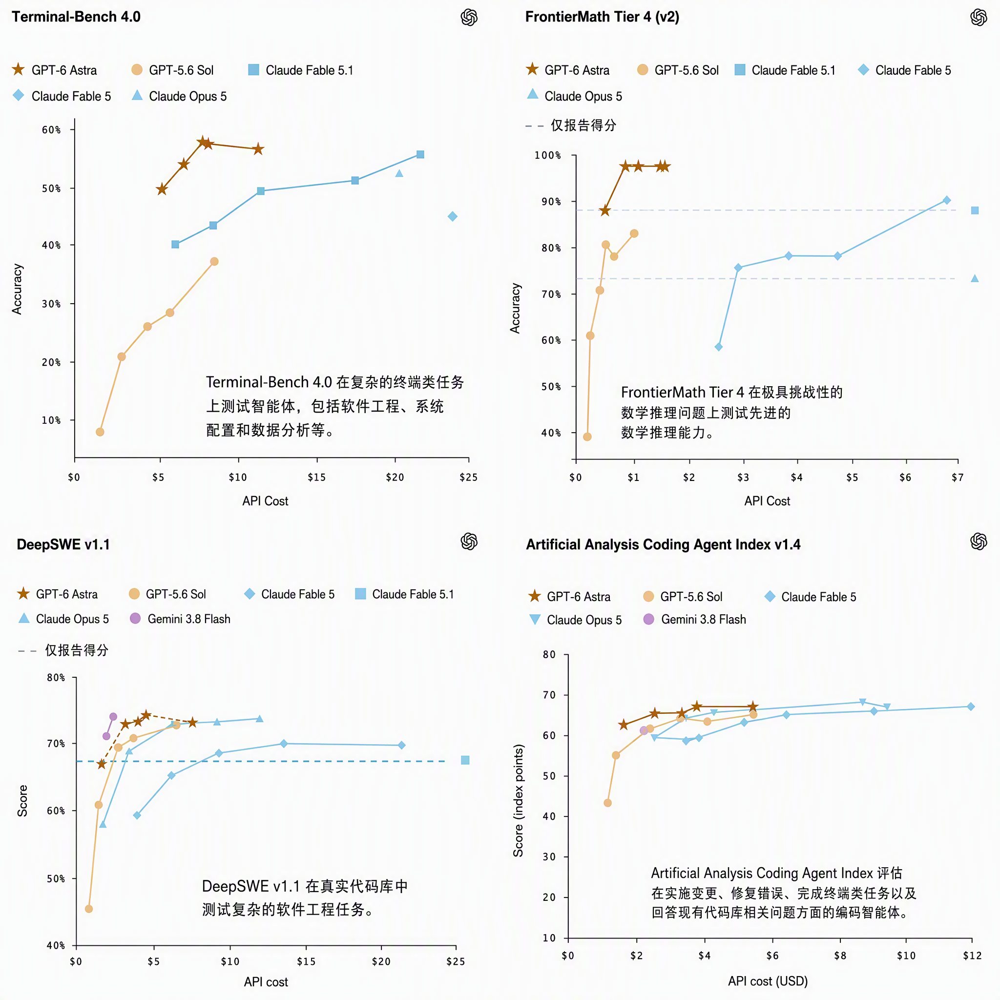

还有一个没画进图里的亮点：Astra 在衡量逻辑谜题求解与泛化能力的 [ARC-AGI-3 基准](https://arcprize.org/arc-agi/3)上拿到了 99.9%，而 GPT-5.6 Sol 只有 7.8%。不过数学、编程和计算机操作基准更值得关注，因为它们更贴近实际应用。

再看 [Artificial Analysis Coding Agent Index v1.4](https://artificialanalysis.ai/agents/coding-agents#coding-agents-index)（上图右下角）。这个指数汇总了多项智能体编程任务，Astra 确实处在前沿水平，但并没有大幅甩开其他模型。下图的综合 [Artificial Analysis Intelligence Index](https://artificialanalysis.ai/evaluations/artificial-analysis-intelligence-index) 也是类似的结论，而且它覆盖的任务类型更广，不只考查编程。

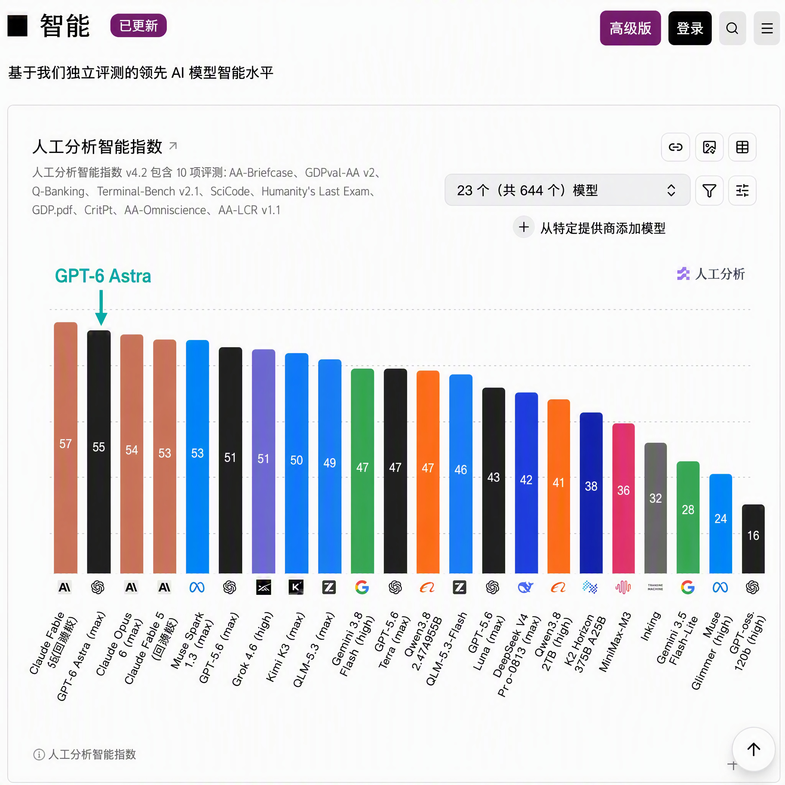

Artificial Analysis 的一大优点是独立第三方评测，可信度比模型厂商自测要高一些。当然，[不同基准使用的评测框架并不一样](https://artificialanalysis.ai/methodology/intelligence-benchmarking)：GDPval-AA 和 AA-Briefcase 用开源精简的 [Stirrup](https://github.com/ArtificialAnalysis/Stirrup) 框架，Terminal-Bench v2.1 用 Terminus 2，τ³-Banking 用 τ-Bench 框架，Coding Agent Index 还会横向比较不同的编程智能体框架。

多个评估共用一套框架时，模型之间的比较才接近同口径。但训练模型时，厂商通常围绕一套主要框架做优化，在其他框架上调得较少，而主要框架往往又是针对模型特点设计的。所以某些智能体评估可能低估 Astra 在主场框架里的表现——要验证这一点，只能让它在不同框架下完成同一批任务。

顺带一提，最近有种说法正在流行，Claude Code 负责人也表达过类似观点：不妨删掉或归档现有 `AGENTS.md` 里的部分内容，以及一些 `SKILL.md`。新一代模型理解提示、解决问题的效率已经更高，手把手的说明太多，反而可能捆住模型的手脚，让它给出更差的方案。这当然不是说这些文件不该用——对需要重复执行的固定工作流，它们仍然能省掉模型每次从头摸索的成本。但有些工作流本就不必专门说明，一些"旧"指令可能已经过时，模型自己也许能想出更好的办法。现在或许正是重新生成这些指令文件的时候。

### 计算机操作能力

Astra 在图像和渲染任务上显得格外强。当任务需要和图形界面交互时，这种优势就体现为计算机操作能力：让模型通过 Codex／ChatGPT 应用操控本地电脑上的软件。

这是它真正出彩的地方，图形任务也天然适合在社交媒体上传播。网上已经有大量惊艳演示，从在 Blender 里[建模并渲染纽约市](https://x.com/higgsfield_ai/status/2096495974734794840?s=20)，到[虚拟开放看房](https://x.com/Dimillian/status/2095596700815516004?s=20)。

举个例子。下图比较了 GPT-6 Astra Medium 和 High：让它们操作我电脑上的鼠标，在 [MS Paint 网页版](https://jspaint.app/#local:aa1757d4bc6008)里重画一张我的照片（没用 Extra High 和 Max，不想把 token 全耗光）。这个例子展示的不只是绘画能力，更是操控界面的能力——从鼠标光标就能看出模型是怎么操作工具的。

能在框架里完成通用计算机操作，Astra 不是第一个。今年早些时候，我已经用 GPT 模型完成过一些 UI 任务，比如在 Excel 里处理费用表格。但这项能力毕竟还新，高度依赖框架支持，远谈不上成熟。这也合理：LLM 本来是文本模型，写作、编程、调用 API 和 CLI 自然最先取得进展。

但还有大量工具和软件没有 CLI。与其等别人做好接口，不如让模型直接学会用图形界面。这有点像人形机器人：在已有专用机器的装配线上，人形机器人未必效率最高，但胜在通用。所以我预计，未来几个月甚至几年，模型和智能体框架都会持续打磨计算机操作，训练侧也会越来越重视它。这还能让 LLM 走出技术圈，去处理日常电脑任务（"嘿，ChatGPT，帮我报税吧"）。

### 计算机操作是怎么训练的

计算机操作的兴起，和一则[近期报道](https://finance.yahoo.com/technology/ai/articles/apple-suddenly-ai-infrastructure-stock-130223938.html)对得上：OpenAI 购买了数万台 Mac Mini 和 Mac Studio 用于强化学习。这些 Mac 并不直接承担模型训练（那还是 GPU 的活），而是在训练过程中提供 macOS 环境，让模型学会使用这个操作系统和里面的工具。

具体流程是这样的：

1. 给模型一项任务，比如"打开应用 xyz 并完成 abc"。
2. 框架把 macOS 界面截图喂给模型。
3. 模型预测鼠标和键盘操作：点击、按键、滚动。
4. 框架在 Mac 上执行这些操作。
5. 把更新后的界面截图再发给模型。
6. 重复第 2～5 步，直到任务成功或失败。
7. 把成功／失败信号和验证器（评分器）作为训练反馈，用于后训练阶段的强化学习，类似常规的可验证奖励强化学习（RLVR）。

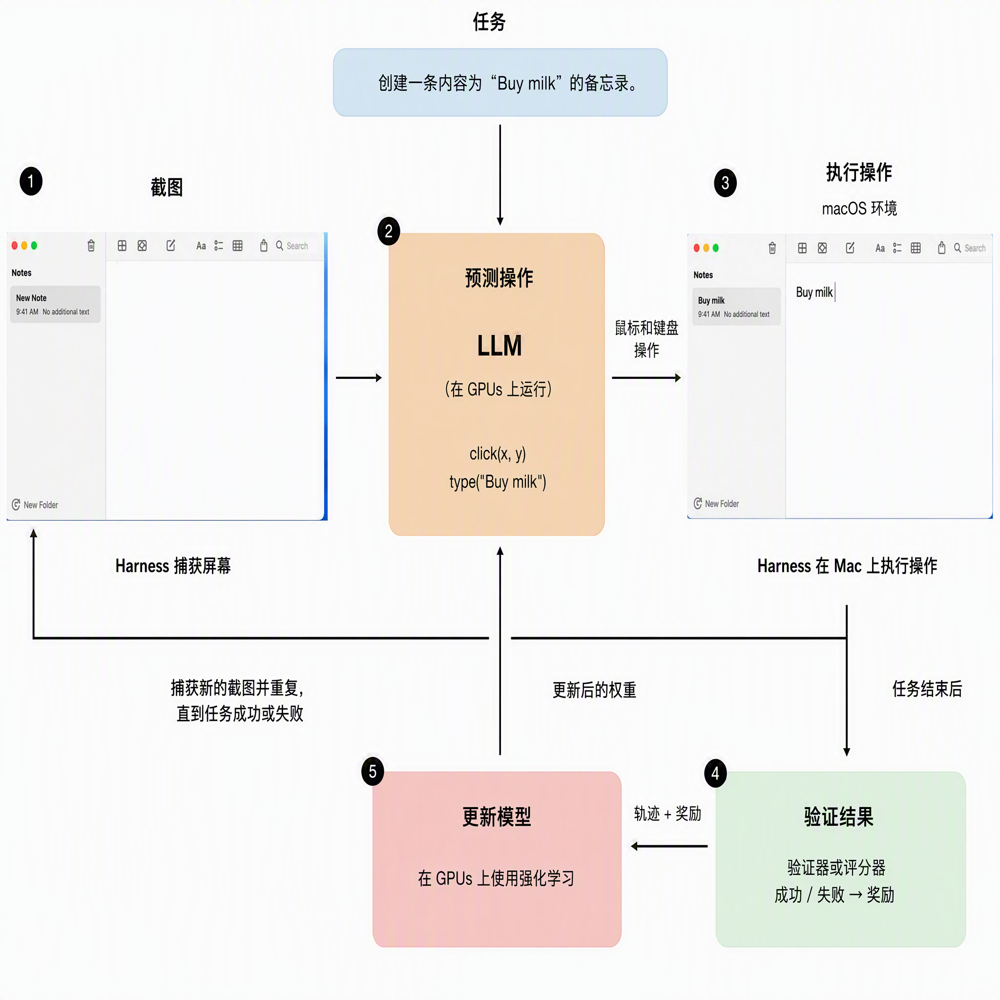

再强调一次，Mac 在这里是环境，不是运行或更新模型的机器。模型大概率跑在 NVIDIA GPU 上，通过 API 接入这些 Mac。[黄仁勋提到](https://x.com/JensenHuang/status/2096700264569090384?s=20)，GPT-6 Astra 用了约 10 万块 Grace Blackwell GPU 训练。

### Astra 仍然是推理模型

计算机操作训练不代表范式发生了根本转变。Astra 仍然是推理模型，可预见的未来其他 LLM 大概率也是如此：它们接受 RLVR 训练，会生成中间推理轨迹，也就是思维链。至于隐藏思维链的争议，后文再展开。

## 什么是循环式 Transformer

Astra 正式发布前两天，The Information 刊登了一篇[报道](https://www.theinformation.com/articles/secret-technique-behind-openais-astra-model-sparks-security-concerns)，援引内部消息称 Astra 采用了名为"循环深度"（recurrent depth）或"循环式 Transformer"（looped transformer）的设计。

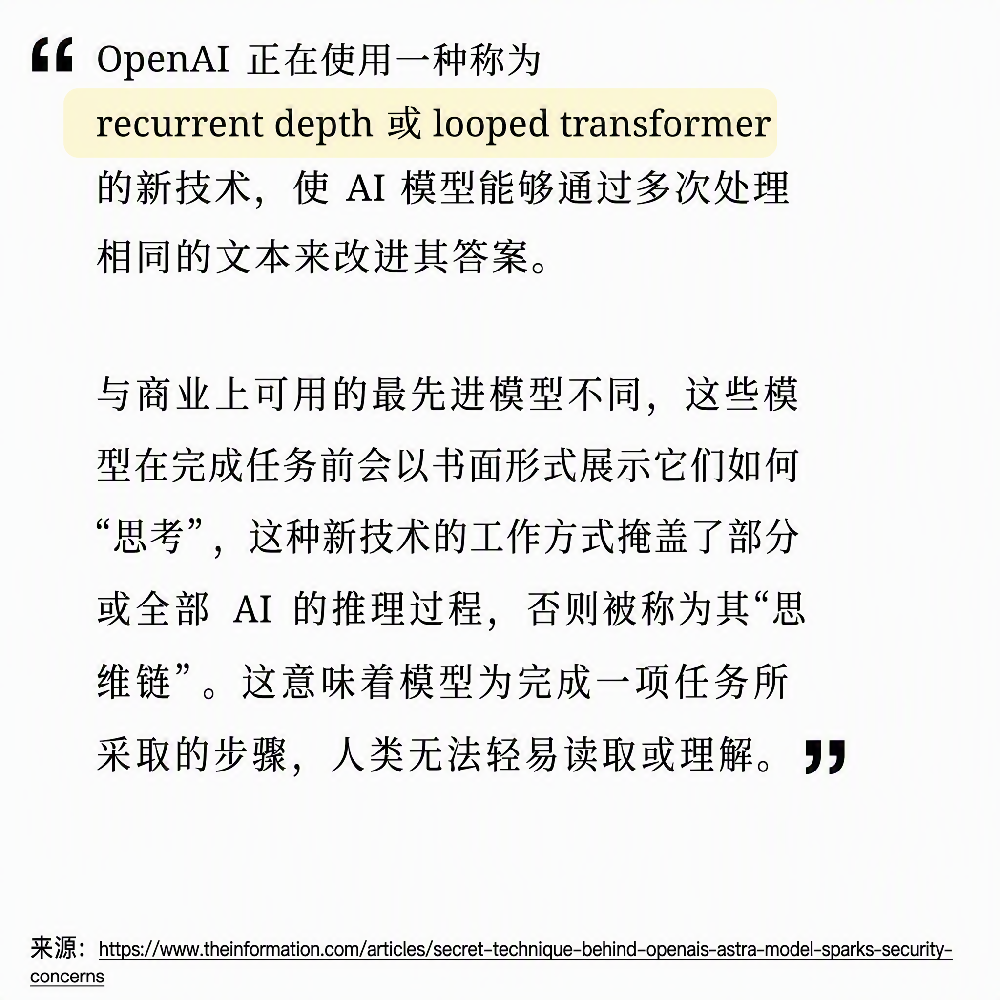

这部分内容有点长，但我认为值得：先弄懂这项技术的基本原理，才能判断它会不会遮蔽推理轨迹。

### 复用同一组 Transformer 模块

循环式 Transformer 本质上是对架构的一种调整：让中间表示反复通过同一组 Transformer 模块，而不是只通过一次。和直接堆叠更多模块相比，关键的"诀窍"是这些轮次共用同一套权重。

先约定几个术语：

- **Transformer 模块**：包含注意力机制、前馈网络、归一化和残差连接的单元，论文里也常叫"Transformer 层"。
- **模块栈**：依次排列的一组 Transformer 模块。
- **模块执行**：让输入通过某个模块一次。

循环式 Transformer 不是新概念，基本思路在 2018 年的 [Universal Transformers](https://arxiv.org/abs/1807.03819) 论文里就出现了。不过先看一个更简单的新例子：今年 7 月发布的开放权重模型 [Nanbeige4.2-3B](https://arxiv.org/abs/2607.22083)。

下图里的 Nanbeige 架构看起来基本就是常规 Transformer，只多了一条橙色箭头，把中间表示绕回模块栈的起点。

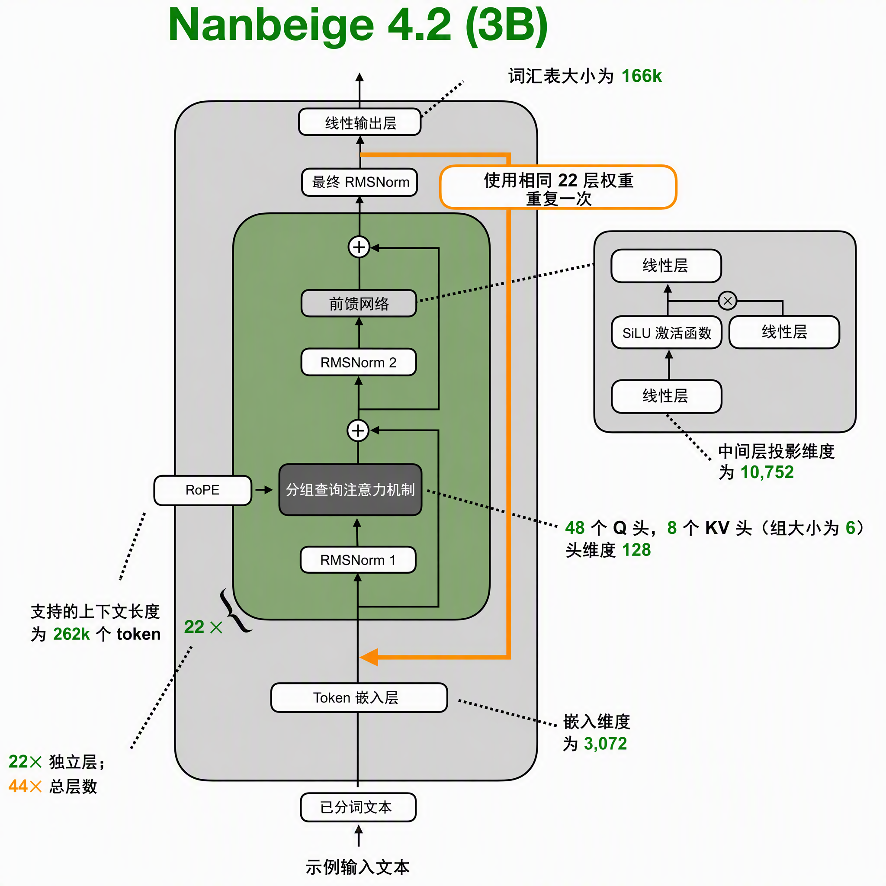

从下往上看：输入文本先分词、转成嵌入向量，然后通过 22 个各自拥有独立权重的 Transformer 模块。循环之处在于，第一轮结束后，隐藏状态会再次送入同样这 22 个模块——模块 1 到模块 22 全部再执行一遍。

展开来看，总共是 44 次模块执行。但和拥有 44 个独立模块的常规 Transformer 不同，后 22 次执行复用前 22 个模块的权重：第 23 次执行用模块 1 的权重，第 24 次用模块 2 的权重，依此类推。

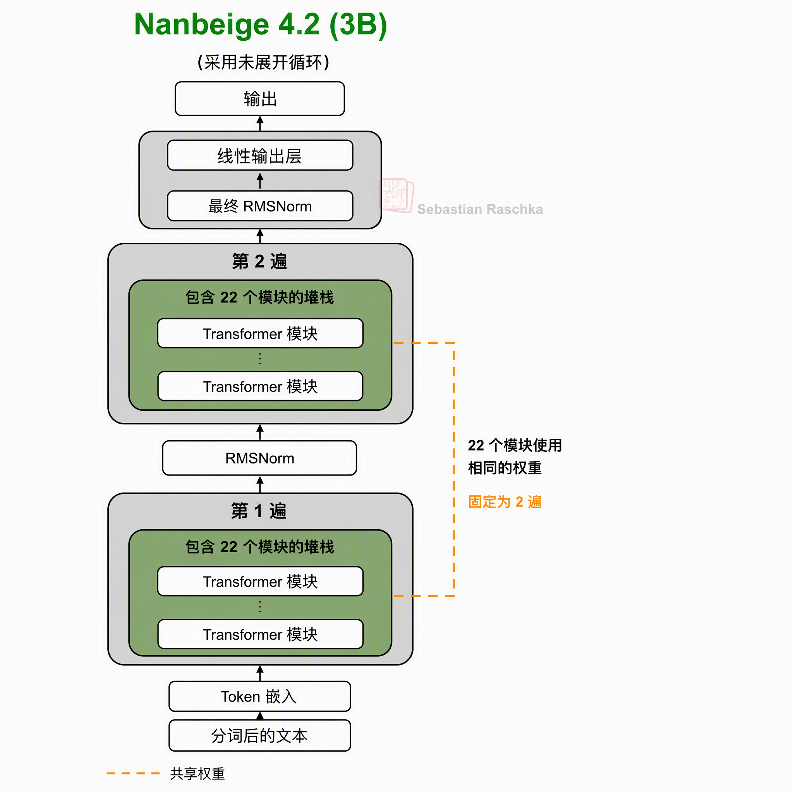

核心思路就是：不增加一套权重，也能把有效深度从 22 次模块执行提到 44 次。

为什么是 2 轮，不是 3 轮、4 轮？Nanbeige 论文没给太多细节，只说这基本是效率最高的配置：循环从 2 轮增到 3 轮确实能提升建模性能，但额外计算成本不划算。

### 循环的代价与收益

除了把模型做大（堆更多模块），循环提供了另一条路。一个 22 个模块跑两轮的模型，Transformer 部分的参数量大约只有 44 层常规模型的一半，存储权重所需的内存因此下降。注意这里的比较不含嵌入层和输出层——这两部分通常很大，在总参数里占比不低。以 Nanbeige 4.2 3B 为例，嵌入层和输出层约占 30 亿总参数的 25%；如果二者共享权重，这个比例能降到 12.5%。

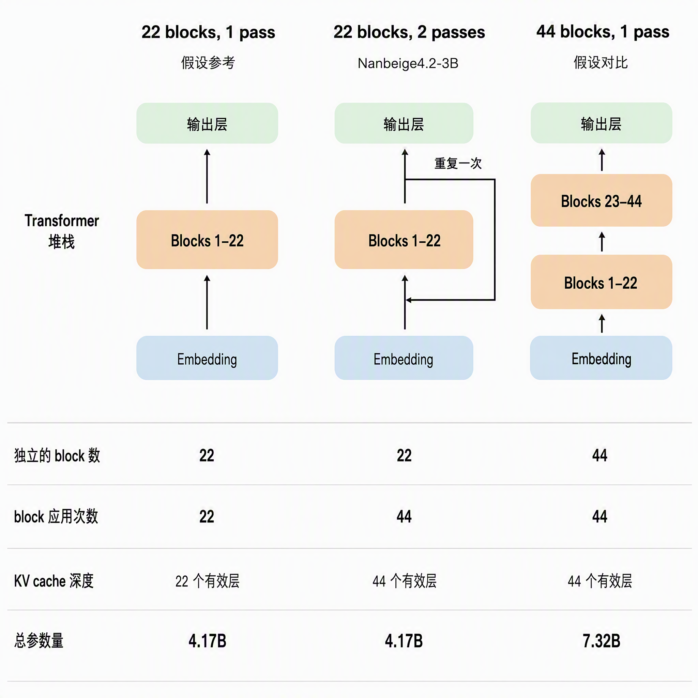

但复用模块不等于省下计算：前向传播仍然要走 44 次模块执行，训练时梯度也要反向流经共享模块栈的两轮。它的计算开销和 44 个独立模块差不多，只是优化器要更新的独立参数更少。

还要考虑 KV 缓存。无论哪种架构，逐 token 生成时都要靠 KV 缓存保存并复用先前 token 的注意力键和值。循环虽然共享权重，但第二轮进入模块的中间状态已经不同，产生的键和值也不一样，KV 缓存并不会减少。具体看第 1 次和第 23 次模块执行：两次都用模块 1，却需要各自独立的 KV 缓存条目。所以 22 个模块跑两轮，和 44 个独立模块的 KV 缓存需求相同。

一个有意思的细节：Nanbeige 作者尝试过让不同轮次共享 KV 缓存，缓存大小减半，但模型表现不如独立缓存版本，最终发布的是后者。

Nanbeige [技术报告](https://arxiv.org/html/2607.22083v1#S2.SS1)还提到另外两个权衡：

1. 从头训练循环架构，效果优于把预训练 Transformer 改造成循环架构。
2. 两轮执行是更受青睐的折中：轮数再多只能带来少量收益，却会拖慢训练、让优化变得不稳定。

轮数本身也是一项架构选择。Nanbeige 把它固定为 2，而下面会看到，轮数也可以因 token 而异。

### Universal Transformers：循环次数可以是灵活的

[Universal Transformers](https://arxiv.org/abs/1807.03819) 反复执行的是同一个 Transformer 模块，而不是整个模块栈，核心思路则相似。执行步数可以固定，论文也探索了自适应停止：某个位置的 token 可能只走一两轮，另一个 token 走三四轮，把更多计算分配给真正需要的 token。

循环次数怎么定？模型在每一步、每个位置上运行一个训练过的小函数，输出停止概率，概率随循环累加，超过阈值就停止；另外还设有最大循环次数兜底，防止计算量失控。

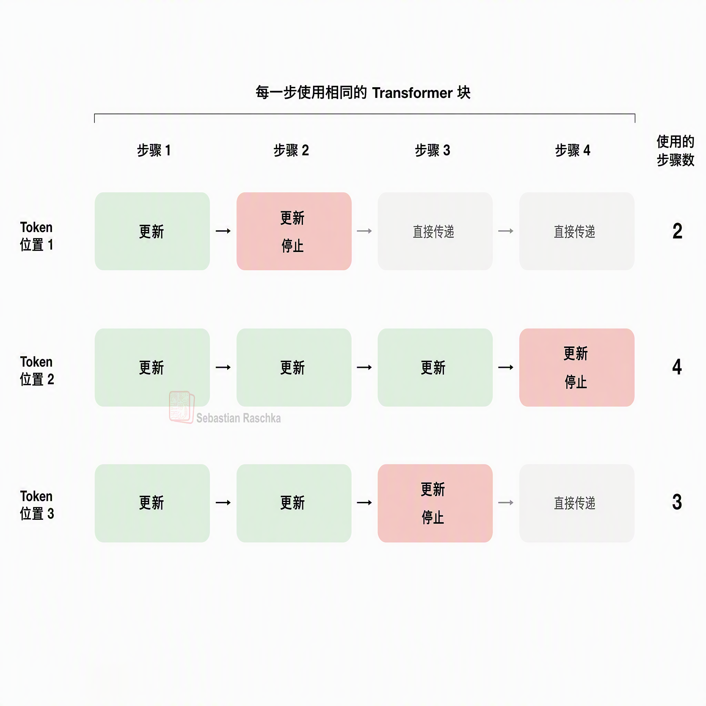

另一个例子是字节跳动的 [Ouro](https://arxiv.org/abs/2510.25741)。Ouro-Thinking 2.6B 把 48 个模块组成的栈执行四轮：只存 48 个模块的权重，却完成 192 次模块执行，比 Nanbeige 更极端。它用一个学习得到的退出门为不同出口分配概率，再由累计阈值决定采用哪一轮的输出，借鉴了 Universal Transformer 的自适应停止思路。不过有个实际限制：发布的 [Hugging Face 实现](https://huggingface.co/ByteDance/Ouro-2.6B-Thinking/blob/main/modeling_ouro.py)会先算完所有预设轮次再选输出，循环次数实际上被硬编码成了 4。

### 用路由器决定循环次数

2025 年的论文 [Mixture-of-Recursions](https://arxiv.org/abs/2507.10524) 提出了更复杂的方案。和 Universal Transformer 类似，不同 token 会以不同次数通过模块栈；创新在于决定次数的机制。论文把循环执行的模块栈称为递归模块，前后各有独立的首尾模块（图中的 Layer 0 和 Layer L-1）。

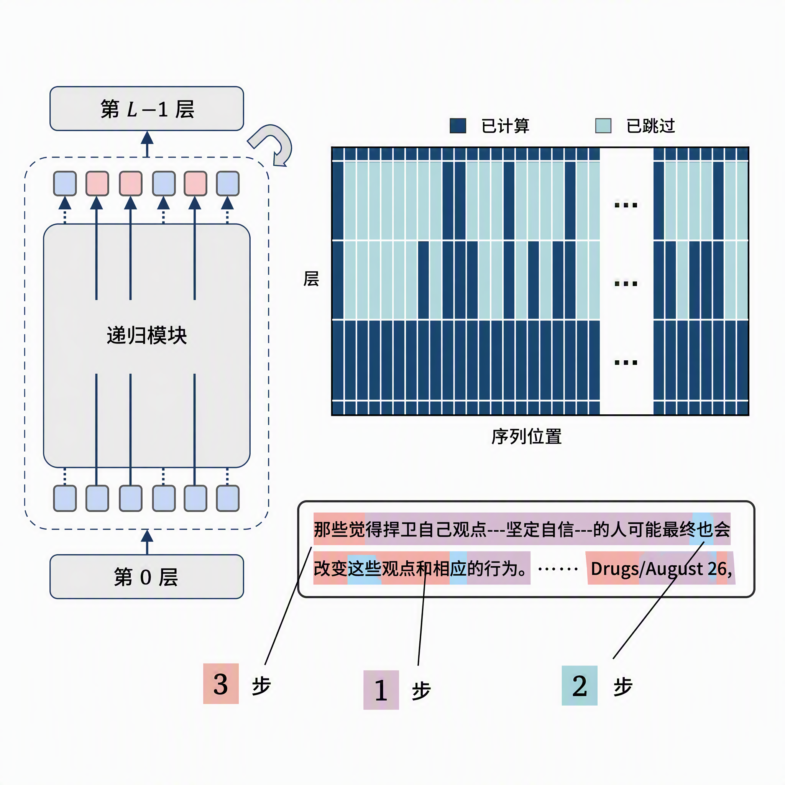

Universal Transformer 靠每一步的停止概率做判断，Mixture-of-Recursions 则用一个小型的学习式路由器，类似专家混合模型里的路由机制，只是路由决策的内容变成"这个 token 要走几轮"。路由器依据 token 的隐藏表示（包含上下文）决策，所以同一个单词在不同位置、不同前文下，分配到的轮数也会变——上图中的"People"并不是每次都循环 3 轮。

论文探索了两种路由方式：

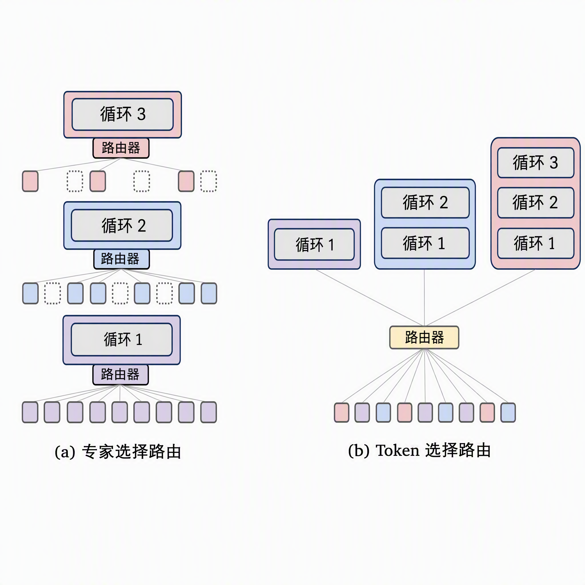

左图是**专家选择路由**：每一步递归都挑选本轮继续处理的 token，已退出的 token 不再进入后续步骤。右图是**令牌选择路由**：路由器在开始时一次性决定，把每个 token 分配到一轮、两轮或三轮的路径。两种方式都在各轮之间复用权重，额外的灵活性在于按 token 分配计算量；模型与路由器共同训练，模型会在训练中学会适应这些不同路径。

### 效果如何

下图比较了不同模型规模和训练计算预算（横轴）下的常规 Transformer（Vanilla）、固定递归 Transformer（Recursive）和 Mixture-of-Recursions（MoR）。

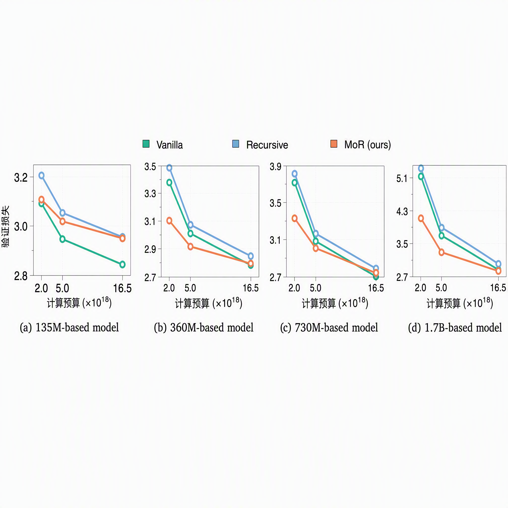

模型规模最小时，常规 Transformer 最好；模型变大后，MoR 追了上来，而且往往更好，训练预算较低时尤其明显；最高预算下几条曲线十分接近。还有一点：训练计算量相同不等于训练 token 数相同——MoR 能跳过部分计算，在同等预算下处理更多 token。

结论是：只要模型足够大，循环式 Transformer 可能在固定计算预算下提升模型质量。这也说明规模化实验很重要，只看 1.35 亿参数的小模型会得出相反结论。

## 插曲：它和 RNN 的区别

如果接触过深度学习，甚至 20 世纪 90 年代的神经网络，"循环"这个思路应该不陌生。经典 RNN 的核心就是在不同迭代中复用相同的层和权重。

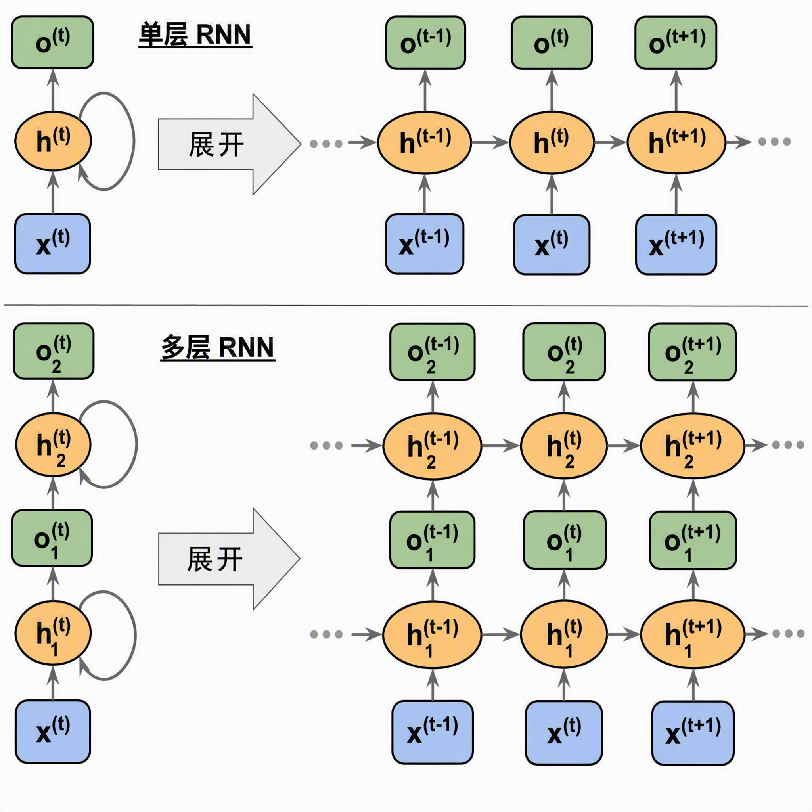

区别在于循环的方向：RNN 沿时间步复用权重，把隐藏状态从一个 token 传给下一个 token，逐个读取序列，靠隐藏状态把前文信息向后传递；循环式 Transformer 则让同一个 token 的中间表示沿网络深度方向多次通过模块栈，token 之间的信息传递仍然交给注意力机制。

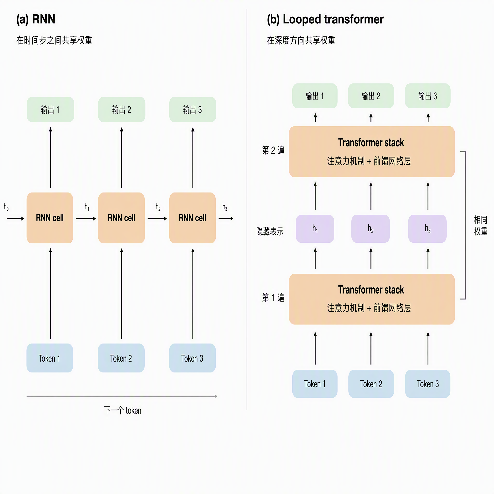

如果这个类比反而让人更困惑，还有个更简单的理解方式：循环式 Transformer 就是在复用 Transformer 模块，效果近似于靠权重共享把模型做深。

## Astra 真的用了循环式 Transformer 吗

The Information 的报道声称循环式 Transformer 会遮蔽推理轨迹。但在讨论这个之前，还有个更基本的问题：Astra 真的采用了它吗？

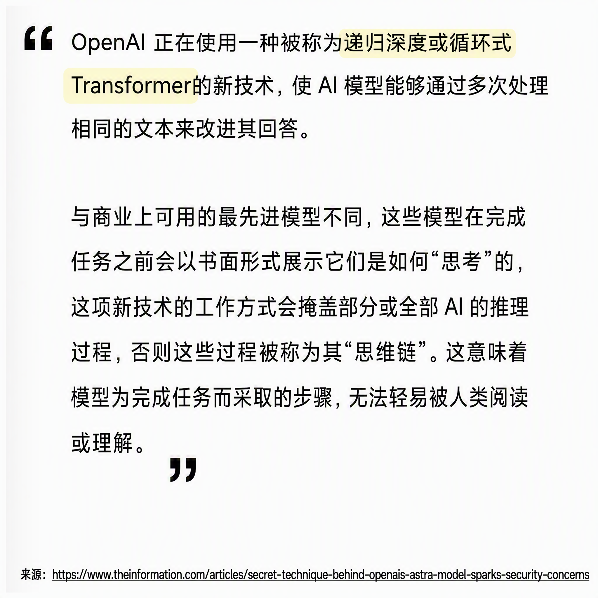

别忘了，这仍是一则未经官方确认的传闻。如果开放了权重，当然可以亲自核实；眼下只能依赖报道。

我倾向于认为 Astra 很可能采用了循环式 Transformer 的某些设计。理由有三：报道本身；这项技术在既往研究中展现了潜力，值得一试；以及 OpenAI 首席科学家[说过的这番话](https://x.com/merettm/status/2095023204993490967?s=20)：

> [……] 我们目前的前沿模型，包括 Astra，其计算图深度与 GPT-4 处在相差 2 倍以内的范围。[……]

但这番话并没有明确证实循环架构——也可能只是说模型用了大约一倍的常规模块。在我看来，Astra 的出色表现主要还是来自更好的训练方案和数据，循环这项改动或许帮了一点忙，The Information 高估了它的贡献。

## 循环式 Transformer 会隐藏思维链吗

先说一个背景：早在 o1 时期，OpenAI 就已经不向用户显示大部分推理轨迹了，所以对最终用户来说差别不大。对可解释性的担忧，主要站在模型开发者的角度。

我的判断是：循环式 Transformer 不是隐藏或遮蔽思维链的主要原因。要看清这一点，得先回到推理模型的工作方式。

### 推理模型在做什么

推理模型通常先生成若干中间步骤，再给最终答案。这些步骤由普通文本 token 构成，在界面里可以不展示给用户，称为推理轨迹或思维链。

比如让模型找两个数，和为 10、积为 21。下图中模型先试 5 和 5：和对了，积是 25，不对；于是改试 3 和 7，重新检查两个条件。

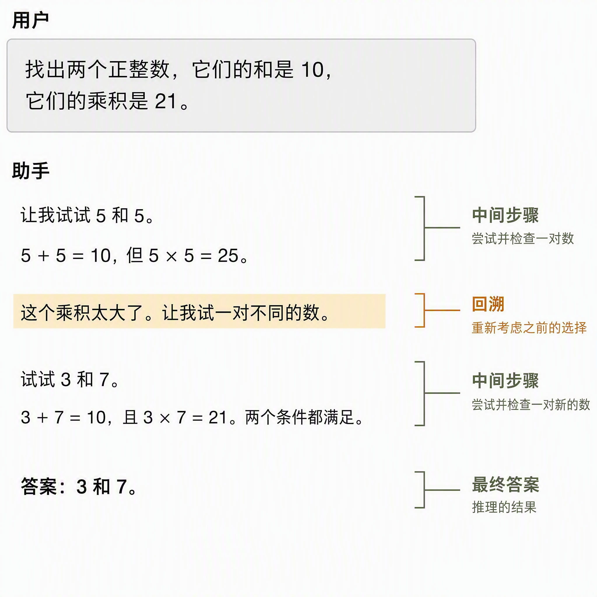

这张图也展示了回溯：发现错误后回到先前的选择，换条思路继续。模型仍然每次只生成一个 token，把提示和此前的 token 作为上下文；这些中间步骤就像草稿纸，在最终答案之前增加计算，而最终答案往往比推理轨迹短得多（OpenAI 通常不显示其中大部分）。

### Token 用量与更短的思维链

推理轨迹多生成 token 会增加计算，循环让 token 经过更多模块同样增加计算。有人据此推测：循环模型在内部做了更多计算，就不需要那么多外显的思考 token。

下图节选了 [GPT-6 基准测试](https://openai.com/index/gpt-6-astra/)中按输出 token 数排列的结果。

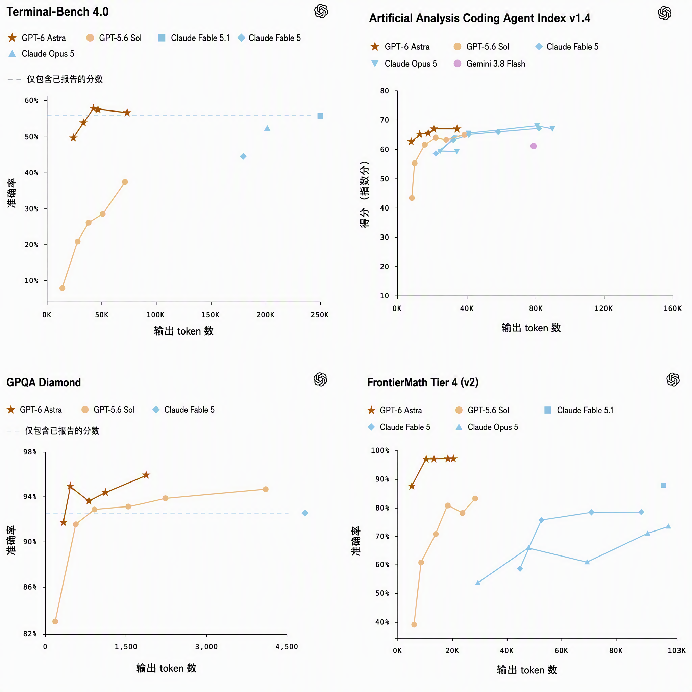

总体看，在各个计算强度档位上，Astra 用的 token 并不一定少于 GPT-5.6 Sol；但准确率相同时，Astra 确实用得更少。这会带来可解释性问题吗？未必。token 变少，也许只是模型更强、犯错和回溯更少，更常在第一次尝试时就答对。仅凭这一点，不足以立刻引发可解释性担忧。

前代模型也是如此。没人会强烈担忧 GPT-5.6 Sol 的可解释性远逊于更小的 Luna，但要达到相近表现，Luna 需要多得多的 token：

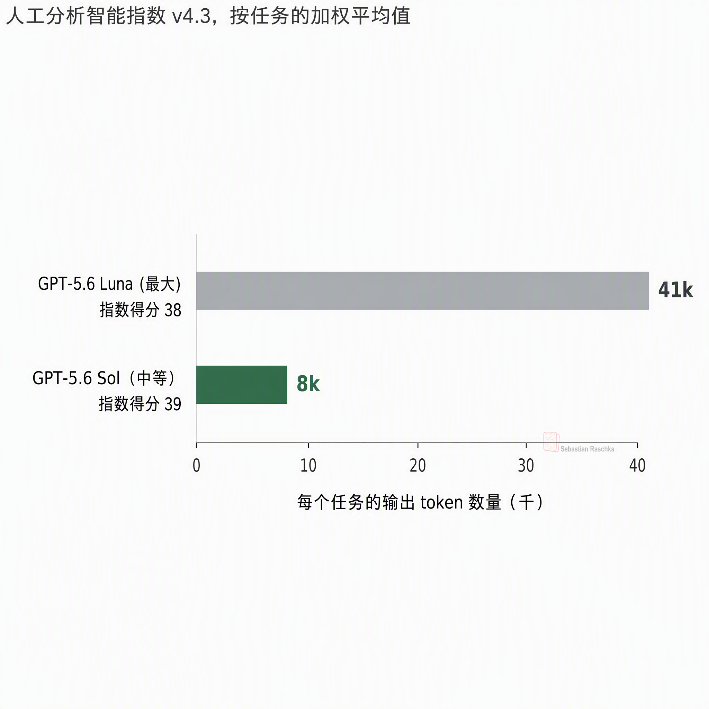

建模性能相近时，Luna 比 Sol 多用 80% 的 token。这难道意味着 Sol 的可解释性差了一大截？更合理的解释是：规模更大、训练更充分、计算投入更多的模型，可以用更少的 token 解决问题。

还要记住，推理轨迹[未必忠实呈现](https://arxiv.org/abs/2305.04388)模型内部发生的一切。真正成立的担忧只有一种：循环式 Transformer 会不会比常规模型更频繁地给出"虚假"推理轨迹、故意误导用户？目前并没有强有力的证据表明此事正在发生。

Astra 的系统卡确实提到，有证据表明其推理轨迹的可监控性相比 Sol 有所退步，主要表现是轨迹更短、信息更少。但这不能证明循环机制是根本原因——也可能只是轨迹整体变短，和上面 Luna 与 Sol 的情况同类。

The Information 的报道发出后，OpenAI 首席科学家 Jakub Pachocki [作出了明确澄清](https://x.com/merettm/status/2095023204993490967?s=20)：

> 我希望避免因混乱报道而掀起一场竞相走向不可监控的竞赛。我们目前的前沿模型，包括 Astra，其计算图深度与 GPT-4 处在相差 2 倍以内的范围。从最早的推理模型开始，OpenAI 就一直努力保留并利用思维链监控。我们非常重视这项技术，因为它能让我们看到模型对齐如何从训练分布泛化出去。我确实认为这项技术很脆弱，而且遗憾的是，趋势正在恶化；原因与架构变化无关，我很快会另文说明。不过，我们可以采取措施来增强它，这也是当前研究计划的核心目标。

"混乱报道"很可能指的就是 The Information，言下之意很清楚：循环设计与思维链的变化无关。

## 近期的循环式 Transformer 研究

最后梳理几篇值得读的论文，它们从不同角度补充了上面的讨论。

### 潜在推理：推理时动态增加循环

2025 年的论文 [Scaling up Test-Time Compute with Latent Reasoning: A Recurrent Depth Approach](https://arxiv.org/abs/2502.05171) 与 Universal Transformer 一脉相承，研究如何在推理时增加循环次数。研究人员用 8000 亿个 token 训练了一个 35 亿参数的模型。

它像 Nanbeige 一样重复执行一个模块栈，但把四个模块组成的共享栈夹在 2 个初始模块和 2 个末尾模块之间。另一个区别是：每轮循环开始时，共享栈除了接收上一轮的隐藏状态，还接收初始模块的输出，二者拼接后经一个学习得到的线性投影再进入共享模块——相当于每一轮都能访问同一份初始输入表示。

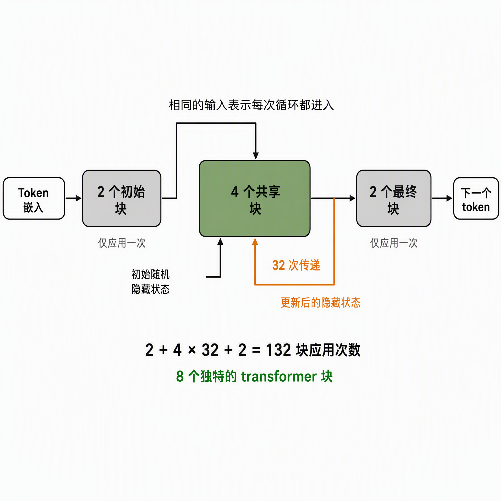

训练时循环次数随机采样，推理时由运行者选定固定预算（比如 8、32、64 轮）；此外还有按 token 的自适应停止：如果连续两轮输出的下一 token 概率分布过于相似（KL 散度低于阈值），就停止。收益因任务而异：HellaSwag 约八轮后基本不再提高，GSM8K 和 HumanEval 能从更多轮次中受益。

注意，标题虽叫"潜在推理"，模型仍然可以生成文本形式的思维链——循环只是在每个输出 token 生成前增加了一些计算。

### 循环提升推理，但不增加知识

存储信息和用信息解题是两回事。2025 年 6 月的论文 [Beyond Parameters: Exploring Virtual Logic Depth for Scaling Laws](https://arxiv.org/abs/2506.18233) 分别测量了这两种能力。

记忆实验里，参数量固定时增加循环次数几乎不改变模型能存储的信息量，增加独立参数才会提高容量。这很合理：信息一旦存好，检索相对简单，循环提供的是计算而不是"存储"。推理实验则相反：复用模块能在不增加参数的情况下，提高多步数学题的解题能力；把模型做大当然也能改善推理，但参数会随之增加。

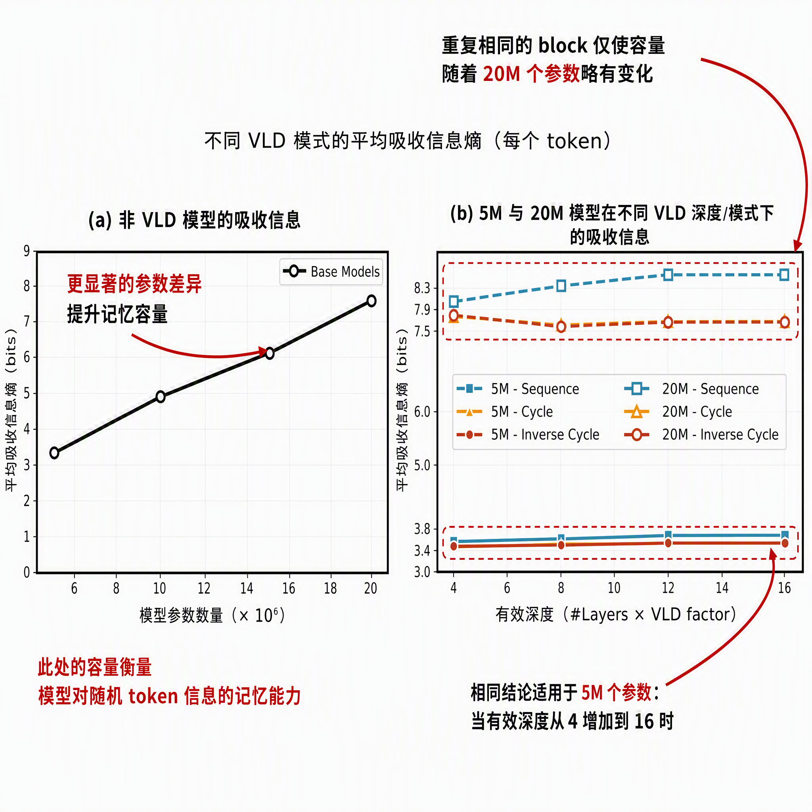

### 计算预算对齐后，循环还划算吗

2026 年 9 月的论文 [SMELT: Scaling Laws for Compute-Matched MoE Looped Transformers](https://arxiv.org/abs/2609.01343) 直接回答这个问题：当每个 token 的计算量、非嵌入参数量和 KV 缓存需求都大致相当时，循环式 Transformer 和常规模型谁更好？

研究人员采用专家混合架构，让中间一半的模块执行两轮（类似 Nanbeige，同时借用了潜在推理的首尾夹层结构）。为抵消额外执行的计算，他们缩小隐藏维度，再靠增加专家数量把总参数补回来，并调整注意力头配置使两者 KV 缓存接近。

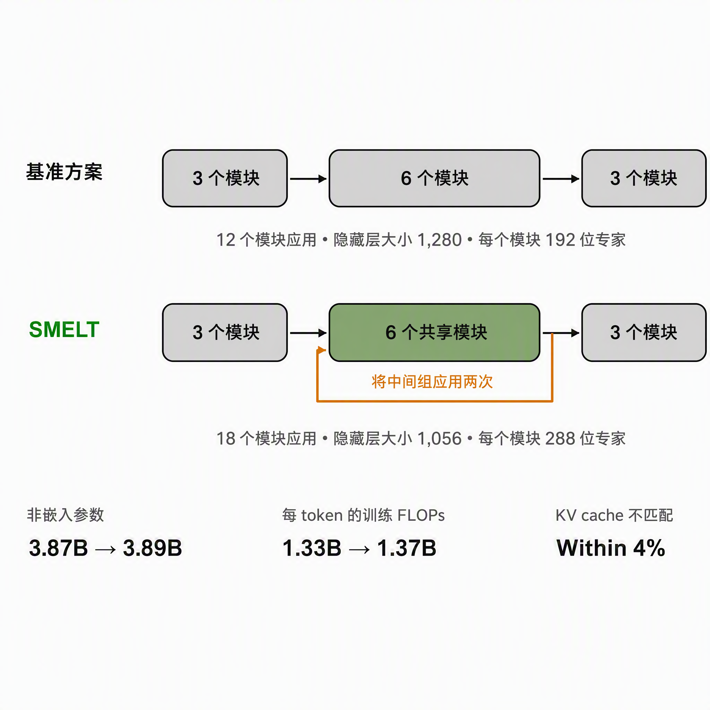

实验规模最高到 540 亿个非嵌入参数。根据拟合的缩放曲线估算，在研究的计算范围内，要达到相同验证损失，SMELT 所需训练计算量约少 6.8%～18%。答案是肯定的：计算预算相同时，循环能换来略好的模型。

### 跨 token 循环与思维链长度

2026 年 8 月的论文 [Full-bandwidth transformer](https://arxiv.org/abs/2608.08888) 研究了另一个方向的循环：跨 token 位置。每个解码步骤通过一个学习得到的门控，把前一个 token 的最终隐藏状态与新采样 token 的嵌入合并，作为下一次前向传播的输入，让下一个 token 从栈底开始计算时就能访问前一个 token 的最终表示。

在 10 亿参数基础模型上，这种潜在反馈方法能在保持甚至提高准确率的同时，缩短 MATH500 上的推理轨迹；但经过指令微调后，缩短效果就消失了。

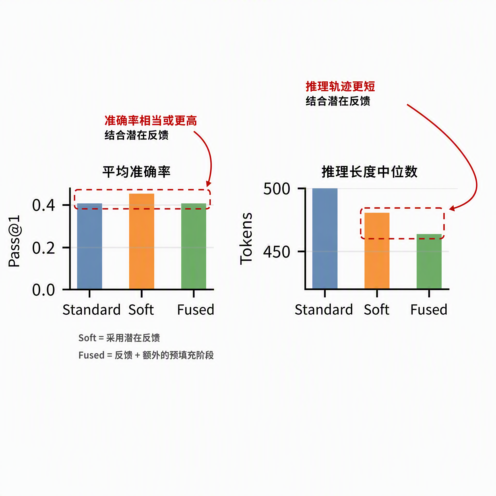

这个结果直接呼应前面的问题：循环会不会缩短推理轨迹？会，但取决于反馈机制和训练方式，而且实验并没有证明较短的轨迹是否更不忠实。另一个重要局限是：论文没有测试常规的扩大模型方式（增加模块而非循环）是否也会带来类似的轨迹缩短。

## 小结

GPT-6 Astra 确实很强，计算机操作能力的跃升尤其明显。我相信未来几个月，计算机会成为开源和专有智能体框架的下一个重点；在这件事上我尤其看重开源——允许一个框架访问主力电脑之前，能先审查它的代码总归是好事。

Astra 很可能采用了循环式 Transformer 的某种变体。在计算预算固定时，循环确实能换来更好的建模性能，SMELT 给出了目前最直接的证据。

更好的性能也可能让思维链变短，但这不是新趋势——同一模型家族的不同规模之间一直如此，Luna 和 Sol 就是例子。在我看来，推理轨迹变短是模型更强之后的副作用：犯错更少，架构内部能调用的计算更多，就不必那么依赖作为草稿纸的外显轨迹。人也有类似的地方：大学数学的现场考试上，聪明又准备充分的学生往往用不了多少草稿纸，也很少回头重算。
