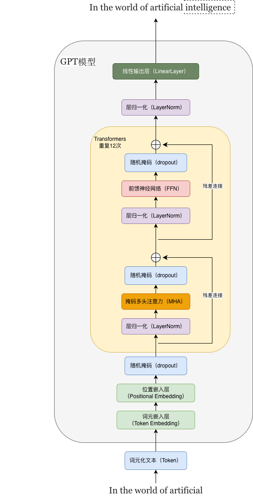

## 背景与目标

自2022年底，OpenAI发布ChatGPT大语言模型以来，人工智能的浪潮再一次被推向高峰，并且热度持续至今。大语言模型本质上是一种基于深度神经网络的语言处理系统，它在理解、生成和解释人类语言方面展现出了惊人的能力。然而，面对动辄数十亿甚至上千亿的参数，许多初学者往往望而却步，不知从何入手。

本篇文章，我们做一件"彻底"的事情：**从 0 到 1，通过代码逐步实现一个基于Transformer架构的类GPT大语言模型**，通过PyTorch的基础组件，亲手搭建出完整的模型骨架，并深入理解每一个核心组件——从分词、嵌入、多头注意力、层归一化到前馈网络和最终输出层。最终，我们还会实现训练循环和文本生成函数，并演示如何加载 OpenAI 发布的预训练权重。

我们将实现一个**GPT‑2 small 规格**的大语言模型，其关键配置如下：

- 词汇表大小：50257（与GPT‑2相同）
- 上下文长度：1024
- 嵌入维度：768
- Transformer 层数：12
- 注意力头数：12
- Dropout 比率：0.1
- 激活函数：GELU

## 模型配置：GPT_CONFIG_124M

在开始构建模型之前，我们首先定义一个配置字典 `GPT_CONFIG_124M`，它集中管理了模型的所有超参数。这样做的好处是：**配置与模型代码分离**，便于调整参数、复现不同规模的模型（如 GPT‑2 small / medium / large）。

```python
GPT_CONFIG_124M = {
    "vocab_size": 50257,      # 词汇表大小
    "context_length": 1024,   # 最大上下文长度（序列长度）
    "emb_dim": 768,           # 嵌入维度（模型隐藏层维度）
    "num_heads": 12,          # 多头注意力的头数
    "num_layers": 12,         # Transformer 解码器块的堆叠层数
    "dropout": 0.0,           # Dropout 比率（预训练时常用 0.0 或很小的值）
    "qkv_bias": False,        # 是否在 Q、K、V 线性层中使用偏置
}
```

在后续代码中，我们会将 `GPT_CONFIG_124M` 传递给 `GPTModel`、`TransformerBlock`、`MultiHeadAttention` 等所有需要参数的模块，从而统一控制模型结构。

```python
model = GPTModel(GPT_CONFIG_124M)
```

## GPT结构概览

这张架构图展示了GPT模型处理文本的完整流程：

模型首先通过词元嵌入层和位置嵌入层将文本转换为向量，随后数据进入由12个相同的Transformer模块组成的堆栈。在每个Transformer模块内部，数据依次经过掩码多头注意力机制和前馈神经网络进行处理，并利用残差连接和层归一化来保证训练的稳定与高效。最后，经过所有模块处理的信息会通过一个最终的层归一化和线性输出层，生成模型的预测结果。



从数据流角度总结整个前向过程：

```
Token IDs (batch, seq_len)
    │
    ├─ Token Embedding → (batch, seq_len, 768)
    ├─ Position Embedding → (batch, seq_len, 768)
    └─ 相加 + Dropout → (batch, seq_len, 768)
         │
         ▼
    ┌─────────────────────────────────┐
    │   TransformerBlock × 12         │
    │   ┌───────────────────────┐     │
    │   │ LayerNorm             │     │
    │   │ Masked Multi-Head Attn│     │
    │   │ Dropout + Residual    │     │
    │   ├───────────────────────┤     │
    │   │ LayerNorm             │     │
    │   │ FFN (768→3072→768)    │     │
    │   │ Dropout + Residual    │     │
    │   └───────────────────────┘     │
    └─────────────────────────────────┘
         │
         ▼
    Final LayerNorm → (batch, seq_len, 768)
         │
         ▼
    Linear Head → (batch, seq_len, 50257)  [logits]
```

## 核心组件实现

### 嵌入层：词嵌入与位置嵌入

#### 分词器（Tokenizer）：从文本到 Token ID

大语言模型本质上是数学运算系统，无法直接处理原始字符串，只能处理数字。因此，第一步是将文本转换为数字序列，这一过程由**分词器**完成。

我们使用 OpenAI 开源的 `tiktoken` 库，它实现了 GPT‑2 使用的 BPE（Byte Pair Encoding）分词算法。BPE 能够将罕见词拆分为更小的子词单元，从而有效处理词汇表外的单词。

```python
# 安装（如未安装）
# pip install tiktoken

import tiktoken
import torch

# 加载 GPT-2 的分词器
tokenizer = tiktoken.get_encoding("gpt2")

# 示例：编码（文本 -> token ID 列表）
text = "Hello, world!"
token_ids = tokenizer.encode(text)
print(token_ids)   # 输出: [15496, 11, 995, 0]

# 解码（token ID 列表 -> 文本）
decoded = tokenizer.decode(token_ids)
print(decoded)     # 输出: "Hello, world!"
```

#### 词嵌入（Token Embedding）：将 Token ID 映射为向量

分词器输出的 token ID 仍然是离散整数，我们需要将其转换为密集的连续向量，才能输入神经网络。这一步由**词嵌入层**完成。

PyTorch 提供了 `nn.Embedding` 模块，它本质上是一个可训练的**查找表**：

```python
import torch.nn as nn

# 假设词汇表大小 50257，嵌入维度 768
embedding_layer = nn.Embedding(num_embeddings=50257, embedding_dim=768)

# 输入：一批 token ID，形状 (batch_size, seq_len)
input_ids = torch.tensor([[15496, 11, 995, 0]])   # (1, 4)

# 输出：嵌入向量，形状 (batch_size, seq_len, embedding_dim)
embedded = embedding_layer(input_ids)             # (1, 4, 768)
```

- `num_embeddings`：词汇表大小（即不同 token ID 的总数）。
- `embedding_dim`：每个 token 映射到的向量维度（例如 768）。
- 内部参数矩阵形状为 `(num_embeddings, embedding_dim)`，初始为随机小值，并在训练中更新。语义相近的 token 会逐渐在向量空间中靠近。

#### 位置嵌入（Positional Embedding）：注入序列顺序信息

Transformer 的自注意力机制本身**不感知序列顺序**——它会把 `[A, B, C]` 和 `[C, B, A]` 视为相同。为了让模型知道每个 token 的绝对位置（第 1 个、第 2 个……），我们需要显式添加**位置信息**。

GPT 系列使用**可学习的绝对位置嵌入**：为每个可能的位置（0 ~ `context_length-1`）分配一个可训练的向量，然后将其**加**到对应的词嵌入上。

```python
class PositionalEmbedding(nn.Module):
    def __init__(self, context_length, emb_dim):
        super().__init__()
        # 可学习的位置参数矩阵： (context_length, emb_dim)
        self.pos_emb = nn.Embedding(context_length, emb_dim)

    def forward(self, x):
        # x 形状: (batch, seq_len, emb_dim)
        batch_size, seq_len, _ = x.shape
        # 生成位置索引 0,1,...,seq_len-1
        positions = torch.arange(seq_len, device=x.device)  # (seq_len,)
        # 取出对应位置向量，并广播到 batch 维度
        pos_embeddings = self.pos_emb(positions)            # (seq_len, emb_dim)
        # 与词嵌入相加
        return x + pos_embeddings
```

使用示例：

```python
context_length = 1024
emb_dim = 768

# 假设已有词嵌入后的向量 token_embeds，形状 (2, 128, 768)
token_embeds = torch.randn(2, 128, 768)

pos_embedding_layer = PositionalEmbedding(context_length, emb_dim)
x = pos_embedding_layer(token_embeds)   # 输出形状仍为 (2, 128, 768)
```

#### 嵌入层的完整集成（在 GPTModel 中）

在实际的 GPT 模型中，我们通常将词嵌入和位置嵌入放在一起，并在最前面应用 Dropout：

```python
class GPTModel(nn.Module):
    def __init__(self, cfg):
        super().__init__()
        self.tok_embed = nn.Embedding(cfg["vocab_size"], cfg["emb_dim"])
        self.pos_embed = nn.Embedding(cfg["context_length"], cfg["emb_dim"])
        self.dropout_emb = nn.Dropout(cfg["dropout"])

    def forward(self, x):
        # x: (batch, seq_len)  token IDs
        batch_size, seq_len = x.shape
        tok_embeds = self.tok_embed(x)                     # (batch, seq_len, emb_dim)
        positions = torch.arange(seq_len, device=x.device) # (seq_len,)
        pos_embeds = self.pos_embed(positions)             # (seq_len, emb_dim)
        # 相加并广播
        x = tok_embeds + pos_embeds                        # (batch, seq_len, emb_dim)
        x = self.dropout_emb(x)
        return x
```

#### 直观理解：一个具体例子

假设 `vocab_size=10`, `emb_dim=4`, `context_length=6`。
输入 token IDs：`[1, 5, 3]`（形状 `(1,3)`）。

- 词嵌入矩阵 `W_tok` 形状 `(10,4)`，取出第 1、5、3 行 → 形状 `(1,3,4)`。
- 位置嵌入矩阵 `W_pos` 形状 `(6,4)`，取出第 0、1、2 行 → 形状 `(3,4)`，广播后 `(1,3,4)`。
- 最终输出 = 词嵌入 + 位置嵌入，形状 `(1,3,4)`。

| Token ID | 词嵌入向量（示例）   | 位置索引 | 位置向量（示例）     | 最终向量             |
| :------- | :------------------- | :------- | :------------------- | :------------------- |
| 1        | [0.2, 0.5, 0.1, 0.8] | 0        | [0.0, 0.1, 0.0, 0.1] | [0.2, 0.6, 0.1, 0.9] |
| 5        | [0.9, 0.3, 0.7, 0.4] | 1        | [0.2, 0.0, 0.1, 0.0] | [1.1, 0.3, 0.8, 0.4] |
| 3        | [0.4, 0.6, 0.5, 0.2] | 2        | [0.1, 0.2, 0.0, 0.1] | [0.5, 0.8, 0.5, 0.3] |

这样，模型既获得了 token 的语义，又知道了每个 token 在序列中的绝对位置。

**小结**：嵌入层是大语言模型的第一道关卡。通过可学习的词嵌入和位置嵌入，我们将离散的 token ID 转换为富含语义和位置信息的连续向量，为后续的 Transformer 块提供了高质量的输入表示。下一节，我们将深入介绍模型的核心——掩码多头注意力机制。

### 掩码多头注意力（Masked Multi‑Head Attention, MHA）

掩码多头注意力是 GPT 类自回归语言模型的**核心组件**。它结合了三个关键概念：**多头注意力**（Multi‑Head Attention）、**因果掩码**（Causal Mask）和**缩放点积注意力**（Scaled Dot‑Product Attention）。理解这一模块，就掌握了 GPT 能够"逐个词生成"的秘密。

#### 为什么需要掩码多头注意力？

在语言模型预训练阶段，模型的任务是"预测下一个词"。训练时我们会给模型一个完整的输入序列（如 `[w1, w2, w3, w4]`），并希望它在预测 `w2` 时只能看到 `w1`，预测 `w3` 时只能看到 `w1, w2`，依此类推。  

- **不加掩码**：每个位置的注意力会看到所有未来的词，导致信息泄露。模型可以"作弊"，直接复制后面的词，而不是真正学习语言规律。
- **掩码（Mask）**：在计算注意力分数时，把未来位置的注意力值强制设为 `-inf`（经过 softmax 后变为 0），使得当前位置**不能关注到未来的 token**。

> 这种"只关注过去"的注意力模式称为**因果注意力**（Causal Attention），是实现自回归生成的关键。

#### 多头注意力机制

多头注意力将 Q, K, V 分别拆分成多个头（head），每个头独立计算注意力，最后拼接起来并经过一个线性变换。这样模型可以从不同表示子空间学习信息。

- 输入：`X` 形状 `(batch, seq_len, d_model)`
- 三个线性层将 X 映射为 Q, K, V，每个形状 `(batch, seq_len, d_model)`
- 按头数 `h` 分割成 `(batch, seq_len, h, d_k)`，然后转置为 `(batch, h, seq_len, d_k)`，其中 `d_k = d_model / h`
- 计算缩放点积注意力（加上掩码）
- 转置并拼接回 `(batch, seq_len, d_model)`
- 最终线性投影

#### 因果掩码的具体形式

对于长度为 `seq_len` 的序列，因果掩码是一个上三角矩阵，其中上三角（不包括对角线）的元素为 `-inf`，下三角和对角线为 `0`。

```python
mask = torch.triu(torch.ones(seq_len, seq_len), diagonal=1) * float('-inf')
# 例如 seq_len=4 时：
# [[0, -inf, -inf, -inf],
#  [0,   0, -inf, -inf],
#  [0,   0,   0, -inf],
#  [0,   0,   0,   0]]
```

在计算 `scores = Q @ K^T / sqrt(d_k)` 之后，将掩码加到 scores 上（`scores += mask`），这样未来位置的分数变为 `-inf`，softmax 后权重为 0。

#### PyTorch实现

以下是一个完整的 `MultiHeadAttention` 模块，可直接用于 GPT 类模型。它支持 `d_in`（输入维度）和 `d_out`（输出维度）不同，但 GPT 中通常两者相等。

```python
import torch
import torch.nn as nn

class MultiHeadAttention(nn.Module):
    def __init__(self, d_in, d_out, num_heads, context_length, dropout, qkv_bias=False):
      	"""
        d_in: 输入特征的维度（例如词嵌入维度）
        d_out: 输出特征的维度（通常等于 d_in，但也可不同）
        num_heads: 注意力头数（必须能整除 d_out）
        context_length: 模型支持的最大序列长度（用于预生成掩码）
        dropout: 注意力权重后的 dropout 比率
        qkv_bias: 是否在 Q、K、V 线性层中使用偏置
        """
        super().__init__()
        assert d_out % num_heads == 0, "d_out must be divisible by num_heads"
        self.num_heads = num_heads
        self.d_out = d_out
        self.head_dim = d_out // num_heads  # 每个头的维度
        self.dropout = nn.Dropout(dropout)
        
        # 三个线性层，将输入映射到 Q, K, V（输出维度均为 d_out）
        self.W_query = nn.Linear(d_in, d_out, bias=qkv_bias)
        self.W_key = nn.Linear(d_in, d_out, bias=qkv_bias)
        self.W_value = nn.Linear(d_in, d_out, bias=qkv_bias)
        
        # 输出投影层
        self.out_proj = nn.Linear(d_out, d_out)
        
        # 注册因果掩码（bool 矩阵，上三角为 True，下三角为 False）
        # 形状 (context_length, context_length)
        self.register_buffer(
            'masked',
            torch.triu(torch.ones((context_length, context_length), dtype=torch.bool), diagonal=1)
        )

    def forward(self, x):
        """
        x: 输入张量，形状 (batch, num_tokens, d_in)
        返回: 形状 (batch, num_tokens, d_out)
        """
        batch_size, num_tokens, _ = x.shape
        
        # 1. 线性投影得到 Q, K, V
        queries = self.W_query(x) # (batch, num_tokens, d_out)
        keys = self.W_key(x)
        values = self.W_value(x)
        
        # 2. 拆分为多头并转置: (batch, num_heads, num_tokens, head_dim)
        queries = queries.view(batch_size, num_tokens, self.num_heads, self.head_dim)
        keys = keys.view(batch_size, num_tokens, self.num_heads, self.head_dim)
        values = values.view(batch_size, num_tokens, self.num_heads, self.head_dim)

        queries = queries.transpose(1, 2)
        keys = keys.transpose(1, 2)
        values = values.transpose(1, 2)
        
        # 3. 计算缩放点积注意力分数
        # scores 形状: (batch, num_heads, num_tokens, num_tokens)
        attn_scores = queries @ keys.transpose(-2, -1)
       
        
        # 4. 应用因果掩码（禁止未来位置）
        # 注意：mask 的形状是 (context_length, context_length)，我们只取前 num_tokens 行/列
        attn_scores.masked_fill_(self.masked[:num_tokens, :num_tokens], -torch.inf)
        
        # 5. softmax 得到注意力权重，再应用 dropout
        attn_weights = torch.softmax(attn_scores / keys.shape[-1]**0.5, dim=-1) # 缩放
        attn_weights = self.dropout(attn_weights)
        
        # 6. 加权聚合 V
        context_vec = attn_weights @ values # Shape:(b, n_head, num_tokens, h_dim)
        
        # 7. 合并多头: 转置 + 重塑
        context_vec = context_vec.transpose(1, 2)
        context_vec = context_vec.contiguous().view(batch_size, num_tokens, self.d_out)
        
        # 8. 最终线性投影
        context_vec = self.out_proj(context_vec)

        return context_vec
```

#### 使用示例

```python
# 配置：d_in=768, d_out=768, 12个头, 最大长度1024, dropout=0.1
attn = MultiHeadAttention(d_in=768, d_out=768, num_heads=12, 
                          context_length=1024, dropout=0.1, qkv_bias=False)

# 随机输入：batch=2, seq_len=128, 768维
x = torch.randn(2, 128, 768)
out = attn(x)          # 输出形状 (2, 128, 768)
print(out.shape)       # torch.Size([2, 128, 768])
```

#### 关键点总结

- **因果掩码**是自回归模型的核心：每个位置只能看到它自己和之前的 token，保证生成时不会"偷看"未来。
- **多头设计**让模型能够关注不同的语义子空间（例如有的头关注相邻词，有的头关注长距离依赖）。
- **缩放因子** `1/√d_k` 防止点积过大导致 softmax 梯度饱和。
- **Dropout** 作用在注意力权重上，是一种有效的正则化手段。
- 代码中预先生成了最大长度的掩码（`context_length`），并在前向时裁剪到实际长度，避免重复计算。

掌握了掩码多头注意力，你就理解了 GPT 生成文本时"每次只看左边"的机制。下一节我们将介绍层归一化和激活函数，它们与注意力共同构成完整的 Transformer 解码器块。

### 层归一化（Layer Normalization）

训练深层神经网络时，随着层数增加，激活值的分布会发生漂移，导致梯度消失或梯度爆炸。这些问题使网络难以稳定地更新参数，从而无法有效学习数据中的潜在模式。

**归一化**是一种有效的解决方案：将激活值调整为均值为 0、方差为 1 的标准分布，从而稳定训练过程。

> **层归一化（LayerNorm）**：**在特征维度上独立地对每个样本做归一化**。不依赖 batch 大小，且对变长序列自然友好，因此成为 Transformer 的标配。

PyTorch 实现（与 GPT 配置兼容）：

```python
import torch
import torch.nn as nn

class LayerNorm(nn.Module):
    def __init__(self, cfg):
        """
        cfg: 配置字典，必须包含 "emb_dim" 键
        """
        super().__init__()
        self.eps = 1e-5
        # scale 和 shift 是可训练参数，初始化为 1 和 0
        self.scale = nn.Parameter(torch.ones(cfg["emb_dim"]))
        self.shift = nn.Parameter(torch.zeros(cfg["emb_dim"]))

    def forward(self, x):
        # 在最后一个维度（特征维度）上计算均值和方差
        mean = x.mean(dim=-1, keepdim=True)      # shape: (batch, seq_len, 1)
        var = x.var(dim=-1, unbiased=False, keepdim=True)  # 有偏方差
        # 归一化： (x - mean) / sqrt(var + eps)
        result = (x - mean) / torch.sqrt(var + self.eps)
        # 仿射变换
        return self.scale * result + self.shift
```

- **`dim=-1`**：表示对最后一个维度操作。在 GPT 类模型中，最后一个维度是 `emb_dim`（如 768），因此每个 token 的 768 维向量会被独立归一化。
- **`keepdim=True`**：保留维度数（形状中的 1），便于后续广播运算。
- **`unbiased=False`**：使用有偏估计，即分母为 N（`emb_dim`）而不是 N-1。这符合原始 LayerNorm 的定义，且在训练和推理时行为一致。
- **`result`**：已经归一化为近似标准正态分布。
- **`self.scale * result + self.shift`**：引入可学习的缩放和平移，让模型能够自适应地调整输出的分布范围。

### 激活函数：GELU（Gaussian Error Linear Unit）

在神经网络中，激活函数的作用是引入非线性，让模型能拟合复杂模式。对于 Transformer 模型，激活函数的选择直接影响训练稳定性与表达能力。GPT 系列使用的是 **GELU**（Gaussian Error Linear Unit），而非更传统的 ReLU。

下图直观展示了 GELU 与 ReLU 的形状对比（数值模拟）：

```text
  输出
   3 |        ReLU ______
   2 |       /
   1 |      /
   0 |_____/_____________
  -1 |    GELU (平滑曲线)
  -2 |
     -3  -2  -1   0   1   2   3  输入
```

PyTorch 实现：

```python
class GELU(nn.Module):
    def __init__(self):
        super().__init__()
        # 预计算常数 sqrt(2/π) ≈ 0.79788456，并注册为 buffer（不参与训练）
        self.register_buffer(
            "constant",
            torch.sqrt(torch.tensor(2.0 / torch.pi))
        )

    def forward(self, x):
        # 使用 tanh 近似公式
        result = 0.5 * x * (
            1 + torch.tanh(self.constant * (x + 0.044715 * torch.pow(x, 3)))
        )
        return result
```

- `constant = sqrt(2/π)` 是公式中的系数。
- `0.044715` 是通过数值拟合得到的系数，使得近似误差最小化。
- `torch.pow(x, 3)` 计算 x³。

> **注意**：PyTorch 从 1.0 起内置了 `nn.GELU(approximate='tanh')`，可以直接使用，且性能更好。这里手动实现是为了展示底层原理。

### 前馈神经网络（Feed‑Forward Network, FFN）

前馈神经网络（FFN）是 Transformer 解码器块中的第二个子层（位于多头自注意力之后）。它对每个位置的表示进行**独立的、位置不变的非线性变换**，是 GPT 模型参数量最大的组成部分之一。

#### 为什么需要 FFN？

多头自注意力负责**跨位置**的信息交互（哪些词相互关注），而 FFN 负责**每个位置内部**的特征提取和变换。两者分工明确：

- **注意力层**：混合序列信息，学习词与词之间的关系。
- **FFN 层**：对每个位置的向量做深度非线性映射，提升模型的表示能力。

如果没有 FFN，仅靠注意力层的线性投影会严重限制模型的表达能力。

#### 标准结构：扩张 → 激活 → 压缩

GPT 采用经典的"两头窄、中间宽"的瓶颈结构：

```python
class FeedForward(nn.Module):
    def __init__(self, cfg):
        super().__init__()
        self.layers = nn.Sequential(
            # 扩张：将每个位置的向量投影到 4 倍维度，FFN 可以获得更强的表达能力，学习复杂的特征交互
            nn.Linear(cfg["emb_dim"], 4 * cfg["emb_dim"]),
            # 激活：用 GELU 激活
            GELU(),
            # 压缩：再投影回原维度
            nn.Linear(4 * cfg["emb_dim"], cfg["emb_dim"]),
        )

    def forward(self, x):
        return self.layers(x)
```

**维度变化示例**（以 GPT‑2 small 为例，`emb_dim = 768`）：

- 输入 `x`：`(batch, seq_len, 768)`
- 第一个线性层：`768 → 3072`（4 倍扩张）
- GELU 激活：形状不变 `(batch, seq_len, 3072)`
- 第二个线性层：`3072 → 768`（压缩回原维度）

#### 参数量分析

对于 `emb_dim = d_model`，FFN 的参数量约为：

- 第一层：`d_model * (4*d_model) = 4*d_model²`
- 第二层：`(4*d_model) * d_model = 4*d_model²`
- 总计：`8*d_model²`（忽略偏置）

对比多头注意力模块（约 `4*d_model²` 用于 Q、K、V、O 四个矩阵），**FFN 的参数量通常是注意力的 2 倍**。在 GPT‑2 small 中，总参数 1.24 亿，FFN 贡献了约 0.8 亿，是模型容量的主要来源。

#### 与其他激活函数的配合

FFN 中默认使用 **GELU** 激活函数（而非 ReLU）。原因是：

- GELU 平滑、可微、允许负值小幅流动，更适合深层网络。
- 实验证明，在 Transformer 中使用 GELU 通常比 ReLU 收敛更快、最终性能更好。

如果希望进一步实验，也可以替换为 `nn.SiLU`（Swish）或 `nn.ReLU`。

#### 在 Transformer 块中的位置

```python
class TransformerBlock(nn.Module):
    def forward(self, x):
        # 注意力子层
        shortcut = x
        x = self.layernorm1(x)
        x = self.attn(x)
        x = self.dropout(x)
        x = x + shortcut

        # FFN 子层
        shortcut = x
        x = self.layernorm2(x)
        x = self.ff(x)          # 这里调用 FeedForward
        x = self.dropout(x)
        x = x + shortcut
        return x
```

这种设计使得每个 token 的表示先通过注意力收集上下文信息，再通过 FFN 独立精炼，二者交替进行，逐层抽象。

小结：FFN 是 GPT 模型中不可或缺的"位置独立"非线性变换层，通过 **扩张 → GELU → 压缩** 的结构，以 4 倍于 `emb_dim` 的隐藏维度提升模型表达能力。它与注意力层分工协作，共同构成每个 Transformer 块的核心。掌握了 FFN 的实现，你就完成了 Transformer 解码器所有子层的构建。

### 残差连接（Residual Connection）

残差连接（又称快捷连接、跳跃连接）最初由 He et al. 在 2015 年的 ResNet 中提出，用于解决极深网络的训练难题。它后来成为 Transformer（包括 GPT）的核心设计之一，与层归一化共同支撑起上百层的深度模型。

一个残差块可以表示为：`output = F(x) + x`，其中：

- x 是输入（捷径路径）
- F(x) 是主路径的变换（如多头注意力或前馈网络）
- 输出是两者逐元素相加

#### 为什么残差连接至关重要？

* **缓解梯度消失**：在深层网络中，梯度通过链式法则反向传播。如果网络很深（如 GPT‑3 有 96 层），梯度会指数级衰减或爆炸。引入残差连接 `y = x + F(x)` 后，其梯度为 `dy/dx = 1 + F'(x)`，无论 F'(x) 多小，梯度中始终存在一个"1"，这意味着梯度可以直接从后层传到前层，不再完全依赖复杂的非线性路径。残差连接为梯度提供了一条"高速公路"。
* **改善信息流动**：在前向传播中，残差连接允许原始信息绕过非线性层直接传递到后续层，保留了低层特征的细节。对于语言模型而言，早期的 token 信息需要被保留到深层以建立长距离依赖，残差连接为此提供了直接路径。

#### 在 Transformer 块中的位置

在 Transformer 中，每个子层（注意力层和 FFN 层）都采用这种结构：

```python
class TransformerBlock(nn.Module):
    def forward(self, x):
        # 注意力子层 + 残差
        shortcut = x
        x = self.layernorm1(x)
        x = self.attn(x)
        x = self.dropout(x)
        x = x + shortcut          # 残差连接

        # FFN 子层 + 残差
        shortcut = x
        x = self.layernorm2(x)
        x = self.ff(x)
        x = self.dropout(x)
        x = x + shortcut          # 残差连接
        return x
```

## 组装 TransformerBlock

`TransformerBlock` 是 GPT 解码器的核心构建块，也是整个模型中重复堆叠的基本单元。每个块包含两个子层：

- **掩码多头自注意力**（Masked Multi‑Head Attention）：负责跨位置的信息交互，同时保证因果性（不看到未来）。
- **前馈网络**（Feed‑Forward Network）：对每个位置的表示进行独立的非线性变换。

此外，每个子层都配备了**层归一化**（LayerNorm）和**残差连接**（Residual Connection）：

```python
class TransformerBlock(nn.Module):
    def __init__(self, cfg):
        super().__init__()
        self.layernorm1 = LayerNorm(cfg) # 注意力前的归一化
        self.layernorm2 = LayerNorm(cfg) # FFN 前的归一化
        self.attn = MultiHeadAttention(  # 因果掩码多头注意力
            d_in=cfg["emb_dim"],
            d_out=cfg["emb_dim"],
            num_heads=cfg["num_heads"],
            context_length=cfg["context_length"],
            dropout=cfg["dropout"],
            qkv_bias=cfg["qkv_bias"]
        )
        self.dropout = nn.Dropout(cfg["dropout"]) # 随机掩码，防止过拟合。
        self.ff = FeedForward(cfg) # 前馈神经网络FFN

    def forward(self, x):
        # 第一子层：注意力 + 残差连接
        shortcut = x
        x = self.layernorm1(x)
        x = self.attn(x)
        x = self.dropout(x)
        x = x + shortcut

        # 第二子层：前馈网络 + 残差连接
        shortcut = x
        x = self.layernorm2(x)
        x = self.ff(x)
        x = self.dropout(x)
        x = x + shortcut

        return x
```

数据流动示例：

假设 `emb_dim = 768`，`batch = 2`，`seq_len = 1024`：

```
输入 x: (2, 1024, 768)
  │
  ├─ 保存 shortcut
  ├─ LayerNorm1 → (2,1024,768)
  ├─ MultiHeadAttention（因果掩码）→ (2,1024,768)
  ├─ Dropout
  └─ x = x + shortcut → (2,1024,768)

  │
  ├─ 保存 shortcut
  ├─ LayerNorm2 → (2,1024,768)
  ├─ FeedForward:
  │      Linear(768→3072) → GELU → Linear(3072→768) → (2,1024,768)
  ├─ Dropout
  └─ x = x + shortcut → (2,1024,768)

输出到下一个 TransformerBlock
```

## 完整 GPTModel

`GPTModel` 类将所有之前构建的组件整合到一起，形成一个完整的生成式预训练 Transformer 模型。它包含了从 token 输入到 logits 输出的完整前向计算图，是"从零构建大语言模型"的最终成果。

### 代码实现

```python
class GPTModel(nn.Module):
    def __init__(self, cfg):
        super().__init__()
        # 词嵌入（Token Embedding）,将每个 token ID（整数）映射为一个稠密向量（emb_dim 维）。
        self.tok_embed = nn.Embedding(cfg["vocab_size"], cfg["emb_dim"])
        
        # 位置嵌入（Positional Embedding）,为每个绝对位置（0, 1, 2, …, context_length-1）学习一个可训练的位置向量。
        self.pos_embed = nn.Embedding(cfg["context_length"], cfg["emb_dim"])
        
        # 在进入 Transformer 块之前对嵌入表示进行随机失活，增强正则化。
        self.dropout_emb = nn.Dropout(cfg["dropout"])
        
        # 堆叠的 Transformer 解码器块
        self.trf_blocks = nn.Sequential(
            *[TransformerBlock(cfg) for _ in range(cfg["num_layers"])]
        )
        
        # 最终层归一化,在所有 Transformer 块之后再加一个 LayerNorm。这有助于稳定输出分布，在预训练和微调时都很重要。
        self.final_layernorm = LayerNorm(cfg)
        
        # 输出头（语言建模头）,将每个位置的 emb_dim 维表示映射到词汇表大小的 logits（未归一化的分数）。
        self.out_head = nn.Linear(cfg["emb_dim"], cfg["vocab_size"], bias=False)
        
    # 前向传播
    def forward(self, x):
        batch_size, num_tokens = x.shape
        tok_embeds = self.tok_embed(x)
        pos_embeds = self.pos_embed(torch.arange(num_tokens, device=x.device))
        x = tok_embeds + pos_embeds
        x = self.dropout_emb(x)
        x = self.trf_blocks(x)
        x = self.final_layernorm(x)
        logits = self.out_head(x)

        return logits
```

### 权重绑定（Weight Tying）

GPT-2 使用了一个重要的优化技巧：**将词嵌入层（`tok_embed`）和输出头（`out_head`）的权重共享**。

直觉上这是合理的——词嵌入将 token ID 映射到语义向量空间，输出头将语义向量映射回 token ID 的概率分布，两者做的是"对称"的事情。共享权重不仅减少了约 3800 万参数（`50257 × 768`），还在实践中改善了模型性能。

```python
class GPTModel(nn.Module):
    def __init__(self, cfg):
        super().__init__()
        # ... 其他层定义同上 ...
        self.out_head = nn.Linear(cfg["emb_dim"], cfg["vocab_size"], bias=False)
        
        # 权重绑定：输出头与词嵌入共享权重
        self.out_head.weight = self.tok_embed.weight
```

绑定后，`tok_embed.weight` 和 `out_head.weight` 指向同一个张量，梯度会同时更新这个共享参数。

### 关键组件总结

| 组件              | 作用                                    | 是否可训练 |
| :---------------- | :-------------------------------------- | :--------- |
| `tok_embed`       | 将 token ID 映射为语义向量              | 是         |
| `pos_embed`       | 注入绝对位置信息                        | 是         |
| `dropout_emb`     | 正则化，防止过拟合                      | 否         |
| `trf_blocks`      | 堆叠的 Transformer 解码器，提取深层特征 | 是         |
| `final_layernorm` | 稳定输出分布，提升训练稳定性            | 是         |
| `out_head`        | 将隐藏表示映射到词汇表空间（与 tok_embed 共享权重） | 是         |

### 参数量验证

让我们验证模型确实有约 1.24 亿参数：

```python
model = GPTModel(GPT_CONFIG_124M)
total_params = sum(p.numel() for p in model.parameters())
print(f"Total parameters: {total_params:,}")
# 输出: Total parameters: 124,439,808（约 1.24 亿）
```

各部分参数量拆解：

| 组件 | 计算 | 参数量 |
|:-----|:-----|:-------|
| tok_embed | 50257 × 768 | 38,597,376 |
| pos_embed | 1024 × 768 | 786,432 |
| 每层 MHA (Q,K,V,O) | 4 × 768 × 768 | 2,359,296 |
| 每层 FFN | 768×3072 + 3072×768 | 4,718,592 |
| 每层 LayerNorm ×2 | 2 × 768 × 2 | 3,072 |
| 12 层 Transformer 合计 | 12 × (2,359,296 + 4,718,592 + 3,072) | 84,969,504 |
| final_layernorm | 768 × 2 | 1,536 |
| out_head（与 tok_embed 绑定） | 0（共享） | 0 |
| **总计** | | **~124M** |

### 使用示例

```python
# 配置（GPT‑2 small 规格）
cfg = {
    "vocab_size": 50257,
    "context_length": 1024,
    "emb_dim": 768,
    "num_heads": 12,
    "num_layers": 12,
    "dropout": 0.1,
    "qkv_bias": False
}

# 创建模型
model = GPTModel(cfg)

# 随机输入（模拟 batch=2, 序列长度=128）
input_ids = torch.randint(0, 50257, (2, 128))
logits = model(input_ids)

print(logits.shape)   # torch.Size([2, 128, 50257])
```

## 训练循环

模型搭建完成后，接下来实现训练循环。GPT 的预训练目标非常简洁：**给定前面的所有 token，预测下一个 token**。这是一个标准的自回归语言建模任务，使用交叉熵损失。

### 数据准备

训练数据的准备方式是：从语料中截取固定长度的文本块，输入是前 N 个 token，目标是后 N 个 token（即输入右移一位）。

```python
import torch
from torch.utils.data import Dataset, DataLoader

class TextDataset(Dataset):
    def __init__(self, token_ids, context_length):
        """
        token_ids: 整个语料编码后的 1D tensor
        context_length: 每个训练样本的序列长度
        """
        self.input_ids = []
        self.target_ids = []
        
        for i in range(0, len(token_ids) - context_length, context_length):
            input_chunk = token_ids[i : i + context_length]
            target_chunk = token_ids[i + 1 : i + context_length + 1]
            self.input_ids.append(input_chunk)
            self.target_ids.append(target_chunk)
    
    def __len__(self):
        return len(self.input_ids)
    
    def __getitem__(self, idx):
        return self.input_ids[idx], self.target_ids[idx]
```

使用示例：

```python
import tiktoken

tokenizer = tiktoken.get_encoding("gpt2")

# 假设有一段训练文本
with open("train.txt", "r") as f:
    text = f.read()

token_ids = torch.tensor(tokenizer.encode(text), dtype=torch.long)
dataset = TextDataset(token_ids, context_length=1024)
dataloader = DataLoader(dataset, batch_size=4, shuffle=True)
```

### 训练步骤

```python
import torch.optim as optim

device = torch.device("cuda" if torch.cuda.is_available() else "cpu")
model = GPTModel(GPT_CONFIG_124M).to(device)
optimizer = optim.AdamW(model.parameters(), lr=3e-4, weight_decay=0.1)

def train_epoch(model, dataloader, optimizer, device):
    model.train()
    total_loss = 0
    
    for batch_idx, (input_ids, target_ids) in enumerate(dataloader):
        input_ids = input_ids.to(device)
        target_ids = target_ids.to(device)
        
        # 前向传播
        logits = model(input_ids)  # (batch, seq_len, vocab_size)
        
        # 计算交叉熵损失
        # 需要将 logits 和 targets 展平
        loss = torch.nn.functional.cross_entropy(
            logits.view(-1, logits.size(-1)),  # (batch*seq_len, vocab_size)
            target_ids.view(-1)                # (batch*seq_len,)
        )
        
        # 反向传播
        optimizer.zero_grad()
        loss.backward()
        
        # 梯度裁剪（防止梯度爆炸）
        torch.nn.utils.clip_grad_norm_(model.parameters(), max_norm=1.0)
        
        # 更新参数
        optimizer.step()
        
        total_loss += loss.item()
        
        if batch_idx % 100 == 0:
            print(f"  Batch {batch_idx}, Loss: {loss.item():.4f}")
    
    return total_loss / len(dataloader)

# 训练循环
num_epochs = 10
for epoch in range(num_epochs):
    avg_loss = train_epoch(model, dataloader, optimizer, device)
    print(f"Epoch {epoch+1}/{num_epochs}, Average Loss: {avg_loss:.4f}")
```

### 关键训练细节

| 超参数 | GPT-2 常用值 | 说明 |
|:-------|:-------------|:-----|
| 优化器 | AdamW | 带权重衰减的 Adam，是 Transformer 的标配 |
| 学习率 | 3e-4 ~ 6e-4 | 配合 warmup + cosine decay 调度器 |
| 权重衰减 | 0.1 | 仅对非 bias/LayerNorm 参数生效 |
| 梯度裁剪 | max_norm=1.0 | 防止训练初期梯度爆炸 |
| Batch Size | 越大越好 | GPT-2 原始论文用了 512 × 1024 tokens/batch |

### 学习率调度

实际训练中通常使用 warmup + cosine decay 策略：

```python
from torch.optim.lr_scheduler import CosineAnnealingLR

# 线性 warmup + 余弦衰减
warmup_steps = 1000
max_steps = 50000

def get_lr(step):
    if step < warmup_steps:
        return step / warmup_steps  # 线性增长
    # 余弦衰减到最小学习率
    progress = (step - warmup_steps) / (max_steps - warmup_steps)
    return 0.5 * (1 + torch.cos(torch.tensor(progress * torch.pi)))

# 或使用 PyTorch 内置调度器
scheduler = CosineAnnealingLR(optimizer, T_max=max_steps, eta_min=1e-5)
```

## 文本生成

训练完成（或加载预训练权重）后，我们可以用模型生成文本。自回归生成的核心循环是：输入已有 token → 模型预测下一个 token 的概率分布 → 采样一个 token → 追加到输入 → 重复。

### 贪心解码（Greedy Decoding）

最简单的策略：每次选概率最高的 token。

```python
def generate_greedy(model, input_ids, max_new_tokens, context_length):
    """
    model: 训练好的 GPTModel
    input_ids: 初始 token IDs, shape (1, seq_len)
    max_new_tokens: 要生成的最大 token 数
    context_length: 模型支持的最大上下文长度
    """
    model.eval()
    with torch.no_grad():
        for _ in range(max_new_tokens):
            # 截断到最大上下文长度
            idx_cond = input_ids[:, -context_length:]
            
            # 前向传播
            logits = model(idx_cond)  # (1, seq_len, vocab_size)
            
            # 只取最后一个位置的 logits
            logits_last = logits[:, -1, :]  # (1, vocab_size)
            
            # 贪心：取 argmax
            next_token = logits_last.argmax(dim=-1, keepdim=True)  # (1, 1)
            
            # 追加到序列
            input_ids = torch.cat([input_ids, next_token], dim=1)
    
    return input_ids
```

### Temperature 采样

贪心解码总是选最高概率的 token，生成的文本确定性强但缺乏多样性。通过引入 **temperature** 参数，可以控制采样的随机性：

- `temperature < 1`：分布更尖锐，倾向于高概率 token（更保守）
- `temperature = 1`：原始分布
- `temperature > 1`：分布更平坦，增加随机性（更有创意）

```python
def generate_with_temperature(model, input_ids, max_new_tokens, context_length, temperature=1.0):
    model.eval()
    with torch.no_grad():
        for _ in range(max_new_tokens):
            idx_cond = input_ids[:, -context_length:]
            logits = model(idx_cond)
            logits_last = logits[:, -1, :]
            
            # 应用 temperature
            logits_last = logits_last / temperature
            
            # 转为概率分布并采样
            probs = torch.softmax(logits_last, dim=-1)
            next_token = torch.multinomial(probs, num_samples=1)
            
            input_ids = torch.cat([input_ids, next_token], dim=1)
    
    return input_ids
```

### Top-k 和 Top-p 采样

为了在多样性和质量之间取得平衡，实际应用中常用 **Top-k** 和 **Top-p（nucleus sampling）**：

```python
def generate(model, input_ids, max_new_tokens, context_length,
             temperature=1.0, top_k=None, top_p=None):
    """
    完整的文本生成函数，支持 temperature、top-k、top-p。
    """
    model.eval()
    with torch.no_grad():
        for _ in range(max_new_tokens):
            idx_cond = input_ids[:, -context_length:]
            logits = model(idx_cond)
            logits_last = logits[:, -1, :]  # (batch, vocab_size)
            
            # 1. 应用 temperature
            if temperature != 1.0:
                logits_last = logits_last / temperature
            
            # 2. Top-k 过滤：只保留概率最高的 k 个 token
            if top_k is not None:
                top_k_values, _ = torch.topk(logits_last, top_k, dim=-1)
                min_top_k = top_k_values[:, -1].unsqueeze(-1)
                logits_last = torch.where(
                    logits_last < min_top_k,
                    torch.full_like(logits_last, float('-inf')),
                    logits_last
                )
            
            # 3. Top-p (nucleus) 过滤：保留累积概率 ≤ p 的最小 token 集合
            if top_p is not None:
                sorted_logits, sorted_indices = torch.sort(logits_last, descending=True)
                cumulative_probs = torch.cumsum(torch.softmax(sorted_logits, dim=-1), dim=-1)
                
                # 找到累积概率超过 top_p 的位置
                sorted_mask = cumulative_probs - torch.softmax(sorted_logits, dim=-1) > top_p
                sorted_logits[sorted_mask] = float('-inf')
                
                # 恢复原始顺序
                logits_last = sorted_logits.scatter(1, sorted_indices.argsort(1), sorted_logits)
            
            # 4. 采样
            probs = torch.softmax(logits_last, dim=-1)
            next_token = torch.multinomial(probs, num_samples=1)
            
            input_ids = torch.cat([input_ids, next_token], dim=1)
    
    return input_ids
```

### 生成示例

```python
import tiktoken

tokenizer = tiktoken.get_encoding("gpt2")
model.eval()

# 编码输入提示
prompt = "The future of artificial intelligence"
input_ids = torch.tensor([tokenizer.encode(prompt)], device=device)

# 生成（使用 top-k=50, temperature=0.8）
output_ids = generate(
    model, input_ids, 
    max_new_tokens=200,
    context_length=1024,
    temperature=0.8,
    top_k=50
)

# 解码并打印
generated_text = tokenizer.decode(output_ids[0].tolist())
print(generated_text)
```

不同采样策略的效果对比：

| 策略 | 特点 | 适用场景 |
|:-----|:-----|:---------|
| Greedy (temperature=0) | 确定性，最高概率 | 事实性问答、代码生成 |
| temperature=0.7 + top_k=50 | 平衡质量与多样性 | 通用文本生成 |
| temperature=1.0 + top_p=0.9 | 较高随机性 | 创意写作、故事生成 |
| temperature=1.2 + top_p=0.95 | 高随机性 | 头脑风暴、多样化生成 |

## 加载预训练权重

从零训练一个 GPT-2 需要大量算力（原始论文用了 256 块 V100 训练数周）。在实践中，我们通常加载 OpenAI 发布的预训练权重，然后在此基础上进行微调或直接推理。

### 从 HuggingFace 加载 GPT-2 权重

```python
from transformers import GPT2LMHeadModel

def load_gpt2_weights(our_model, model_name="gpt2"):
    """
    将 HuggingFace GPT-2 的预训练权重加载到我们自己实现的 GPTModel 中。
    model_name: "gpt2" (small), "gpt2-medium", "gpt2-large", "gpt2-xl"
    """
    # 下载 HuggingFace 的 GPT-2 模型
    hf_model = GPT2LMHeadModel.from_pretrained(model_name)
    hf_state = hf_model.state_dict()
    
    # 映射权重
    with torch.no_grad():
        # 词嵌入和位置嵌入
        our_model.tok_embed.weight.copy_(hf_state["transformer.wte.weight"])
        our_model.pos_embed.weight.copy_(hf_state["transformer.wpe.weight"])
        
        # 逐层映射 Transformer 块
        for i in range(our_model.trf_blocks.__len__()):
            prefix = f"transformer.h.{i}"
            block = our_model.trf_blocks[i]
            
            # 注意力层的 Q, K, V（HuggingFace 将三者合并为一个矩阵）
            qkv_weight = hf_state[f"{prefix}.attn.c_attn.weight"]
            qkv_bias = hf_state.get(f"{prefix}.attn.c_attn.bias")
            
            d = qkv_weight.shape[0]
            q_w, k_w, v_w = qkv_weight.split(d, dim=1)
            block.attn.W_query.weight.copy_(q_w.T)
            block.attn.W_key.weight.copy_(k_w.T)
            block.attn.W_value.weight.copy_(v_w.T)
            
            if qkv_bias is not None:
                q_b, k_b, v_b = qkv_bias.split(d)
                block.attn.W_query.bias.copy_(q_b)
                block.attn.W_key.bias.copy_(k_b)
                block.attn.W_value.bias.copy_(v_b)
            
            # 注意力输出投影
            block.attn.out_proj.weight.copy_(
                hf_state[f"{prefix}.attn.c_proj.weight"].T
            )
            block.attn.out_proj.bias.copy_(
                hf_state[f"{prefix}.attn.c_proj.bias"]
            )
            
            # FFN
            block.ff.layers[0].weight.copy_(
                hf_state[f"{prefix}.mlp.c_fc.weight"].T
            )
            block.ff.layers[0].bias.copy_(
                hf_state[f"{prefix}.mlp.c_fc.bias"]
            )
            block.ff.layers[2].weight.copy_(
                hf_state[f"{prefix}.mlp.c_proj.weight"].T
            )
            block.ff.layers[2].bias.copy_(
                hf_state[f"{prefix}.mlp.c_proj.bias"]
            )
            
            # Layer Norms
            block.layernorm1.scale.copy_(hf_state[f"{prefix}.ln_1.weight"])
            block.layernorm1.shift.copy_(hf_state[f"{prefix}.ln_1.bias"])
            block.layernorm2.scale.copy_(hf_state[f"{prefix}.ln_2.weight"])
            block.layernorm2.shift.copy_(hf_state[f"{prefix}.ln_2.bias"])
        
        # 最终 LayerNorm
        our_model.final_layernorm.scale.copy_(hf_state["transformer.ln_f.weight"])
        our_model.final_layernorm.shift.copy_(hf_state["transformer.ln_f.bias"])
        
        # 输出头（与 tok_embed 共享权重，已自动绑定）
    
    print(f"Successfully loaded weights from '{model_name}'")
    return our_model
```

### 加载并测试

```python
# 创建模型（注意 GPT-2 原始配置使用 qkv_bias=True）
cfg_gpt2 = {
    "vocab_size": 50257,
    "context_length": 1024,
    "emb_dim": 768,
    "num_heads": 12,
    "num_layers": 12,
    "dropout": 0.0,
    "qkv_bias": True  # GPT-2 原始模型使用偏置
}

model = GPTModel(cfg_gpt2)
model = load_gpt2_weights(model, "gpt2")
model = model.to(device)

# 测试生成
prompt = "In a world where AI has become"
input_ids = torch.tensor([tokenizer.encode(prompt)], device=device)

output_ids = generate(
    model, input_ids,
    max_new_tokens=100,
    context_length=1024,
    temperature=0.7,
    top_k=40
)

print(tokenizer.decode(output_ids[0].tolist()))
```

### GPT-2 模型家族

| 模型 | 层数 | 头数 | emb_dim | 参数量 |
|:-----|:-----|:-----|:--------|:-------|
| gpt2 (small) | 12 | 12 | 768 | 124M |
| gpt2-medium | 24 | 16 | 1024 | 355M |
| gpt2-large | 36 | 20 | 1280 | 774M |
| gpt2-xl | 48 | 25 | 1600 | 1558M |

## Pre-Norm vs Post-Norm

值得注意的是，我们的实现（以及 GPT-2）使用的是 **Pre-Norm**（归一化在子层之前），而原始 Transformer 论文使用的是 **Post-Norm**（归一化在子层之后）。

```python
# Pre-Norm（GPT-2 采用）：更稳定，不需要精心调整学习率 warmup
x = x + Attention(LayerNorm(x))
x = x + FFN(LayerNorm(x))

# Post-Norm（原始 Transformer）：需要更仔细的初始化和 warmup
x = LayerNorm(x + Attention(x))
x = LayerNorm(x + FFN(x))
```

Pre-Norm 的优势在于：梯度在残差路径上不经过归一化层，信号衰减更少，训练更稳定，已成为现代 LLM 的主流选择。

## 总结

本文从零开始，逐步实现了一个完整的 GPT-2 级别的大语言模型。让我们回顾完整的构建路径：

1. **分词器**：使用 BPE 将文本转为 token ID 序列
2. **嵌入层**：词嵌入 + 位置嵌入，将离散 ID 转为连续向量
3. **掩码多头注意力**：实现因果性，让模型"只看左边"
4. **前馈网络**：逐位置的非线性变换，扩张-激活-压缩
5. **层归一化 + 残差连接**：稳定深层训练
6. **TransformerBlock**：将上述组件组装为可重复堆叠的单元
7. **GPTModel**：端到端的完整模型，包含权重绑定
8. **训练循环**：交叉熵损失 + AdamW + 梯度裁剪
9. **文本生成**：贪心、temperature、top-k、top-p 多种策略
10. **加载预训练权重**：对接 HuggingFace，即刻可用

理解了这套代码，你就掌握了现代大语言模型最核心的代码形态。在此基础上，你可以进一步探索：

- **监督微调（SFT）**：在指令-回答数据集上微调，让模型遵从指令
- **RLHF / DPO**：通过人类偏好对齐模型输出
- **KV Cache**：加速推理时的自回归生成
- **量化（Quantization）**：INT8/INT4 量化，降低显存占用
- **Flash Attention**：内存高效的注意力实现
- **分布式训练**：数据并行、张量并行、流水线并行

从 124M 到 1750 亿参数，底层架构的核心逻辑是相同的——只是规模不同。掌握了小模型的完整实现，就等于拥有了理解所有 GPT 类模型的钥匙。
