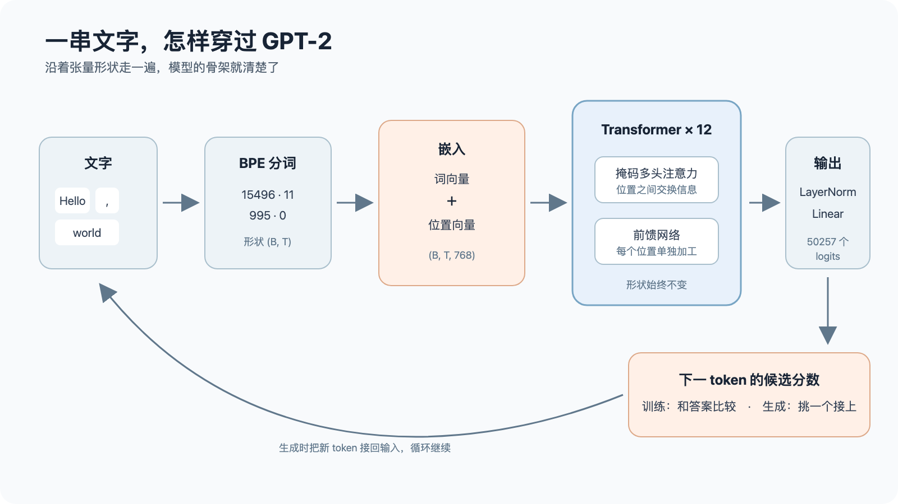
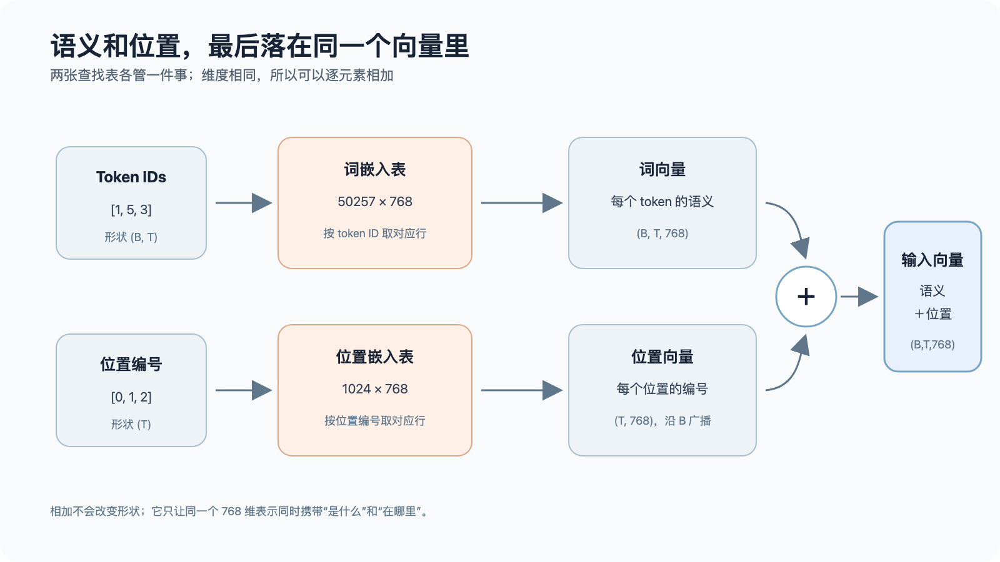
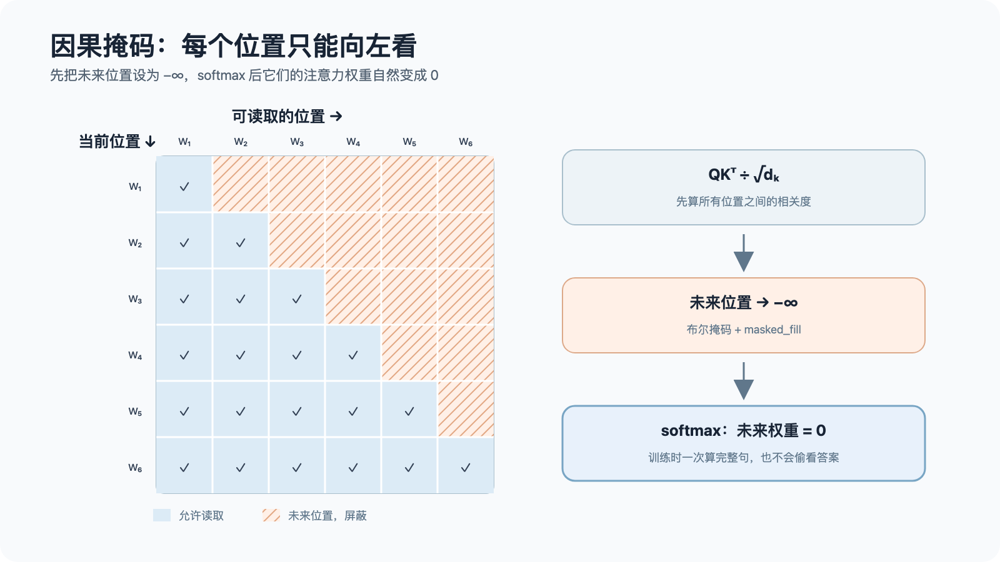
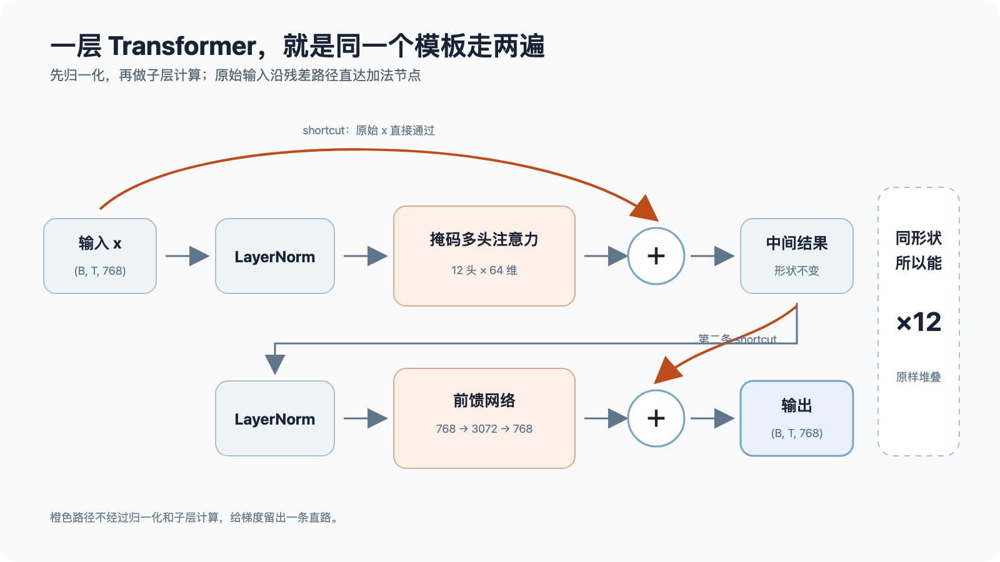
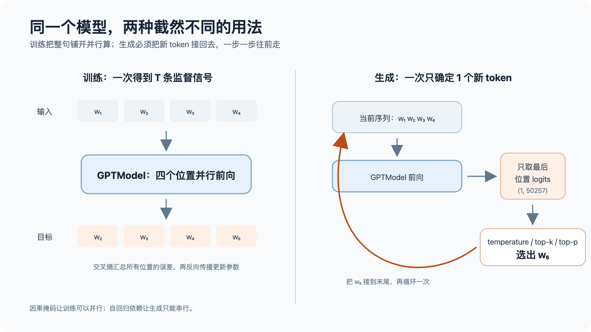

## 这篇文章想带你做什么

ChatGPT 出来之后，大家都知道大语言模型很强，但打开论文看到“1750 亿参数”“96 层 Transformer”这些数字，很容易就不想看了。

其实反过来想：GPT-2 small 有 1.24 亿参数，GPT-3 有 1750 亿，差了一千多倍，但两者的代码骨架几乎一模一样。把 GPT-2 small 的每一行代码看懂，你就看懂了这一类模型的全部结构。剩下的区别只是层数、维度、训练数据的多少。

所以这篇文章做一件很具体的事：用 PyTorch 的基础组件，从一张白纸开始，把一个 GPT-2 small 规格的模型完整写出来。写完之后它能训练，能生成文本，还能把 OpenAI 官方发布的预训练权重直接加载进来跑。

读这篇需要什么基础：会写 Python，知道神经网络大概是“输入乘权重、算损失、反向传播更新权重”这么个循环。矩阵乘法知道是怎么回事就够，不需要推导过反向传播，也不需要读过 Transformer 论文。文中每个数学步骤都会说清它在干什么、为什么要这么干。

不需要什么：不需要 GPU。搭模型、跑前向、加载预训练权重生成文本，这些在笔记本的 CPU 上都能做。只有真的要从零预训练才需要显卡，而那一步我们不做（后面会讲为什么不做，以及怎么绕过）。

### 先说清楚“大语言模型”在做什么

后面所有代码都是为一件事服务的，所以先把这件事说透。

大语言模型干的活，说白了就是猜下一个词。

给它`今天天气真`，它输出一个概率表：`好`占 62%、`热`占 15%、`冷`占 8%、`香蕉`占 0.0001%……然后从这张表里挑一个，比如挑中`好`。接着把`今天天气真好`整句重新喂回去，再猜下一个词。一个一个往后接，就成了一段话。

这就是全部。看着简单，但一个能把“下一个词”猜得足够准的模型，必须顺带学会一大堆东西：语法（`的`后面大概接名词）、事实（`法国的首都是`后面接`巴黎`）、推理（`3 加 5 等于`后面接`8`）。这些能力没人专门去教，全是在几千亿个词上反复猜下一个词的过程里自己长出来的。

“一个一个往后接、每次都把已生成的内容重新当输入”这种做法有个名字，叫自回归（autoregressive）。这个词后面会反复出现，含义就是刚才那句话。

我们要写的模型，说到底就是一个函数：

```
输入：一串词（转成数字）
输出：词表里每个词“适合接在后面”的分数
```

模型内部那 1.24 亿个参数，全都是为了把这个分数算得更准。

### 目标规格

我们要做的是 GPT-2 small，这是 OpenAI 2019 年发布的模型里最小的一档：

| 配置项 | 值 | 这个数字意味着什么 |
|:--|:--|:--|
| 词汇表大小 | 50257 | 模型认识 50257 个“词”（准确说是 token） |
| 上下文长度 | 1024 | 一次最多读 1024 个 token，超了就得截断 |
| 嵌入维度 | 768 | 每个 token 用一个 768 个数字的向量表示 |
| Transformer 层数 | 12 | 同样结构的模块叠 12 层 |
| 注意力头数 | 12 | 每层里有 12 个“注意力头”并行工作 |
| 参数总量 | 约 1.24 亿 | 需要训练的数字总共 1.24 亿个 |

这些数字现在看着是天书，读完这篇文章你会知道每一个是从哪来的、改了会怎样。

### 整篇文章的路线

我们按数据流动的顺序往前走，每一节都是下一节的输入：

```
文字  →  分词器  →  数字 ID
                      ↓
                  嵌入层（给每个 ID 配一个向量，再标上位置）
                      ↓
            ┌─── Transformer 层 × 12 ───┐
            │   注意力：词和词之间互相看  │
            │   前馈网络：每个词单独加工  │
            └───────────────────────────┘
                      ↓
                  输出层  →  每个词的分数
                      ↓
              训练（对答案、改参数）/ 生成（挑一个词、接上去）
```

前半部分把零件一个个做出来，然后拼成一层、摞成完整模型，后半部分讲怎么训练它、怎么让它生成文字、怎么把 OpenAI 的权重搬进来。



*图 1：先记住这条主线。后面的每一节，都只是在拆开其中一个方框。*

代码可以边读边跑。装两个包就够了：

```bash
pip install torch tiktoken
```

---

## 配置字典：把所有超参数集中管理

写模型之前先做件小事：把所有配置抽成一个字典。

```python
GPT_CONFIG_124M = {
    "vocab_size": 50257,      # 词汇表大小
    "context_length": 1024,   # 一次最多处理多少个 token
    "emb_dim": 768,           # 每个 token 的向量长度
    "num_heads": 12,          # 每层有几个注意力头
    "num_layers": 12,         # Transformer 层叠几层
    "dropout": 0.1,           # Dropout 比率
    "qkv_bias": False,        # Q/K/V 的线性层是否带偏置
}
```

好处很实际：想训个更小的模型试试水，把 `emb_dim` 改成 128、`num_layers` 改成 4 就行，模型代码一行都不用动。后面每个模块都接收这个 `cfg` 字典，从里面取自己要的值。

`dropout` 和 `qkv_bias` 这两项先放着，各自到了对应章节会详细讲。这里只提一句：这两个值在不同场景下要改，用哪个值取决于你要干什么：

| 场景 | dropout | qkv_bias |
|:--|:--|:--|
| 自己从零训练（数据量小，怕过拟合） | 0.1 | False |
| 加载 OpenAI 官方 GPT-2 权重 | 0.0 | **True** |

加载官方权重时 `qkv_bias` 必须是 `True`，因为 OpenAI 当年训练时带了偏置项，权重文件里就有这些数。你的模型结构里没有对应的位置，权重就搬不进去。这一点到“加载预训练权重”那节还会再强调。

---

## 把文字变成数字：分词器

### 为什么要分词

神经网络里流动的全是浮点数，它不认识字符串。所以第一步必须把`Hello, world!`变成一串数字。

最笨的办法是按字母切，每个字母一个编号。词表很小，但一句话会变得特别长，模型得从字母开始学拼写，太浪费。

另一个极端是按单词切，一个单词一个编号。句子短了，但英语单词几十万个，词表撑不住，而且遇到没见过的词（比如你新造的名字）就彻底不认识了。

实际用的是折中方案 BPE（Byte Pair Encoding，字节对编码）：常见的词整个作为一个 token，罕见的词拆成几个常见片段。

### 实际跑一下

GPT-2 用的 BPE 分词器在 `tiktoken` 这个库里，直接能用：

```python
import tiktoken

tokenizer = tiktoken.get_encoding("gpt2")

text = "Hello, world!"
token_ids = tokenizer.encode(text)
print(token_ids)                      # [15496, 11, 995, 0]

# 看看每个 ID 对应的到底是什么
print([tokenizer.decode([i]) for i in token_ids])
# ['Hello', ',', ' world', '!']

# 解码回文字
print(tokenizer.decode(token_ids))    # Hello, world!
```

注意两个细节：

**标点是独立的 token。** 逗号和感叹号各占一个 ID。

**空格跟在词的前面。** `' world'` 前面那个空格是 token 的一部分。这是 GPT-2 的设定，好处是解码时不用猜哪里该加空格，把所有 token 拼起来就是原文。

再看罕见词怎么处理：

```python
print([tokenizer.decode([i]) for i in tokenizer.encode("unbelievable")])
# ['un', 'bel', 'iev', 'able']

print([tokenizer.decode([i]) for i in tokenizer.encode("tokenization")])
# ['token', 'ization']
```

`unbelievable` 拆成了四块，`tokenization` 拆成了 `token` + `ization`。BPE 换来的就是这一点：任何字符串都能拆出来，永远不会遇到“不认识”的输入。 极端情况下退化成按字节切，但至少不会失败。

顺便说一句，GPT-2 的词表是拿英文语料训的，中文在它眼里是一堆字节碎片：

```python
print(tokenizer.encode("章鱼"))   # [44165, 254, 165, 109, 120]
```

两个汉字占了 5 个 token，而且每个 token 单独解码都是乱码，必须拼起来才能还原。所以拿 GPT-2 处理中文效率很低，这也是后来的中文模型都要重训分词器的原因。

词表一共 50257 个 token：

```python
print(tokenizer.n_vocab)   # 50257
```

这个数字就是配置里的 `vocab_size`，也是模型最后输出层的宽度。每猜一次下一个词，都要给这 50257 个候选各打一个分。

---

## 嵌入层：给每个 token 配一个向量

分词之后我们拿到的是 `[15496, 11, 995, 0]` 这样的整数。但整数不能直接送进网络，原因很直白：ID 之间的数值关系是假的。 `995`（world）和 `996` 不会因为编号挨着就意思相近，编号只是查字典的行号。

所以要把每个 ID 换成一个向量，让“意思”有地方存。

### 词嵌入

PyTorch 的 `nn.Embedding` 就是干这个的，说白了是一张可训练的查找表：

```python
import torch
import torch.nn as nn

embedding_layer = nn.Embedding(num_embeddings=50257, embedding_dim=768)

input_ids = torch.tensor([[15496, 11, 995, 0]])   # (1, 4)
embedded = embedding_layer(input_ids)             # (1, 4, 768)
print(embedded.shape)                             # torch.Size([1, 4, 768])
```

内部就是一个 `(50257, 768)` 的矩阵。传进来 ID `995`，它取出第 995 行那 768 个数字，别的什么都没做。

这张表一开始全是随机数，所以初始状态下`猫`和`狗`的向量毫无关系。但这张表是参数，会被训练更新。训到后来，经常出现在类似上下文里的词，向量会慢慢靠近。这不是谁设计的，是“猜下一个词”这个目标逼出来的：既然`猫`和`狗`后面能接的词差不多，那把它们的向量放近一点，预测起来更省力。

这一层的参数量是 `50257 × 768 = 38,597,376`，占全模型的三分之一，是单个最大的一块。

### 位置嵌入

现在有个麻烦。

后面要讲的注意力机制，算的是“每个词和其他词的相关度”。这个计算里完全没有位置的概念。在它眼里，`猫追狗`和`狗追猫`是同一堆词，因为参与运算的就是那几个向量，谁在前谁在后不影响结果。

但这两句话意思是反的。所以位置信息必须额外补进去。

GPT 的做法直接得有点粗暴：再搞一张查找表，专门存位置。 第 0 个位置一个向量，第 1 个位置一个向量，一直到第 1023 个。然后把位置向量加到词向量上。

```python
context_length, emb_dim = 1024, 768
pos_embedding = nn.Embedding(context_length, emb_dim)

seq_len = 4
positions = torch.arange(seq_len)        # tensor([0, 1, 2, 3])
pos_embeds = pos_embedding(positions)    # (4, 768)
print(pos_embeds.shape)                  # torch.Size([4, 768])
```

“相加”这个操作第一次见会觉得奇怪：语义和位置是两种完全不同的信息，加在一起不就混了吗？

确实混在一起了，但 768 维空间足够大，模型有能力在训练中学会把两种信息分开用。这是实践中验证过可行的做法，而且比拼接省参数（拼接的话维度会翻倍，后面所有层都得跟着变宽）。

这张表的参数量是 `1024 × 768 = 786,432`，比词嵌入小得多。

这张表也解释了上下文长度为什么是硬上限：表里只有 1024 行，第 1024 个位置压根没有对应的向量，模型处理不了更长的序列。

### 合起来看一个完整例子

用小数字演示。假设 `vocab_size=10`、`emb_dim=4`、`context_length=6`，输入 token IDs 是 `[1, 5, 3]`：

| Token ID | 词向量 | 位置 | 位置向量 | 相加结果 |
|:--|:--|:--|:--|:--|
| 1 | [0.2, 0.5, 0.1, 0.8] | 0 | [0.0, 0.1, 0.0, 0.1] | [0.2, 0.6, 0.1, 0.9] |
| 5 | [0.9, 0.3, 0.7, 0.4] | 1 | [0.2, 0.0, 0.1, 0.0] | [1.1, 0.3, 0.8, 0.4] |
| 3 | [0.4, 0.6, 0.5, 0.2] | 2 | [0.1, 0.2, 0.0, 0.1] | [0.5, 0.8, 0.5, 0.3] |

形状变化：`(1,3)` 的 ID → 词嵌入 `(1,3,4)` → 加上广播后的位置嵌入 `(3,4)` → 还是 `(1,3,4)`。

注意位置向量只有 `(3,4)`，没有 batch 维度。PyTorch 的广播机制会自动把它复制到每个样本上，因为同一个 batch 里所有样本的位置编号都一样，第 0 个位置就是第 0 个位置，跟内容无关。



*图 2：两张表分别回答“是什么”和“在哪里”，相加后仍然是 768 维。*

### 写进模型里

嵌入这部分在完整模型里长这样（后面会补齐其余部分）：

```python
class GPTModel(nn.Module):
    def __init__(self, cfg):
        super().__init__()
        self.tok_embed = nn.Embedding(cfg["vocab_size"], cfg["emb_dim"])
        self.pos_embed = nn.Embedding(cfg["context_length"], cfg["emb_dim"])
        self.dropout_emb = nn.Dropout(cfg["dropout"])

    def forward(self, x):
        # x: (batch, seq_len)，内容是 token ID
        batch_size, seq_len = x.shape

        tok_embeds = self.tok_embed(x)                              # (batch, seq_len, emb_dim)
        positions = torch.arange(seq_len, device=x.device)          # (seq_len,)
        pos_embeds = self.pos_embed(positions)                      # (seq_len, emb_dim)

        x = tok_embeds + pos_embeds                                 # 广播相加
        x = self.dropout_emb(x)
        return x
```

`device=x.device` 这句别漏掉。`torch.arange` 默认在 CPU 上建张量，如果模型在 GPU 上，两个不同设备的张量相加会直接报错。

顺便解释一下 `Dropout`：训练时随机把一部分数值置成 0（比率 0.1 就是随机扔掉 10%），逼模型不要过度依赖某几个特定神经元，是防过拟合的常用手段。它只在训练时生效，`model.eval()` 之后自动关闭。注意它是随机失活。下一节要讲的因果掩码是另一回事，两者别混。

到这里，离散的 token ID 已经变成了带语义、带位置的连续向量。下一节讲注意力，模型里最难也最要紧的一块。

---

## 掩码多头注意力

这是 Transformer 的心脏，也是整篇文章唯一需要慢慢读的一节。名字里三个词分别对应三件事，我们一件一件拆。

### 注意力要解决什么问题

看这句话：

> 那只动物没有过马路，因为它太累了。

`它`指的是动物。你能判断出来，是因为你读`它`的时候会回头看前面的词，发现`动物`跟它关系最近。

注意力机制就是把这个动作写成了数学：**处理每个词的时候，回头看一遍前面所有词，算出跟每个词的相关度，然后按相关度加权，把前面的信息汇总过来。**

`它`这个位置的新向量 ≈ 0.6 × 动物的向量 + 0.2 × 累的向量 + 0.1 × 马路的向量 + ……

这样一来，`它`的向量里就带上了`动物`的信息。这就是注意力在做的事，让每个词的表示融入上下文。

### Q、K、V：三个角色

怎么算相关度？Transformer 的做法是，给每个词算出三个不同的向量：

| 名字 | 全称 | 打个比方 | 用来干什么 |
|:--|:--|:--|:--|
| Q | Query（查询） | 我要找什么 | 当前词发出的“检索请求” |
| K | Key（键） | 我是什么 | 每个词挂出的“标签” |
| V | Value（值） | 我能提供什么 | 每个词实际交出的内容 |

想象在图书馆找书：你心里的需求是 Q，每本书的标签是 K，拿 Q 去跟所有 K 比对，看哪本最匹配；匹配上了，真正拿走的是书里的内容，也就是 V。

一个词为什么要分成三个向量？因为它在三种场合扮演不同角色：作为“提问方”需要什么，和作为“被查方”宣称自己是什么，这两件事不一样。拆成三个向量，模型才能分别学。

三个向量都是用同一个输入向量乘不同的权重矩阵得来的：

```python
d_in, d_out = 768, 768
W_query = nn.Linear(d_in, d_out, bias=False)
W_key   = nn.Linear(d_in, d_out, bias=False)
W_value = nn.Linear(d_in, d_out, bias=False)

x = torch.randn(1, 4, 768)        # 4 个词的向量
Q, K, V = W_query(x), W_key(x), W_value(x)   # 各自 (1, 4, 768)
```

这三个矩阵是训练出来的，模型自己学怎么提问、怎么挂标签、交出什么内容，才最有利于猜下一个词。

### 缩放点积注意力

有了 Q、K、V，相关度的计算就是三步。

**第一步，Q 和 K 做点积。** 两个向量点积越大表示方向越接近，正好可以当相关度：

```python
attn_scores = Q @ K.transpose(-2, -1)   # (1, 4, 4)
```

结果是个 4×4 的矩阵，第 `i` 行第 `j` 列 = 第 `i` 个词对第 `j` 个词的相关度分数。

**第二步，除以 √d_k 做缩放。** `d_k` 是每个向量的长度。为什么要除？因为向量越长，点积的结果就越容易变成很大的数。而后面要过 softmax，输入数值一大，softmax 的输出会变得极端（一个位置接近 1，其余全接近 0），这时候梯度几乎为 0，参数就更新不动了。除以 √d_k 把数值压回合理范围。

**第三步，softmax 归一化。** 把每一行的分数变成加起来等于 1 的权重：

```python
attn_weights = torch.softmax(attn_scores / K.shape[-1]**0.5, dim=-1)
context = attn_weights @ V
```

`dim=-1` 表示对每一行做归一化，因为每一行代表“一个词对所有词的关注分配”，这个分配加起来应该是 1。

最后 `attn_weights @ V` 就是加权求和：按算出来的权重把各个词的 V 混合起来。

### 因果掩码：不许偷看后面

现在要加一个关键限制。

我们训练时的做法是，给模型一整句话 `[w1, w2, w3, w4]`，让它在每个位置都预测下一个词：看 `w1` 猜 `w2`，看 `w1 w2` 猜 `w3`，以此类推。这样一句话能同时产生 4 条训练信号，效率很高。

但刚才那个注意力有个漏洞：算 `w1` 位置的时候，它能看到 `w2`、`w3`、`w4`。而 `w1` 位置的任务恰恰是预测 `w2`，答案就摆在眼前。

这种情况下模型学到的会是“把后面那个词抄过来”，而不是真正的语言规律。训练时 loss 降得很漂亮，一旦真正用它生成文本（这时后面的词还不存在），立刻就废了。

解决办法叫因果掩码（causal mask）：算注意力分数的时候，把所有“未来位置”的分数强制设成负无穷。softmax 遇到负无穷会输出 0，这些位置的权重就彻底归零。

4 个词的时候，掩码后的分数矩阵是这样（实际跑出来的数）：

```
        看w1     看w2     看w3     看w4
w1 →  [ 0.44,   -inf,   -inf,   -inf]     只能看自己
w2 →  [-0.23,   0.04,   -inf,   -inf]     能看 w1、自己
w3 →  [ 0.12,  -0.21,  -0.20,   -inf]     能看 w1、w2、自己
w4 →  [-0.10,   0.34,   0.66,   0.01]     全都能看
```

过完 softmax：

```
w1 →  [1.000, 0.000, 0.000, 0.000]
w2 →  [0.432, 0.568, 0.000, 0.000]
w3 →  [0.410, 0.294, 0.297, 0.000]
w4 →  [0.172, 0.268, 0.367, 0.193]
```

每行加起来都是 1，上三角全是 0。这个下三角形状，就是 GPT“只看左边”的全部秘密。



*图 3：蓝色区域可以参与注意力计算；橙色区域会在 softmax 后变成 0。*

代码上，掩码是一个布尔矩阵：

```python
mask = torch.triu(torch.ones(4, 4, dtype=torch.bool), diagonal=1)
print(mask)
# tensor([[False,  True,  True,  True],
#         [False, False,  True,  True],
#         [False, False, False,  True],
#         [False, False, False, False]])
```

`torch.triu` 取上三角，`diagonal=1` 表示从对角线往上一格开始（对角线自己不算，因为每个词可以看自己）。`True` 的位置就是要屏蔽掉的。

用的时候配合 `masked_fill`：

```python
attn_scores = attn_scores.masked_fill(mask, -torch.inf)
```

> 这里有个常见的坑，值得单独说。 不少教程里会看到这种写法：
>
> ```python
> mask = torch.triu(torch.ones(4, 4), diagonal=1) * float('-inf')   # 错的
> ```
>
> 看着挺聪明：上三角是 1，乘 -inf 得 -inf；下三角是 0，乘 -inf 得 0。
>
> 但 IEEE 754 浮点标准里，`0 × inf` 的结果是 NaN，不是 0。实际跑一下：
>
> ```python
> print(torch.triu(torch.ones(4, 4), diagonal=1) * float('-inf'))
> # tensor([[nan, -inf, -inf, -inf],
> #         [nan, nan, -inf, -inf],
> #         [nan, nan, nan, -inf],
> #         [nan, nan, nan, nan]])
> ```
>
> 下三角全是 NaN。这个掩码加到分数上，整个矩阵会被 NaN 污染，loss 变成 NaN，模型完全训不动，而且报错信息看不出问题在哪。
>
> 用布尔掩码配 `masked_fill`，别用乘法造掩码。

### 多头：同时从多个角度看

最后一个概念。

前面讲的注意力，每个词对其他词只有一套权重。但词和词的关系有很多种：语法上的主谓关系、语义上的指代关系、位置上的邻近关系……一套权重表达不完。

多头注意力的做法是：把 768 维切成 12 份，每份 64 维，各自独立算一遍注意力，最后再拼回来。

```
768 维  ──切开──→  12 个头，每个 64 维
                    ↓  每个头独立算注意力（各自一套权重）
                  12 个 64 维的结果
                    ↓  拼接
                  768 维  ──→  再过一个线性层混合
```

每个头只有 64 维，能关注的东西有限，就自然分化了：训练完之后去看真实模型，能发现有的头专门盯着相邻词，有的头专门找句子里的动词，有的头负责长距离的指代。

关键在于切开不增加计算量。12 个 64 维的注意力，总计算量和 1 个 768 维的差不多，但表达能力丰富了很多。这是个几乎白捡的收益，所以所有 Transformer 都用多头。

切分靠 `view` 和 `transpose` 完成：

```python
batch, num_tokens, num_heads, head_dim = 1, 4, 12, 64

Q = torch.randn(batch, num_tokens, 768)
Q = Q.view(batch, num_tokens, num_heads, head_dim)   # (1, 4, 12, 64) 拆开最后一维
Q = Q.transpose(1, 2)                                # (1, 12, 4, 64) 把头数换到前面
```

`transpose(1, 2)` 这一步是为了让后面的矩阵乘法作用在正确的维度上。换过之后，张量可以理解成“12 个独立的 (4, 64) 注意力问题”，PyTorch 的批量矩阵乘法会自动并行处理。

### 完整实现

三个概念都讲完了，拼成一个模块：

```python
import torch
import torch.nn as nn


class MultiHeadAttention(nn.Module):
    def __init__(self, d_in, d_out, num_heads, context_length, dropout, qkv_bias=False):
        """
        d_in:            输入维度（GPT 中即 emb_dim）
        d_out:           输出维度（GPT 中等于 d_in）
        num_heads:       注意力头数，必须能整除 d_out
        context_length:  支持的最大序列长度，用来预先生成掩码
        dropout:         作用在注意力权重上的 dropout 比率
        qkv_bias:        Q/K/V 线性层是否带偏置（加载 OpenAI 权重时需为 True）
        """
        super().__init__()
        assert d_out % num_heads == 0, "d_out 必须能被 num_heads 整除"

        self.num_heads = num_heads
        self.d_out = d_out
        self.head_dim = d_out // num_heads      # 每个头的维度，768 // 12 = 64

        self.W_query = nn.Linear(d_in, d_out, bias=qkv_bias)
        self.W_key   = nn.Linear(d_in, d_out, bias=qkv_bias)
        self.W_value = nn.Linear(d_in, d_out, bias=qkv_bias)

        self.out_proj = nn.Linear(d_out, d_out)  # 多头拼接后的混合层
        self.dropout = nn.Dropout(dropout)

        # 预先按最大长度生成掩码，注册为 buffer：
        # 随模型一起 .to(device)，但不是参数、不参与训练
        self.register_buffer(
            "mask",
            torch.triu(
                torch.ones(context_length, context_length, dtype=torch.bool),
                diagonal=1,
            ),
        )

    def forward(self, x):
        """x: (batch, num_tokens, d_in) → 返回 (batch, num_tokens, d_out)"""
        batch_size, num_tokens, _ = x.shape

        # 1. 线性投影得到 Q、K、V
        queries = self.W_query(x)        # (batch, num_tokens, d_out)
        keys    = self.W_key(x)
        values  = self.W_value(x)

        # 2. 拆成多头：(batch, num_heads, num_tokens, head_dim)
        queries = queries.view(batch_size, num_tokens, self.num_heads, self.head_dim).transpose(1, 2)
        keys    = keys.view(batch_size, num_tokens, self.num_heads, self.head_dim).transpose(1, 2)
        values  = values.view(batch_size, num_tokens, self.num_heads, self.head_dim).transpose(1, 2)

        # 3. 点积得到分数，并做缩放
        # (batch, num_heads, num_tokens, num_tokens)
        attn_scores = queries @ keys.transpose(-2, -1)
        attn_scores = attn_scores / self.head_dim ** 0.5

        # 4. 因果掩码：截取到实际长度，未来位置填 -inf
        attn_scores = attn_scores.masked_fill(
            self.mask[:num_tokens, :num_tokens], -torch.inf
        )

        # 5. softmax 归一化 + dropout
        attn_weights = torch.softmax(attn_scores, dim=-1)
        attn_weights = self.dropout(attn_weights)

        # 6. 加权聚合 V
        context = attn_weights @ values   # (batch, num_heads, num_tokens, head_dim)

        # 7. 合并多头，还原成 (batch, num_tokens, d_out)
        context = context.transpose(1, 2).contiguous()
        context = context.view(batch_size, num_tokens, self.d_out)

        # 8. 输出投影，让各头的信息混合
        return self.out_proj(context)
```

几个实现细节值得说明：

**`register_buffer` 而不是普通属性。** 注册成 buffer 的张量会跟着 `model.to("cuda")` 一起搬到 GPU，也会进 `state_dict`，但不会被优化器当成参数去更新。掩码是固定的常量，正好符合这个定位。

**掩码按 `context_length` 预生成，前向时切片。** 每次前向都重新造一个掩码是纯浪费，预生成一次，用 `[:num_tokens, :num_tokens]` 取需要的部分就行。

**缩放放在掩码之前。** 原理上 `-inf / 常数` 还是 `-inf`，先掩码再缩放结果一样。但先缩放更符合公式的书写顺序，读代码的人不用停下来想“这样会不会有问题”。

**`masked_fill` 而不是 `masked_fill_`。** 带下划线的是原地操作，会直接改掉 `attn_scores`。原地修改在某些计算图结构下会让 autograd 报错（它需要原始值来算梯度），用非原地版本更稳妥，代价只是多一份内存。

**`contiguous()` 是必需的。** `transpose` 只改变了张量的读取方式，内存里的实际排布没动。紧接着调用 `view` 要求内存连续，所以中间必须插一个 `contiguous()` 真正重排内存，否则会报错。

跑一下确认形状对得上：

```python
attn = MultiHeadAttention(
    d_in=768, d_out=768, num_heads=12,
    context_length=1024, dropout=0.1, qkv_bias=False,
)

x = torch.randn(2, 128, 768)   # batch=2, 128 个 token
out = attn(x)
print(out.shape)               # torch.Size([2, 128, 768])
```

进来 `(2, 128, 768)`，出去还是 `(2, 128, 768)`。 形状完全不变，但每个位置的向量已经不再只代表自己那个词，而是融合了它左边所有词的信息。形状不变这点很重要，正因如此这个模块才能一层层叠起来。

这一层的参数量：Q、K、V、输出投影四个 `768×768` 的矩阵，`4 × 768 × 768 = 2,359,296`。

---

## 层归一化：让深层网络训得动

注意力讲完了，接下来几个零件都简单一些，但缺一个都不行。

### 深层网络为什么难训

把 12 层堆起来会遇到一个现实问题：数值会漂。

第一层输出的数值范围可能在 -2 到 2 之间，经过第二层变成 -8 到 8，第三层变成 -30 到 30……也可能反过来，一层层缩到接近 0。每层的权重都在乘，误差会累积放大。

数值漂掉之后，反向传播算出的梯度也跟着失控：要么大到参数一步跳出合理范围（梯度爆炸），要么小到参数基本不动（梯度消失）。两种情况模型都学不到东西。

归一化就是在每层之间加一道校准：把数值拉回“均值 0、标准差 1”的标准分布，让下一层拿到的输入总是在一个稳定的范围里。

### 在哪个维度上归一化

归一化有好几种，区别就在于“对哪一堆数字算均值”。

Transformer 用的是层归一化（LayerNorm）：对每个 token 的向量，在它自己那 768 个数字内部做归一化。

具体点：一个 `(2, 128, 768)` 的张量里有 `2 × 128 = 256` 个 token，LayerNorm 会独立处理 256 次，每次只看一个 token 的 768 个数字，算出这 768 个数的均值和方差，然后把它们标准化。token 之间互不干扰。

为什么这么选，对比一下另一个常见选项就清楚了。批归一化（BatchNorm）是在 batch 维度上算均值，也就是把所有样本同一个位置的数值凑在一起算。这在图像任务里很好用，但在语言模型里有两个硬伤：一是句子长度不一样，短句子补的 padding 会污染统计量；二是推理时经常只输入一个句子，batch 里只有一个样本，算不出有意义的均值。

LayerNorm 完全避开了这些问题。它只看单个 token 自己，跟 batch 多大、句子多长都没关系。

### 看看效果

```python
import torch

x = torch.tensor([[[6.31, 4.33, 3.31, 6.11, 0.74, 2.17]]])   # 一个 token，6 维
print(x.mean().item(), x.std(unbiased=False).item())
# 3.828  2.006

mean = x.mean(dim=-1, keepdim=True)
var = x.var(dim=-1, unbiased=False, keepdim=True)
y = (x - mean) / torch.sqrt(var + 1e-5)

print(y.round(decimals=2))
# tensor([[[ 1.24,  0.25, -0.26,  1.14, -1.54, -0.83]]])
print(y.mean().item(), y.std(unbiased=False).item())
# -0.0  1.0
```

原来均值 3.83、标准差 2.01，处理完变成均值 0、标准差 1。数值的相对大小关系完全保留（原来第 1 个最大，现在第 1 个还是最大），只是整体平移缩放到了标准范围。

### 实现

```python
class LayerNorm(nn.Module):
    def __init__(self, cfg):
        super().__init__()
        self.eps = 1e-5
        # 可训练的缩放和平移，初始化成“什么都不做”
        self.scale = nn.Parameter(torch.ones(cfg["emb_dim"]))
        self.shift = nn.Parameter(torch.zeros(cfg["emb_dim"]))

    def forward(self, x):
        mean = x.mean(dim=-1, keepdim=True)                  # (batch, seq_len, 1)
        var = x.var(dim=-1, unbiased=False, keepdim=True)    # (batch, seq_len, 1)
        norm = (x - mean) / torch.sqrt(var + self.eps)
        return self.scale * norm + self.shift
```

逐项解释：

**`dim=-1`** 指最后一个维度，也就是 `emb_dim`（768）那一维。这就是“在特征维度上归一化”的落地写法。

**`keepdim=True`** 让结果保持 `(batch, seq_len, 1)` 而不是压成 `(batch, seq_len)`。留着那个长度为 1 的维度，减法才能正确广播回 768 维。

**`unbiased=False`** 用的是有偏方差，分母是 N 而不是 N-1。LayerNorm 原始定义就是有偏估计，而且这里做的是数值缩放，不涉及统计推断，用哪个分母对效果没影响，但要跟标准实现保持一致（否则加载别人的权重时会有微小偏差）。

**`self.eps = 1e-5`** 防止方差为 0 时除零。一个 token 的 768 个数字全都相同时方差就是 0，虽然罕见但真的会发生。

**`scale` 和 `shift` 为什么要有。** 强行把每层输出都压成标准正态分布，其实限制了模型的表达能力。万一某一层最合适的输出分布就该是“均值 2、标准差 5”呢？所以归一化之后再加一个可训练的缩放和平移，让模型自己决定要不要偏离标准分布。初始值是 `scale=1, shift=0`，相当于“先不动，需要的话你自己学”。

这两个参数每个 768 维，一个 LayerNorm 共 1536 个参数。整个模型有 25 个 LayerNorm（12 层各 2 个，加最后 1 个），总共也才 38400 个参数，可以忽略。

---

## GELU 激活函数

### 为什么需要激活函数

假设整个网络只有线性层，没有激活函数。那么两层叠起来是 `W2 @ (W1 @ x) = (W2 @ W1) @ x`，等价于一个单层线性变换。叠一百层还是一个线性变换，白叠。

激活函数的作用就是在层之间插入一个非线性，让叠层真正带来表达能力的提升。

### GELU 和 ReLU 的区别

最常见的激活函数是 ReLU：负数全变 0，正数原样输出。简单有效。

GPT 用的是 GELU（Gaussian Error Linear Unit）。看实际取值就明白区别在哪：

| 输入 x | -3 | -2 | -1 | -0.5 | 0 | 0.5 | 1 | 2 | 3 |
|:--|:--|:--|:--|:--|:--|:--|:--|:--|:--|
| ReLU | 0 | 0 | 0 | 0 | 0 | 0.5 | 1 | 2 | 3 |
| GELU | -0.004 | -0.045 | -0.159 | -0.154 | 0 | 0.346 | 0.841 | 1.955 | 2.996 |

三个差别：

**负数区间 GELU 不是死的零。** 输入 -1 时 ReLU 输出 0，GELU 输出 -0.159。这一点很关键：ReLU 在负半轴梯度恒为 0，一个神经元的输入长期为负，它的梯度就一直是 0，参数永远不更新，相当于死掉了（这叫 dying ReLU 问题）。GELU 保留了小幅负值，梯度不为零，神经元还有救回来的机会。

**GELU 在 0 附近是平滑的。** ReLU 在 0 处有个折角，导数从 0 突变到 1。GELU 处处可导，过渡连续，优化起来更稳。

**正数区间两者越来越接近。** 输入 3 的时候 GELU 输出 2.996，几乎就是 ReLU。差别主要集中在 0 附近。

形状上可以这样理解：GELU 是把 ReLU 那个折角“磨圆”了，并且在负半轴留了一个浅浅的下凹，最低点在 x ≈ -0.75 附近（约 -0.17），然后再回升到 0。

### 实现

GELU 的精确定义要用高斯分布的累积分布函数，计算比较慢，实践中用 tanh 近似：

```python
class GELU(nn.Module):
    def __init__(self):
        super().__init__()
        # sqrt(2/π) ≈ 0.7979，常量，注册成 buffer 不参与训练
        self.register_buffer("constant", torch.sqrt(torch.tensor(2.0 / torch.pi)))

    def forward(self, x):
        return 0.5 * x * (
            1 + torch.tanh(self.constant * (x + 0.044715 * torch.pow(x, 3)))
        )
```

公式里 `0.044715` 是拟合出来的系数，让这个近似式尽可能贴近精确的 GELU。实测下来近似误差在 0.0005 以内，完全够用。

顺带说明：`torch.pi` 是 PyTorch 提供的圆周率常量，等于 `math.pi`。

> 实际写项目时，直接用 `nn.GELU(approximate='tanh')` 就行。 PyTorch 内置的版本用 C++ 实现，比手写的 Python 版快。上面手写一遍只是为了看清公式里在算什么。
>
> 注意 `approximate` 这个参数是 PyTorch 1.12 才加的。更早的版本 `nn.GELU()` 只有精确实现（用 erf 函数算），和 tanh 近似有约 0.0004 的差异。这个差异小到不影响训练效果，但如果你在复现别人的结果、追求数值完全一致，就要注意用的是哪一个。手写版和 `nn.GELU(approximate='tanh')` 的差异在 1e-8 级别，可以认为完全相同。

---

## 前馈网络：每个位置单独加工

### 它补上了注意力缺的那块

到这里模型里有两种处理方式，分工很清楚：

注意力管“横向”：让不同位置的词交换信息，学词和词之间的关系。

前馈网络管“纵向”：每个位置单独处理自己的向量，位置之间不交流，做的是深度特征加工。

为什么需要后者？注意力做的是加权平均，把别人的 V 按权重混起来。混合是线性的，即使叠很多层，表达能力也受限。要拟合复杂的模式，得有真正的非线性变换，这就是前馈网络的活。

打个比方：注意力是开会，大家互相通气；前馈网络是散会后各自回工位干活。两件事交替进行，层层递进。

### 结构：先胖后瘦

```python
class FeedForward(nn.Module):
    def __init__(self, cfg):
        super().__init__()
        self.layers = nn.Sequential(
            nn.Linear(cfg["emb_dim"], 4 * cfg["emb_dim"]),   # 768 → 3072，扩张
            GELU(),                                          # 非线性
            nn.Linear(4 * cfg["emb_dim"], cfg["emb_dim"]),   # 3072 → 768，压缩
        )

    def forward(self, x):
        return self.layers(x)
```

形状变化（以 `emb_dim=768` 为例）：

```
(batch, seq_len, 768)
    ↓ Linear(768 → 3072)
(batch, seq_len, 3072)
    ↓ GELU（形状不变）
(batch, seq_len, 3072)
    ↓ Linear(3072 → 768)
(batch, seq_len, 768)
```

先扩到 4 倍再压回来，这个“中间宽两头窄”的形状是故意的。 直觉上，在更高维的空间里，原本纠缠在一起的特征更容易被分开处理。768 维里挤在一块的信息，摊到 3072 维就有了活动空间，做完非线性变换再压缩回来。

4 倍这个比例来自原始 Transformer 论文，后续大量模型沿用（Llama 等新模型改成了约 2.7 倍配合三个矩阵的 SwiGLU 结构，但思路一样）。它是个经验值，不是推导出来的。

**注意 `nn.Linear` 作用在最后一维。** 输入 `(batch, seq_len, 768)` 时，它对每个位置的 768 维向量独立做同样的变换，位置之间毫无交互。这就是“位置独立”的含义，也是它和注意力的根本区别。

### 参数量：它才是模型的大头

一层前馈网络的参数：

- 第一个线性层：`768 × 3072 = 2,359,296`
- 第二个线性层：`3072 × 768 = 2,359,296`
- 合计 `4,718,592`（偏置项另算 3840 个）

对比同一层里的注意力模块（Q、K、V、输出投影四个 768×768 矩阵）是 `2,359,296`。

前馈网络的参数量是注意力的整两倍。 12 层加起来，前馈网络约 5660 万参数，注意力约 2830 万。模型存知识的地方主要是前馈网络，不是注意力。这一点和很多人的直觉相反。

---

## 残差连接：给梯度留一条直路

### 它解决的问题

还是深层网络的老问题。反向传播算梯度用的是链式法则，也就是一路乘下去：

```
第 1 层的梯度 = 第 12 层的梯度 × 第 11 层的导数 × … × 第 2 层的导数
```

12 个数相乘。如果每个导数都是 0.5，乘完是 `0.5^11 ≈ 0.0005`，第 1 层几乎收不到信号。GPT-3 有 96 层，情况更糟。

残差连接（residual connection，也叫跳跃连接）的做法是，让每个子层的输出加上它自己的输入：

```
输出 = F(输入) + 输入
```

`F` 是这个子层做的变换（注意力或前馈网络）。就加一下，看着微不足道，但求导之后：

```
d(输出)/d(输入) = F'(输入) + 1
```

多了一个 1。 这意味着即使 `F'` 缩到接近 0，梯度里始终还有一条乘 1 的通路。梯度可以沿着这些`+1`从最后一层几乎无损地传回第一层。

前向方向也有好处：低层的信息可以直接越过中间所有变换传到高层，不会被层层加工磨掉。对语言模型来说，开头几个 token 的信息要能撑到最深的层，才可能建立长距离依赖。

这个设计 2015 年由何恺明等人在 ResNet 里提出，把 CNN 从几十层推到上百层。Transformer 直接继承了它。

### 怎么和层归一化搭配

每个子层的完整写法是三件套：归一化 → 子层 → 加回输入。

```python
shortcut = x                 # 先存一份输入
x = self.layernorm1(x)       # 归一化
x = self.attn(x)             # 子层变换
x = self.dropout(x)          # 正则化
x = x + shortcut             # 加回去
```

`shortcut` 必须在归一化之前存。这样残差路径上就是原封不动的输入，梯度回传时那条通路不经过任何变换。

### Pre-Norm 和 Post-Norm

归一化放在子层前还是子层后，是有讲究的：

```python
# Pre-Norm（GPT-2 和现在所有主流 LLM 的选择）
x = x + Attention(LayerNorm(x))
x = x + FFN(LayerNorm(x))

# Post-Norm（2017 年原始 Transformer 论文的做法）
x = LayerNorm(x + Attention(x))
x = LayerNorm(x + FFN(x))
```

差别在于残差那条路上有没有归一化层。

Pre-Norm 的残差路径是干净的：`x` 一路直通，中间不经过任何东西。梯度回传时这条路完全无损。

Post-Norm 的 `x` 要穿过 LayerNorm 才能到下一层，归一化会对梯度做缩放，多层累积下来信号衰减明显。原始 Transformer 用 Post-Norm，必须配合精心设计的学习率 warmup 才能训起来，不然训练初期就崩。

Pre-Norm 对超参数宽容得多，这是它成为现代标准的原因。代价是模型最终输出没有经过归一化，所以要在所有层之后额外补一个 LayerNorm，后面完整模型里的 `final_layernorm` 就是干这个的。


---

## 把零件拼成一层：TransformerBlock

所有零件都做好了，现在组装。一个 Transformer 层里就两个子层，每个子层都套上归一化、dropout 和残差：

```python
class TransformerBlock(nn.Module):
    def __init__(self, cfg):
        super().__init__()
        self.layernorm1 = LayerNorm(cfg)      # 注意力前的归一化
        self.layernorm2 = LayerNorm(cfg)      # 前馈网络前的归一化
        self.attn = MultiHeadAttention(
            d_in=cfg["emb_dim"],
            d_out=cfg["emb_dim"],
            num_heads=cfg["num_heads"],
            context_length=cfg["context_length"],
            dropout=cfg["dropout"],
            qkv_bias=cfg["qkv_bias"],
        )
        self.ff = FeedForward(cfg)
        self.dropout = nn.Dropout(cfg["dropout"])

    def forward(self, x):
        # 子层一：注意力
        shortcut = x
        x = self.layernorm1(x)
        x = self.attn(x)
        x = self.dropout(x)
        x = x + shortcut

        # 子层二：前馈网络
        shortcut = x
        x = self.layernorm2(x)
        x = self.ff(x)
        x = self.dropout(x)
        x = x + shortcut

        return x
```

两个子层的写法完全是同一个模板，只是中间那一步换成了不同的模块。数据走一遍是这样（`batch=2`、`seq_len=1024`、`emb_dim=768`）：

```
输入 (2, 1024, 768)
  │
  ├── 存 shortcut
  ├── LayerNorm1            → (2, 1024, 768)
  ├── 掩码多头注意力          → (2, 1024, 768)   ← 位置之间交换信息
  ├── Dropout
  └── + shortcut            → (2, 1024, 768)
  │
  ├── 存 shortcut
  ├── LayerNorm2            → (2, 1024, 768)
  ├── FeedForward
  │     Linear(768→3072) → GELU → Linear(3072→768)
  │                       → (2, 1024, 768)      ← 每个位置单独加工
  ├── Dropout
  └── + shortcut            → (2, 1024, 768)
  │
输出 (2, 1024, 768)   形状和输入完全一样
```

输入输出形状相同，整个设计就靠这一点。 正因为一层进出的形状不变，才能把它原样叠 12 层、24 层、96 层，代码一个字都不用改。这就是 Transformer 能做大的结构基础。



*图 4：注意力负责位置之间交换信息，前馈网络负责逐位置加工；两次计算都保留一条残差直路。*

每层的参数量：注意力 2,359,296 + 前馈网络 4,718,592 + 两个 LayerNorm 3,072 = 7,080,960（不含偏置）。

---

## 组装完整模型

### 代码

```python
class GPTModel(nn.Module):
    def __init__(self, cfg):
        super().__init__()
        # 词嵌入：token ID → 向量
        self.tok_embed = nn.Embedding(cfg["vocab_size"], cfg["emb_dim"])
        # 位置嵌入：位置编号 → 向量
        self.pos_embed = nn.Embedding(cfg["context_length"], cfg["emb_dim"])
        self.dropout_emb = nn.Dropout(cfg["dropout"])

        # 12 层 Transformer
        self.trf_blocks = nn.Sequential(
            *[TransformerBlock(cfg) for _ in range(cfg["num_layers"])]
        )

        # Pre-Norm 架构需要在最后补一个归一化
        self.final_layernorm = LayerNorm(cfg)

        # 输出头：768 维 → 50257 个词的分数
        self.out_head = nn.Linear(cfg["emb_dim"], cfg["vocab_size"], bias=False)

        # 权重绑定：输出头和词嵌入共用同一个矩阵
        self.out_head.weight = self.tok_embed.weight

        # 按 GPT-2 的方式初始化参数
        self.apply(self._init_weights)

    def _init_weights(self, module):
        if isinstance(module, nn.Linear):
            torch.nn.init.normal_(module.weight, mean=0.0, std=0.02)
            if module.bias is not None:
                torch.nn.init.zeros_(module.bias)
        elif isinstance(module, nn.Embedding):
            torch.nn.init.normal_(module.weight, mean=0.0, std=0.02)

    def forward(self, x):
        # x: (batch, num_tokens)，内容是 token ID
        batch_size, num_tokens = x.shape

        tok_embeds = self.tok_embed(x)                                  # (b, n, emb_dim)
        pos_embeds = self.pos_embed(torch.arange(num_tokens, device=x.device))
        x = tok_embeds + pos_embeds
        x = self.dropout_emb(x)

        x = self.trf_blocks(x)          # 过 12 层
        x = self.final_layernorm(x)
        logits = self.out_head(x)       # (b, n, vocab_size)

        return logits
```

### 初始化为什么不能省

`_init_weights` 这几行很容易被当成可选的优化。不做初始化，这个模型根本训不动。

PyTorch 的 `nn.Linear` 默认初始化是按 `1/√fan_in` 的范围取均匀分布，对一般网络够用，但对这种深度堆叠的结构方差偏大。实测一下就知道差多少：

```python
import math

# 同样的模型、同样的输入，只有初始化方式不同
# 默认初始化：
#   初始 loss = 535.64
# std=0.02 初始化：
#   初始 loss = 10.90
print(math.log(50257))   # 10.82
```

理论上一个完全没训练过的模型，面对 50257 个候选词应该是均匀瞎猜，loss 就是 `ln(50257) ≈ 10.82`。

`std=0.02` 初始化后的 10.90 正好落在这个值上，说明模型处于健康的“什么都不知道”的起点。默认初始化的 535 意味着模型在非常自信地给出错误答案，初始梯度巨大，训练一开始就会震荡甚至发散。

`std=0.02` 这个数字来自 GPT-2 的官方实现，`nanoGPT` 等复现项目也都用它。自己搭模型时这一步必须做。

### 权重绑定

`self.out_head.weight = self.tok_embed.weight` 这一行让输出头和词嵌入共用一个矩阵。

为什么可以这样？看两者在做什么：

- 词嵌入：token ID → 768 维向量（查表，取一行）
- 输出头：768 维向量 → 50257 个分数（和每一行做点积）

两个操作用的是同一个 `(50257, 768)` 矩阵，只是方向相反。词嵌入是“取出第 i 行”，输出头是“和所有行比相似度”。语义上说得通：一个 token 的嵌入向量，同时也可以当作“预测这个 token 的模板”，隐藏状态跟哪一行最像，就该输出哪个词。

好处很实在：省下 `50257 × 768 = 38,597,376` 个参数，也就是 3860 万，占模型总量近三分之一。而且实践中效果通常还略有提升，因为两处共享梯度，词嵌入得到的训练信号更充分。

绑定之后两个属性指向同一个张量对象，任何一处的梯度更新都会作用在这个共享矩阵上。

### 参数量核对

说到参数量，这里有个细节值得较真。

```python
model = GPTModel(GPT_CONFIG_124M)
total = sum(p.numel() for p in model.parameters())
print(f"参数总量: {total:,}")
# 参数总量: 124,412,160
```

拆开看（`qkv_bias=False` 的配置）：

| 组件 | 计算 | 参数量 |
|:--|:--|:--|
| tok_embed | 50257 × 768 | 38,597,376 |
| pos_embed | 1024 × 768 | 786,432 |
| 每层注意力（Q/K/V/O） | 4 × 768 × 768 | 2,359,296 |
| 每层注意力偏置（out_proj） | 768 | 768 |
| 每层前馈网络 | 768×3072 + 3072×768 | 4,718,592 |
| 每层前馈网络偏置 | 3072 + 768 | 3,840 |
| 每层两个 LayerNorm | 2 × 768 × 2 | 3,072 |
| **12 层合计** | 12 × 7,085,568 | **85,026,816** |
| final_layernorm | 768 × 2 | 1,536 |
| out_head | 与 tok_embed 共享 | 0 |
| **总计** | | **124,412,160** |

有个数字要单独说明。你在很多地方会看到 GPT-2 small 的参数量是 124,439,808，和这里的 124,412,160 差了 27,648。

差的就是 Q、K、V 三个线性层的偏置：`3 × 768 × 12 层 = 27,648`。

124,439,808 对应 `qkv_bias=True`。 OpenAI 原版 GPT-2 的 Q/K/V 是带偏置的，所以官方口径的 124M 是那个数。我们自己从零训练时把 `qkv_bias` 设成 `False`（省一点参数，效果没区别），得到的就是 124,412,160。

两个数都对，只是配置不同。四种组合都实测过：

| qkv_bias | 权重绑定 | 参数量 |
|:--|:--|:--|
| False | 是 | 124,412,160 |
| True | 是 | 124,439,808（官方 GPT-2 口径） |
| False | 否 | 163,009,536 |
| True | 否 | 163,037,184 |

注意不绑定权重时会涨到 1.63 亿。所以说“GPT-2 small 是 124M”这个说法本身就隐含了“做了权重绑定”这个前提。

### 跑一遍

```python
model = GPTModel(GPT_CONFIG_124M)

input_ids = torch.randint(0, 50257, (2, 128))    # batch=2，每条 128 个 token
logits = model(input_ids)

print(logits.shape)      # torch.Size([2, 128, 50257])
```

输出 `(2, 128, 50257)` 怎么读：每个样本的每个位置，都给出了 50257 个词的分数。

也就是说一次前向传播产生了 `2 × 128 = 256` 组预测。位置 0 的那 50257 个分数是“看了第 1 个词之后，猜第 2 个词”；位置 1 是“看了前 2 个词，猜第 3 个”……以此类推。因果掩码保证了每个位置只用到它左边的信息，所以这 256 组预测全都是合法的、互不作弊的。

这也解释了训练为什么高效：喂进去一句 128 个词的话，能同时拿到 128 条训练信号。

这些原始分数叫 logits，还没归一化。想看概率就过一下 softmax：

```python
probs = torch.softmax(logits, dim=-1)
print(probs[0, -1].topk(5))      # 最后一个位置最可能接的 5 个词
```

### 组件总览

| 组件 | 干什么 | 可训练 | 参数量 |
|:--|:--|:--|:--|
| `tok_embed` | token ID → 语义向量 | 是 | 38.6M |
| `pos_embed` | 位置编号 → 位置向量 | 是 | 0.79M |
| `dropout_emb` | 正则化 | 否 | 0 |
| `trf_blocks` | 12 层 Transformer，主体计算 | 是 | 85.0M |
| `final_layernorm` | Pre-Norm 架构的收尾归一化 | 是 | 0.0015M |
| `out_head` | 向量 → 50257 个词的分数 | 是 | 0（共享） |


---

## 训练模型

模型能跑前向了，但现在它的输出是纯随机的。要让它真的会说话，得训练。

### 训练数据长什么样

自回归语言模型的训练数据不需要人工标注，这是它最大的便利，答案就藏在文本自己里面。

做法是把一段文本错开一位：输入是第 1 到第 N 个 token，目标是第 2 到第 N+1 个 token。

```
原文本 token：  [ 今  天  天  气  真  好 ]

输入 (input)：  [ 今  天  天  气  真 ]
目标 (target)： [ 天  天  气  真  好 ]
                  ↑   ↑   ↑   ↑   ↑
              看"今"猜"天" 看"今天"猜"天" ……
```

对齐之后，输入的第 `i` 个位置对应的正确答案，就是目标的第 `i` 个位置。整句话的每个位置都是一条训练样本。

```python
import torch
from torch.utils.data import Dataset, DataLoader


class TextDataset(Dataset):
    def __init__(self, token_ids, context_length, stride=None):
        """
        token_ids:      整个语料编码后的 1D tensor
        context_length: 每个样本的长度
        stride:         滑动窗口步长，默认等于 context_length（不重叠切分）
        """
        if stride is None:
            stride = context_length

        self.input_ids = []
        self.target_ids = []

        # 目标序列要往后取一位，所以上界是 len - context_length
        for i in range(0, len(token_ids) - context_length, stride):
            self.input_ids.append(token_ids[i : i + context_length])
            self.target_ids.append(token_ids[i + 1 : i + context_length + 1])

    def __len__(self):
        return len(self.input_ids)

    def __getitem__(self, idx):
        return self.input_ids[idx], self.target_ids[idx]
```

验证一下切出来的东西对不对：

```python
ids = torch.arange(100)                   # 假装 token 是 0~99
ds = TextDataset(ids, context_length=10)
dl = DataLoader(ds, batch_size=2, shuffle=False)

x, y = next(iter(dl))
print(x.shape, y.shape)    # torch.Size([2, 10]) torch.Size([2, 10])
print(x[0].tolist())       # [0, 1, 2, 3, 4, 5, 6, 7, 8, 9]
print(y[0].tolist())       # [1, 2, 3, 4, 5, 6, 7, 8, 9, 10]
```

目标正好比输入错开一位，对了。

`stride` 这个参数值得说一下。 默认等于 `context_length`，也就是一刀一刀不重叠地切，每个 token 只出现一次。把它调小（比如 `context_length // 2`）会让窗口重叠，同一个 token 出现在不同的上下文位置里，相当于数据增强，代价是样本数量翻倍、训练变慢。数据少的时候可以试试。

接上真实语料：

```python
import tiktoken

tokenizer = tiktoken.get_encoding("gpt2")

with open("train.txt", "r", encoding="utf-8") as f:
    text = f.read()

token_ids = torch.tensor(tokenizer.encode(text), dtype=torch.long)
print(f"语料共 {len(token_ids):,} 个 token")

dataset = TextDataset(token_ids, context_length=256)
dataloader = DataLoader(dataset, batch_size=4, shuffle=True, drop_last=True)
```

`drop_last=True` 丢掉最后凑不满一个 batch 的残余，避免不同 batch 大小导致的抖动。自己练手建议先把 `context_length` 设成 256，1024 在 CPU 上太慢了。

### 损失函数

训练要有个“错了多少”的度量。语言模型用交叉熵损失。

它算的是：模型给正确答案打的概率有多低。正确答案的概率越接近 1，损失越接近 0；概率越接近 0，损失越大（趋向无穷）。

PyTorch 的 `cross_entropy` 要求输入是二维的，第一维是样本数、第二维是类别数，而我们的 logits 是三维 `(batch, seq_len, vocab_size)`，所以要先展平：

```python
loss = torch.nn.functional.cross_entropy(
    logits.view(-1, logits.size(-1)),   # (batch*seq_len, vocab_size)
    target_ids.view(-1),                # (batch*seq_len,)
)
```

展平相当于把“2 个样本 × 128 个位置”看成 256 条独立的分类题，每题从 50257 个选项里选一个。这样做是对的，因为每个位置的预测本来就是独立评分的。

顺便，交叉熵还给了你一把检查模型健康的尺子。 完全没训练过的模型应该是均匀瞎猜，此时 loss 应该约等于 `ln(vocab_size)`：

```python
import math
print(math.log(50257))    # 10.82
```

所以训练刚开始，loss 打印出来在 10.8 附近就是正常的。如果是几百，说明初始化有问题（回去看上一节）；如果是 NaN，检查掩码是不是用了乘法那种写法。这个判断在调试时特别有用。

另外 loss 和“困惑度”（perplexity）可以互换：`perplexity = exp(loss)`。loss 10.82 对应困惑度 50257，意思是“模型的困惑程度相当于在 5 万个词里瞎猜”。训到 loss 3.0，困惑度约 20，相当于“大致锁定在 20 个候选词里”。困惑度比 loss 直观一些，论文里常用。

### 训练循环

```python
import torch.optim as optim

device = torch.device("cuda" if torch.cuda.is_available() else "cpu")
model = GPTModel(GPT_CONFIG_124M).to(device)

optimizer = optim.AdamW(model.parameters(), lr=3e-4, weight_decay=0.1)


def train_epoch(model, dataloader, optimizer, device, scheduler=None):
    model.train()                       # 打开 dropout
    total_loss = 0.0

    for batch_idx, (input_ids, target_ids) in enumerate(dataloader):
        input_ids = input_ids.to(device)
        target_ids = target_ids.to(device)

        # 前向
        logits = model(input_ids)                    # (b, seq_len, vocab_size)
        loss = torch.nn.functional.cross_entropy(
            logits.view(-1, logits.size(-1)),
            target_ids.view(-1),
        )

        # 反向
        optimizer.zero_grad()                        # 清掉上一步的梯度
        loss.backward()                              # 算梯度

        # 梯度裁剪：把梯度整体范数限制在 1.0 以内
        torch.nn.utils.clip_grad_norm_(model.parameters(), max_norm=1.0)

        optimizer.step()                             # 更新参数
        if scheduler is not None:
            scheduler.step()                         # 更新学习率（必须在 optimizer.step() 之后）

        total_loss += loss.item()

        if batch_idx % 100 == 0:
            lr = optimizer.param_groups[0]["lr"]
            print(f"  batch {batch_idx:>5} | loss {loss.item():.4f} | lr {lr:.2e}")

    return total_loss / len(dataloader)


num_epochs = 10
for epoch in range(num_epochs):
    avg_loss = train_epoch(model, dataloader, optimizer, device, scheduler)
    print(f"epoch {epoch + 1}/{num_epochs} | 平均 loss {avg_loss:.4f}")
```

循环里几个容易踩的点：

**`optimizer.zero_grad()` 不能忘。** PyTorch 的梯度是累加的，不清零就会把上一步的梯度混进来。

**`loss.backward()` 之后、`optimizer.step()` 之前做梯度裁剪。** 顺序反了就没有效果，梯度已经用掉了。裁剪的作用是：算出所有梯度的总范数，如果超过 1.0 就整体等比缩小。训练初期偶尔会碰上某个 batch 让梯度炸掉，有这一步就不会一步把参数带到沟里。

**`scheduler.step()` 要放在 `optimizer.step()` 之后。** 放前面的话第一步用的学习率就错了，而且 PyTorch 会打警告。

**`model.train()` 和 `model.eval()` 要配对用。** 前者打开 dropout，后者关闭。评估和生成之前一定要切到 `eval()`，不然结果带随机性。

### 学习率调度

固定学习率能训，但效果差一截。实践中的标准做法是先线性升温，再余弦衰减。

```python
import math
from torch.optim.lr_scheduler import LambdaLR

warmup_steps = 1000        # 前 1000 步线性升温
max_steps = 50000          # 总训练步数
min_lr_ratio = 0.1         # 最终学习率降到峰值的 10%


def lr_lambda(step):
    """返回学习率的倍数，会被乘到 optimizer 的初始 lr 上"""
    if step < warmup_steps:
        return (step + 1) / warmup_steps        # +1 避免第 0 步学习率为 0

    progress = (step - warmup_steps) / (max_steps - warmup_steps)
    progress = min(1.0, progress)               # 夹住上界，防止超出后余弦回升
    cosine = 0.5 * (1 + math.cos(math.pi * progress))
    return min_lr_ratio + (1 - min_lr_ratio) * cosine


scheduler = LambdaLR(optimizer, lr_lambda)
```

实际跑出来的学习率曲线（初始 lr = 3e-4）：

| step | 学习率 | 阶段 |
|:--|:--|:--|
| 0 | 3.00e-07 | warmup 起点 |
| 500 | 1.50e-04 | warmup 中段 |
| 1000 | 3.00e-04 | 到达峰值 |
| 25000 | 1.69e-04 | 余弦衰减 |
| 50000 | 3.00e-05 | 衰减到底（峰值的 10%） |
| 60000 | 3.00e-05 | 超出后保持不变 |

三个设计各有道理：

**warmup（升温）**：训练最开始参数还是随机的，梯度方向很不可靠，这时候用大学习率容易一步走坏。先用很小的学习率慢慢热，等模型进入合理区域再提速。

**余弦衰减**：后期需要小步精调。余弦曲线比线性衰减更平缓地过渡，是经验上表现最好的形状之一。

**`min_lr_ratio` 不降到 0**：一直保留一点学习率，模型还能继续微调。降到 0 就彻底停了。

写这段代码有两个坑要避开：

一是 `progress` 必须用 `min(1.0, ...)` 夹住。不夹的话训练步数超过 `max_steps` 后，余弦函数会从谷底往回升。`cos(π × 1.2)` 比 `cos(π)` 大，学习率会莫名其妙涨回去。

二是 `lr_lambda` 的返回值必须是 Python `float`，不要用 `torch.cos` 返回张量。返回张量会让 `optimizer.param_groups[0]['lr']` 变成一个 tensor，存 checkpoint 和打日志时都会出怪问题。这里用的是 `math.cos`，返回的就是 float。

`LambdaLR` 这一层不能少。 光写一个 `lr_lambda` 函数放在那里、不套进调度器、也不调 `scheduler.step()`，那它就是一段没人调用的死代码，warmup 完全不生效。

### 超参数参考

| 超参数 | 常用值 | 说明 |
|:--|:--|:--|
| 优化器 | AdamW | 带权重衰减的 Adam，Transformer 训练的默认选择 |
| 学习率 | 3e-4 ~ 6e-4 | 配 warmup + 余弦衰减；模型越大取值越小 |
| 权重衰减 | 0.1 | 一种正则化手段，通常不作用在 bias 和 LayerNorm 参数上 |
| 梯度裁剪 | max_norm=1.0 | 防梯度爆炸，几乎是标配 |
| batch size | 越大越稳 | GPT-2 原始训练用的是 512 个序列 × 1024 token |
| warmup 步数 | 总步数的 1% ~ 2% | 太短起不到作用，太长浪费算力 |

单卡显存装不下大 batch 时，可以用梯度累加：连续跑几个小 batch，梯度攒起来再更新一次参数，效果等价于一个大 batch。

### 关于从零预训练的现实情况

必须说清楚一件事：按 GPT-2 的规格从零训练，个人设备基本做不到。 原始 GPT-2 用了 40GB 的 WebText 语料，OpenAI 没有公开训练用的硬件配置和时长，但按现在的行情估算，这个量级的训练在单张消费级显卡上要跑几个月。

所以实际的学习路径通常是两条：

**一是缩小规模练手。** 拿一本小说（几 MB 文本），把模型改成 4 层、128 维、上下文 128，在 CPU 上跑几十分钟，就能看到 loss 从 10.8 降到 4 左右，生成的文本开始有语法的样子（内容还是胡言乱语，但词序像话了）。这足以验证你的代码是对的。

**二是加载 OpenAI 的预训练权重。** 直接拿别人训好的 1.24 亿参数，跳过预训练，马上就能生成通顺的英文。这是最后一节要做的事。


---

## 生成文本

模型给出的是 50257 个词的分数，怎么从这堆分数里挑出一个词、接成一句话，是个独立的话题。这一步叫解码策略，它对生成质量的影响比很多人想象的大。同一个模型配不同的解码参数，输出可以从死板重复到胡言乱语。

生成的主循环是固定的：

```
1. 把当前序列喂给模型
2. 取最后一个位置的 logits（只有它代表“下一个词”）
3. 按某种策略从中挑一个 token
4. 把这个 token 接到序列末尾
5. 回到第 1 步
```

第 2 步为什么只取最后一个位置？因为模型对每个位置都输出了预测，但位置 0 预测的是“第 2 个词”，我们已经知道第 2 个词是什么了。只有最后一个位置的输出指向真正未知的下一个词。



*图 5：因果掩码让训练可以并行；自回归依赖让生成只能逐 token 进行。*

### 贪心解码

最简单的策略：每次都选分数最高的那个。

```python
def generate_greedy(model, input_ids, max_new_tokens, context_length):
    model.eval()
    with torch.no_grad():
        for _ in range(max_new_tokens):
            idx_cond = input_ids[:, -context_length:]     # 超长时截断
            logits = model(idx_cond)[:, -1, :]            # 取最后位置 (1, vocab_size)
            next_token = logits.argmax(dim=-1, keepdim=True)
            input_ids = torch.cat([input_ids, next_token], dim=1)
    return input_ids
```

`input_ids[:, -context_length:]` 这一句是必需的。序列越生成越长，一旦超过 1024，位置嵌入表里就没有对应的行了，会直接报索引越界。截断保留最近的 1024 个 token，丢掉最早的。

`with torch.no_grad()` 关掉梯度记录，生成时不需要反向传播，能省下可观的内存和时间。

贪心解码的问题是太死板。同样的输入永远得到同样的输出，而且容易陷入重复循环，生成一句话之后开始一模一样地重复它，因为每一步的最优选择是确定的。写代码、做事实问答时这种确定性是优点，但写文章就不行了。

### Temperature 采样

改进思路：不总选最高的，而是按概率随机抽。分数高的词被抽中的机会大，但低分词也有机会。

`temperature` 参数控制这个随机性的强度，把 logits 除以 temperature 再做 softmax：

```python
probs = torch.softmax(logits / temperature, dim=-1)
next_token = torch.multinomial(probs, num_samples=1)
```

除以一个小于 1 的数会放大分数之间的差距，除以大于 1 的数会缩小差距。拿一组分数 `[4, 3, 2, 1, 0]` 实际算一下：

| temperature | 概率分布 |
|:--|:--|
| 0.5 | [0.865, 0.117, 0.016, 0.002, 0.000] |
| 0.8 | [0.715, 0.205, 0.059, 0.017, 0.005] |
| 1.0 | [0.636, 0.234, 0.086, 0.032, 0.012] |
| 1.5 | [0.505, 0.259, 0.133, 0.068, 0.035] |

`temperature=0.5` 时第一名拿到 86.5% 的概率，几乎等于贪心；`temperature=1.5` 时第一名只有 50.5%，后面几个词都有不小的机会。

所以这个参数的效果可以这样记：

- 小于 1：更保守，倾向高分词，输出更稳定但可能乏味
- 等于 1：模型原始的概率分布
- 大于 1：更奔放，低分词机会增加，有创意但也更容易跑偏

### Top-k 和 Top-p

纯 temperature 采样有个隐患：长尾里的烂词也有机会被抽中。 词表有 50257 个词，即使每个烂词只有 0.00001% 的概率，它们加起来也有不小的总概率。抽中一个完全不合语境的词，后面整段就跟着歪了。

解决办法是先把候选范围砍掉，再在剩下的里面抽。

Top-k：只留分数最高的 k 个词，其余全部排除。

```python
kth_value = torch.topk(logits, top_k, dim=-1).values[:, -1:]   # 第 k 名的分数
logits = logits.masked_fill(logits < kth_value, -torch.inf)
```

简单直接，但 k 是固定的，不够灵活。有时候模型很确定（第一名占 95%），留 50 个候选就是在给噪声开门；有时候模型很犹豫（前 200 个词概率差不多），只留 50 个又砍掉了合理选项。

Top-p（也叫 nucleus sampling）：不固定个数，而是按累积概率划线。从高到低累加概率，加到超过 p（比如 0.9）就停，只保留这些词。

这样候选数量是动态的：模型确定时可能只留 3 个词，模型犹豫时可能留 200 个。比 top-k 更贴合实际情况，现在是主流做法。

### 完整的生成函数

把三种策略合到一起：

```python
def generate(model, input_ids, max_new_tokens, context_length,
             temperature=1.0, top_k=None, top_p=None, eos_id=None):
    """
    model:           训练好的 GPTModel
    input_ids:       起始 token，形状 (batch, seq_len)
    max_new_tokens:  最多生成多少个新 token
    context_length:  模型支持的最大上下文
    temperature:     采样温度，0 表示贪心
    top_k:           只保留分数最高的 k 个候选
    top_p:           只保留累积概率前 p 的候选
    eos_id:          遇到这个 token 就提前停止
    """
    model.eval()
    with torch.no_grad():
        for _ in range(max_new_tokens):
            idx_cond = input_ids[:, -context_length:]
            logits = model(idx_cond)[:, -1, :]          # (batch, vocab_size)

            if temperature == 0.0:
                # 贪心：单独处理，否则下面会除以 0
                next_token = logits.argmax(dim=-1, keepdim=True)
            else:
                if temperature != 1.0:
                    logits = logits / temperature

                # Top-k 过滤
                if top_k is not None:
                    kth_value = torch.topk(logits, top_k, dim=-1).values[:, -1:]
                    logits = logits.masked_fill(logits < kth_value, -torch.inf)

                # Top-p 过滤
                if top_p is not None:
                    sorted_logits, sorted_idx = torch.sort(logits, descending=True)
                    probs = torch.softmax(sorted_logits, dim=-1)
                    cumulative = torch.cumsum(probs, dim=-1)
                    # 用“不含自身的前缀累积概率”判断，天然保证第一个候选不被删
                    remove = cumulative - probs > top_p
                    remove[:, 0] = False                # 保险起见再兜一道
                    sorted_logits = sorted_logits.masked_fill(remove, -torch.inf)
                    # 按原始下标还原顺序
                    logits = torch.empty_like(logits).scatter_(1, sorted_idx, sorted_logits)

                probs = torch.softmax(logits, dim=-1)
                next_token = torch.multinomial(probs, num_samples=1)

            if eos_id is not None and (next_token == eos_id).all():
                break

            input_ids = torch.cat([input_ids, next_token], dim=1)

    return input_ids
```

这个函数里有三处是踩过坑才写成这样的，值得单独说清楚。

#### 坑一：temperature=0 必须特判

很多教程的表格里写“贪心解码 = temperature 0”，但代码里如果不特判，`logits / 0` 会产生 `inf` 和 `-inf`，softmax 之后变成 NaN，然后 `torch.multinomial` 直接抛异常：

```
RuntimeError: probability tensor contains either `inf`, `nan` or element < 0
```

所以 `temperature == 0` 要单独走 `argmax` 分支。

#### 坑二：top-p 还原顺序，`scatter` 的方向很容易搞反

这是我见过最隐蔽的一个 bug。`torch.sort` 之后 logits 被打乱了顺序，过滤完必须还原回原始的词表顺序，否则采样出来的 token ID 对应的是别的词。

错误的写法（在不少教程里出现过）：

```python
logits = sorted_logits.scatter(1, sorted_idx.argsort(1), sorted_logits)   # 错的
```

正确的写法：

```python
logits = torch.empty_like(logits).scatter_(1, sorted_idx, sorted_logits)
```

区别在于 `scatter` 的 index 参数语义是目标位置：`self[i][index[i][j]] = src[i][j]`。“排序后第 j 名”原本在哪儿？答案就是 `sorted_idx[j]`。用 `argsort` 得到的是反向映射，方向恰好搞错了。

拿具体数字看差别。输入 `[1.0, 5.0, 3.0, 2.0]`，排序后是 `[5.0, 3.0, 2.0, 1.0]`，`sorted_idx = [1, 2, 3, 0]`：

| | 结果 |
|:--|:--|
| 原始 logits | `[1.0, 5.0, 3.0, 2.0]` |
| 错误写法还原 | `[3.0, 2.0, 1.0, 5.0]` |
| 正确写法还原 | `[1.0, 5.0, 3.0, 2.0]` |

错误写法把每个值都放到了错的位置上。麻烦的是它不报错，程序照常运行，只是生成的文本莫名其妙地差，而且很难想到问题出在这里。

#### 坑三：top-p 必须保证至少留一个候选

如果照字面实现“累积概率超过 p 就砍”：

```python
remove = cumulative > top_p     # 有问题
```

当第一名的概率本身就大于 p 时（比如模型很确定，第一名占 0.95，而 `top_p=0.9`），第一名的累积概率 0.95 > 0.9，它自己会被删掉。候选全空，采样崩溃。

上面代码用的是 `cumulative - probs > top_p`，也就是拿不含自身的前缀累积概率来判断。第一名的前缀和恒为 0，永远不会被删，问题自动消失。这也是 HuggingFace 的实现方式。

### 跑一下

```python
import tiktoken

tokenizer = tiktoken.get_encoding("gpt2")

prompt = "The future of artificial intelligence"
input_ids = torch.tensor([tokenizer.encode(prompt)], device=device)

output_ids = generate(
    model, input_ids,
    max_new_tokens=200,
    context_length=1024,
    temperature=0.8,
    top_k=50,
)

print(tokenizer.decode(output_ids[0].tolist()))
```

### 参数怎么选

| 配置 | 特点 | 适合 |
|:--|:--|:--|
| `temperature=0` | 完全确定，同输入同输出 | 代码生成、事实问答、需要复现的场景 |
| `temperature=0.7, top_k=50` | 质量和多样性平衡 | 通用文本生成，最常用的默认值 |
| `temperature=1.0, top_p=0.9` | 随机性较高 | 创意写作、故事生成 |
| `temperature=1.2, top_p=0.95` | 随机性很高 | 头脑风暴、要多样化的候选 |

`top_k` 和 `top_p` 可以同时用，先按 k 砍一刀再按 p 砍一刀，会更保守一些。

还有一件事这个实现没做：KV Cache。现在每生成一个 token 都要把整个序列重新前向一遍，但前面那些 token 的 K、V 其实每次算出来都一样，纯属重复劳动。缓存起来可以让生成速度快好几倍，是推理优化的第一课。这篇不展开，知道有这回事就行。


---

## 加载 OpenAI 的预训练权重

我们的模型结构和 GPT-2 是一样的，所以 OpenAI 训好的那 1.24 亿个参数，可以直接搬进来用。搬完立刻就能生成通顺的英文，不用自己训。

### 先改配置

这一步有个必须注意的地方：

```python
cfg_gpt2 = {
    "vocab_size": 50257,
    "context_length": 1024,
    "emb_dim": 768,
    "num_heads": 12,
    "num_layers": 12,
    "dropout": 0.0,        # 推理时关掉 dropout
    "qkv_bias": True,      # 关键：原版 GPT-2 的 Q/K/V 带偏置
}
```

`qkv_bias` 必须是 `True`。OpenAI 训练时 Q、K、V 的线性层带了偏置项，权重文件里就有这些数。如果你的模型里没有对应的位置，这部分权重就没地方放。而且多数情况下代码不会报错，只是悄悄少加载了一批参数，生成结果变差，你还不知道为什么。

这也是前面参数量那节提到的 124,439,808 和 124,412,160 差异的来源，那 27,648 个参数就是这些偏置。

`dropout` 设成 0.0，推理时不需要随机失活。

### 两边的命名对照

HuggingFace 版 GPT-2 的参数命名和我们不一样，加载前得先建立对应关系：

| 我们的命名 | HuggingFace 的命名 | 说明 |
|:--|:--|:--|
| `tok_embed.weight` | `transformer.wte.weight` | wte = word token embedding |
| `pos_embed.weight` | `transformer.wpe.weight` | wpe = word position embedding |
| `trf_blocks[i].attn.W_query/key/value` | `transformer.h.{i}.attn.c_attn.weight` | **三者合并成了一个矩阵** |
| `trf_blocks[i].attn.out_proj` | `transformer.h.{i}.attn.c_proj` | |
| `trf_blocks[i].ff.layers[0]` | `transformer.h.{i}.mlp.c_fc` | 前馈第一层（扩张） |
| `trf_blocks[i].ff.layers[2]` | `transformer.h.{i}.mlp.c_proj` | 前馈第二层（压缩） |
| `trf_blocks[i].layernorm1.scale/shift` | `transformer.h.{i}.ln_1.weight/bias` | |
| `trf_blocks[i].layernorm2.scale/shift` | `transformer.h.{i}.ln_2.weight/bias` | |
| `final_layernorm.scale/shift` | `transformer.ln_f.weight/bias` | ln_f = final layer norm |

有两处需要动手处理，不是简单改个名就行。

**第一处，Q、K、V 合在一起了。** HF 把三个矩阵拼成了一个 `c_attn`，形状是 `(768, 2304)`，其中 `2304 = 768 × 3`。要沿第 1 维切成三份：

```python
qkv_w = hf["transformer.h.0.attn.c_attn.weight"]    # (768, 2304)
d = qkv_w.shape[1] // 3                             # 768
q_w, k_w, v_w = qkv_w.split(d, dim=1)               # 各 (768, 768)
```

这里写 `shape[1] // 3` 而不是 `shape[0]`。在 GPT-2 上两者恰好相等（都是 768），但 `shape[1] // 3` 才是真正表达了“把拼在一起的三份平均切开”这个意图，读代码的人不会误解。

**第二处，权重需要转置。** 这是最容易出错的地方，因为出错了也不报错。

HF 的 GPT-2 用的是一个叫 `Conv1D` 的自定义层（TensorFlow 时代的遗留），它算的是 `y = x @ W`，权重的两个维度依次是输入维度、输出维度。PyTorch 的 `nn.Linear` 算的是 `y = x @ Wᵀ`，权重的两个维度正好反过来，先输出维度再输入维度。

两者是转置关系，所以搬的时候必须 `.T`。实测一下不转置的后果：

```python
# Conv1D 的计算：y = x @ W
# Linear 的计算：y = x @ weight.T
#
# 正确（copy_(W.T)）：  与 Conv1D 输出最大差 4.8e-05   ← 浮点误差量级，等价
# 错误（copy_(W)）：    与 Conv1D 输出最大差 149.99     ← 完全是另一回事
```

差 150 意味着结果毫无关系，模型输出会是纯噪声。而这个错误不会抛异常，因为 `768 × 768` 转置之后形状还是 `768 × 768`，`copy_` 检查不出问题。

### 完整的加载函数

```python
import torch
from transformers import GPT2LMHeadModel


def load_gpt2_weights(our_model, model_name="gpt2"):
    """
    把 HuggingFace 版 GPT-2 的权重搬到我们自己实现的 GPTModel 里。
    model_name 可选："gpt2"、"gpt2-medium"、"gpt2-large"、"gpt2-xl"
    """
    hf_model = GPT2LMHeadModel.from_pretrained(model_name)
    hf = hf_model.state_dict()

    with torch.no_grad():
        # 两张嵌入表，形状一致，直接拷
        our_model.tok_embed.weight.copy_(hf["transformer.wte.weight"])
        our_model.pos_embed.weight.copy_(hf["transformer.wpe.weight"])

        for i, block in enumerate(our_model.trf_blocks):
            p = f"transformer.h.{i}"

            # 注意力：Q/K/V 是拼在一起的，先切开再各自转置
            qkv_w = hf[f"{p}.attn.c_attn.weight"]      # (768, 2304)
            d = qkv_w.shape[1] // 3
            q_w, k_w, v_w = qkv_w.split(d, dim=1)
            block.attn.W_query.weight.copy_(q_w.T)
            block.attn.W_key.weight.copy_(k_w.T)
            block.attn.W_value.weight.copy_(v_w.T)

            # Q/K/V 的偏置（需要 qkv_bias=True 才有地方放）
            qkv_b = hf.get(f"{p}.attn.c_attn.bias")
            if qkv_b is not None and block.attn.W_query.bias is not None:
                q_b, k_b, v_b = qkv_b.split(d)
                block.attn.W_query.bias.copy_(q_b)
                block.attn.W_key.bias.copy_(k_b)
                block.attn.W_value.bias.copy_(v_b)

            # 注意力输出投影
            block.attn.out_proj.weight.copy_(hf[f"{p}.attn.c_proj.weight"].T)
            block.attn.out_proj.bias.copy_(hf[f"{p}.attn.c_proj.bias"])

            # 前馈网络两层
            block.ff.layers[0].weight.copy_(hf[f"{p}.mlp.c_fc.weight"].T)
            block.ff.layers[0].bias.copy_(hf[f"{p}.mlp.c_fc.bias"])
            block.ff.layers[2].weight.copy_(hf[f"{p}.mlp.c_proj.weight"].T)
            block.ff.layers[2].bias.copy_(hf[f"{p}.mlp.c_proj.bias"])

            # 两个 LayerNorm（我们叫 scale/shift，HF 叫 weight/bias）
            block.layernorm1.scale.copy_(hf[f"{p}.ln_1.weight"])
            block.layernorm1.shift.copy_(hf[f"{p}.ln_1.bias"])
            block.layernorm2.scale.copy_(hf[f"{p}.ln_2.weight"])
            block.layernorm2.shift.copy_(hf[f"{p}.ln_2.bias"])

        # 最后的 LayerNorm
        our_model.final_layernorm.scale.copy_(hf["transformer.ln_f.weight"])
        our_model.final_layernorm.shift.copy_(hf["transformer.ln_f.bias"])

        # 输出头：显式拷一次，不要依赖“反正绑定了”
        our_model.out_head.weight.copy_(hf["transformer.wte.weight"])

    print(f"已加载 {model_name} 的权重")
    return our_model
```

最后那行 `out_head.weight.copy_(...)` 容易被当成多余的。逻辑上确实多余，`out_head.weight` 和 `tok_embed.weight` 是同一个张量，拷词嵌入的时候它就已经更新了。

但显式再写一次是划算的：万一哪天你改了模型、去掉了权重绑定，加载函数不会跟着悄悄失效。**不写这一行的话，一旦绑定没生效，`out_head` 会保持随机初始化，模型输出纯乱码，而且全程不报任何错。** 这种 bug 排查起来非常难受，多一行代码换一个安心。

还有 `for i, block in enumerate(our_model.trf_blocks)` 这个写法。有些代码里会看到 `range(our_model.trf_blocks.__len__())`，能跑，但直接调用双下划线方法不符合 Python 习惯，用 `enumerate` 更清楚，也省掉了下标索引。

### 加载并生成

```python
model = GPTModel(cfg_gpt2)
model = load_gpt2_weights(model, "gpt2")
model = model.to(device)

print(f"参数总量: {sum(p.numel() for p in model.parameters()):,}")
# 参数总量: 124,439,808

prompt = "In a world where AI has become"
input_ids = torch.tensor([tokenizer.encode(prompt)], device=device)

output_ids = generate(
    model, input_ids,
    max_new_tokens=100,
    context_length=1024,
    temperature=0.7,
    top_k=40,
)

print(tokenizer.decode(output_ids[0].tolist()))
```

加载完打印出的参数总量正好是 124,439,808，和官方口径一致。这是个很好的自查点：数字对上了，说明 `qkv_bias=True` 和权重绑定都配置对了。

怎么确认加载真的成功了？ 生成的文本通顺就是最直接的证据。实测下来是这样的：

```
>>> prompt: "The capital of France is"
The capital of France is the capital of the French Republic, and the capital of the French Republic

>>> prompt: "In a world where AI has become"
In a world where AI has become a reality, it's important to understand how it works.
```

语法通顺、语义连贯，说明权重确实进去了。（贪心解码容易出现重复，第一句的循环是解码策略导致的，不是加载出错。换成 `temperature=0.7, top_k=40` 就好了。）

再严格一点可以对比 loss：拿一段正常英文算交叉熵，实测是 4.12。判读标准很简单：

| loss 大致范围 | 含义 |
|:--|:--|
| 3 ~ 4 | 加载成功 |
| 10.8 左右 | 权重压根没进去，模型还在瞎猜 |
| 几十以上 | 某处映射错了，很可能是漏了 `.T` |

### GPT-2 全家族

换个 `model_name` 就能加载更大的模型，配置跟着改：

| 模型 | 层数 | 头数 | emb_dim | 参数量 |
|:--|:--|:--|:--|:--|
| `gpt2` (small) | 12 | 12 | 768 | 124M |
| `gpt2-medium` | 24 | 16 | 1024 | 355M |
| `gpt2-large` | 36 | 20 | 1280 | 774M |
| `gpt2-xl` | 48 | 25 | 1600 | 1558M |

四个规格的 `head_dim` 都是 64（`768/12`、`1024/16`、`1280/20`、`1600/25`），这不是巧合。每个头 64 维是 Transformer 的常见设定，放大模型时通常是加头数而不是加单头维度。

顺带说明一个容易让人困惑的地方：GPT-2 论文里给的参数量是 117M / 345M / 762M / 1542M，和上面这张表不一样。差异来自统计口径（是否计入位置嵌入等），两套数字指的是同一批模型。现在通行的是 124M 这套。


---

## 常见错误速查

自己动手复现时，下面这些问题出现的概率不低。按现象查原因会快很多。

| 现象 | 大概率原因 |
|:--|:--|
| loss 一开始就是 NaN | 掩码用了 `torch.ones(...) * float('-inf')` 这种乘法写法，下三角全是 NaN |
| 初始 loss 几百甚至上千 | 没做 `std=0.02` 初始化，模型在自信地给错答案 |
| 初始 loss 正常但降不下来 | 定义了 `lr_lambda` 却没套 `LambdaLR`，或忘了调 `scheduler.step()`，warmup 没生效 |
| loss 降得很漂亮，生成却是乱码 | 因果掩码没生效，模型学会了抄答案 |
| `TabError` / `IndentationError` | 复制代码时混了 Tab 和空格 |
| `view` 报 "view size is not compatible" | `transpose` 之后漏了 `contiguous()` |
| 序列生成变长后索引越界 | 生成循环里没做 `input_ids[:, -context_length:]` 截断 |
| `multinomial` 报 "probability tensor contains inf/nan" | `temperature=0` 没特判，除零了 |
| 生成的文本莫名其妙地差 | top-p 还原顺序时 `scatter` 用了 `argsort`，方向搞反 |
| 加载预训练权重后输出乱码 | 忘了 `.T` 转置，或 `qkv_bias` 没设成 `True` |
| 加载后 loss 还是 10.8 左右 | 权重压根没进去，检查 `out_head` 有没有拷到 |
| GPU 上报 "expected all tensors on same device" | `torch.arange` 忘了带 `device=x.device` |

---

## 总结

我们从一张白纸开始，把一个完整的 GPT-2 small 搭了出来。回头看走过的路：

**分词器**把文字切成 token，BPE 保证任何输入都能处理。

**嵌入层**给每个 token 配一个 768 维向量，再加上位置向量，让离散的 ID 变成带语义、带位置的连续表示。

**掩码多头注意力**撑起了整个模型：Q/K/V 三个角色算出词与词的相关度，因果掩码保证只看左边，多头让模型同时从 12 个角度观察。

**前馈网络**扩张到 4 倍维度做非线性变换再压回来，模型的参数大头在这里。

**层归一化和残差连接**让 12 层能训得动：一个稳住数值，一个给梯度留出直通的路。

**TransformerBlock** 把上面几件拼成一个进出形状相同的模块，于是可以任意叠加。

**GPTModel** 叠 12 层，配上权重绑定和 `std=0.02` 初始化，凑出 1.24 亿参数。

**训练**用交叉熵损失、AdamW、梯度裁剪，配 warmup 加余弦衰减的学习率。

**生成**按 temperature、top-k、top-p 从概率分布里采样，一个一个往后接。

**加载预训练权重**对接 HuggingFace，跳过预训练直接可用。

写这一遍真正的收获，是知道了每个设计要解决什么问题：因果掩码解决信息泄露，残差连接解决梯度衰减，LayerNorm 解决数值漂移，位置嵌入解决注意力不感知顺序。这些问题在任何规模的模型里都存在，解法也基本没变。 所以看懂这 1.24 亿参数的版本，再去看 1750 亿参数的模型，你会发现区别主要落在工程量上，结构是同一套。

往下走还有很多方向：

- **监督微调（SFT）**：拿指令和回答配对的数据继续训，让模型学会听指令而不只是续写
- **RLHF / DPO**：用人类偏好数据对齐输出，让模型说话更符合人的期待
- KV Cache：缓存历史 token 的 K、V，生成速度能快好几倍
- **Flash Attention**：改写注意力的计算方式，省显存又更快，长序列场景必备
- **量化**：把权重从 float32 压到 INT8 或 INT4，显存占用降一大截
- **分布式训练**：数据并行、张量并行、流水线并行，训大模型的必经之路
- **更现代的架构组件**：旋转位置编码（RoPE）、RMSNorm、SwiGLU、分组查询注意力（GQA），这些是 Llama 一代模型对 GPT-2 的改进，每一项都可以在你现在这份代码上单独替换、单独验证

最后一句：从 1.24 亿到 1750 亿，中间隔着大量的工程和算力，但那套骨架你已经完整写过一遍了。
