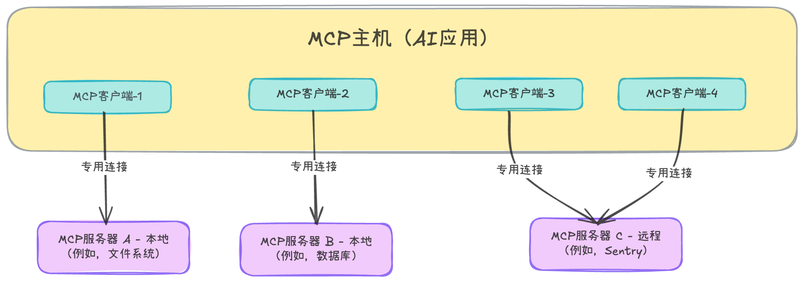

## 什么是 MCP？

[MCP (Model Context Protocol)](https://modelcontextprotocol.io/docs/getting-started/intro) 是一种由 [Anthropic](https://www.anthropic.com/news/model-context-protocol) 推出并开源的模型上下文协议，它建立了一个标准化的框架，让基于大型语言模型 LLM 的 AI 应用能够无缝地连接到外部数据源、工具和服务（如搜索引擎、数据库、代码库等），从而让 AI 应用能获取最新信息、执行复杂任务、打破信息孤岛，并提供更准确、更具功能性的响应。

**类比说明**：

* 可以将 MCP 看作是 AI 应用的 USB-C 接口。就像 USB-C 为电子设备提供了统一的连接方式一样，MCP 为 AI 应用连接外部系统提供了一种标准化的方法。

* 也可以像理解浏览器插件一样理解 MCP。浏览器插件为浏览器增添功能，而 MCP 服务器则为 AI 应用添功能。两者本质上都是提供一个小程序，浏览器或 AI 应用可以加载该程序并与之通信，从而实现更多功能。这个小程序在 MCP 中被称为 MCP 服务器，AI 应用可以通过它来获取信息或执行操作。

要理解 MCP 的工作方式和运行原理，首先需要弄清 MCP 主要的三大组件：MCP Host（MCP 主机）、MCP Client（MCP 客户端）、MCP Server（MCP 服务器）。

MCP 采用 C/S（client-server）架构，核心参与者包括：

| 角色        | 描述                                                         | 示例                                                  |
| ----------- | ------------------------------------------------------------ | ----------------------------------------------------- |
| MCP 主机    | 一种 AI 应用（LLM Client Application），运行 LLM，并通过 MCP 协议调用外部能力。 | Claude Desktop、Visual Studio Code、你自己的Agent App |
| MCP 客户端  | MCP 协议中的客户端角色，负责与 MCP 服务器保持连接，并从 MCP 服务器获取上下文信息，供 MCP 主机使用。 | Claude Desktop 内部的 MCP 实现                        |
| MCP  服务器 | 实现了 MCP 协议的程序，向 MCP 客户端提供上下文信息。         | 文件系统 MCP、数据库 MCP                              |




## 如何让一个程序成为 MCP 服务器？

凡是实现了 MCP 协议的程序，都可以成为 MCP 服务器。该协议定义了以下内容：

- 服务器必须暴露哪些函数（能力声明）
- 这些函数如何描述（工具元数据）
- LLM 如何调用它们（JSON 请求格式）
- 服务器如何返回结果（JSON 响应格式）

凡是遵循 MCP 消息规范的程序，都是 MCP 服务器。值得注意的是，使用的语言、运行环境或部署位置都不影响其成为 MCP 服务器。

**关键能力包括：**

- 声明工具
- 接收工具调用请求
- 执行请求的函数
- 返回结果或错误

**工具调用消息示例：**

例如，LLM 需要查内部系统数据：

```json
{
  "method": "tools/call",
  "params": {
    "name": "get_user_profile",
    "arguments": {
      "user_id": "u_12345"
    }
  }
}
```

表示：调用 `get_user_profile`，查询用户（user_id = u_12345）的相关信息。

## 创建 MCP 服务器

既然任何程序都可以成为 MCP 服务器，那我们就来创建一个。

假设你在一家电影院工作，希望可以让 AI 智能体帮助用户购买电影票。这样，用户就可以通过与 ChatGPT 对话来选择电影，或者让 Claude 直接帮他买票。

但对于这些 LLM 来说，它们并不知道你所在电影院的实时情况，所以需要通过 MCP 来公开电影院的 API，让 LLM 能够与之交互。

这里，我们将使用 [**fastmcp**](https://github.com/jlowin/fastmcp)，一个用于构建 MCP 应用的标准框架。它是一个 Python 包，可以将 Python 函数封装成符合 MCP 规范的形式。我们可以把这些代码“呈现”给 LLM，使它们了解有哪些函数可用，并能够在需要时调用这些函数。

```python
from fastmcp import FastMCP

mcp = FastMCP("exanple_server")

@mcp.tool
def list_movies() -> str:
  """ List the movies that are currently playing"""
  # Simulate a GET request to our /movies endpoint
  return ["Shrek", "Inception", "The Matrix", "Lord of the Rings"]

if __name__ == "__main__":
  mcp.run()
```

上面这段代码定义了一个 MCP 服务器，并注册了一个工具（list_movies()）。函数的文档字符串和类型提示可以帮助 fastmcp 向 MCP 客户端描述该工具（这是 MCP 协议所要求的）。智能体会根据这些描述来判断该函数是否适合完成它所要执行的任务。

## 将 VS Code 连接到 MCP 服务器

VS Code 本身是一个 MCP 主机，通过内置或扩展里的 MCP 客户端，它可以连接一个或多个 MCP Server 服务器，从而把这些 MCP 服务器暴露的 tools 变成 “编辑器里的 Agent 能用的能力”。

1. 在 VS Code中安装并启用 GitHub Copilot Chat 扩展，也可以选择使用其他支持 MCP 协议的 MCP 客户端，如 Cline、Claude Code等。

2. [VS Code 支持多种方式添加 MCP 服务器](https://code.visualstudio.com/docs/copilot/customization/mcp-servers)，这里我们选择在项目级别，通过在 `.vscode/mcp.json` 声明 MCP 服务器，让整个项目的 AI Agent 都能使用同一套工具能力。

   首先在工作区中创建 `.vscode/mcp.json` 文件，然后更新文件内容为：

   ```json
   {
   	"servers": {
   		"cinema_server": {
   			"type": "stdio",
   			"command": "/Users/myuanzhang/mcp/.venv/bin/python",
   			"args": [
                   "/Users/myuanzhang/mcp/cinema_mcp.py"
         ]
   		}
   	},
   }
   ```


3. 在 MCP SERVERS 下可以看到当前注册成功，并已经成功运行的 MCP 服务器。

   

4. 现在，我们的 MCP 服务器已经注册完成，GitHub Copilot Chat 就可以使用它了。例如，它可以调用 `list_movies()` 函数，LLM 可以自主决定是否使用它们。

   

5. 你还可以根据需要在程序中增加相关功能，以支持更多相关操作，例如查询电影放映场次，模拟购票下单等：

   

   

## MCP 的适用场景

在以下场景中，MCP 非常适合：

- 希望 LLM 能访问实时数据
- 希望 LLM 能执行操作（如创建任务、获取文件、写入记录）
- 希望以受控的方式对外暴露内部系统
- 希望将自己的工具打包分享，让他人直接接入他们的 LLM

对于使用者，MCP 让他们的 LLM 成为更强大的助手，对于服务提供者，MCP 使其能够以安全、一致的方式对外提供自己的服务。

## 需要注意的事情

自 2024 年 11 月发布以来，MCP 被广泛讨论和应用，如今已成为将 AI 智能体连接到外部系统的默认方式。MCP 极大地推动了智能体能力的扩展，但同时也引入了新的复杂性和潜在风险。在将 MCP 部署到生产环境前，工程师务必对其安全性和性能影响进行充分评估。

### 安全性

当你下载并连接一个未知来源的 MCP 服务器到你的 LLM 时，本质上相当于授予该服务器广泛的系统权限——包括访问本地文件、网络资源、凭据，甚至执行任意命令的能力。恶意或不可信的 MCP 工具可能带来严重后果，例如：

- 读取、篡改或删除本地文件
- 窃取敏感数据（如 `.ssh` 密钥）并外传
- 对内部网络进行扫描探测
- 修改生产系统关键配置
- 盗取 API 令牌、密钥等身份凭证

MCP 的安全性完全取决于你所信任的服务器。若缺乏适当的防护机制，实际上等同于将本地系统的控制权部分交给了 LLM 及其连接的工具。此外，由于 MCP 工具易于集成，若管理不当，很容易造成权限过度暴露，进一步放大风险。

这与浏览器插件的情形非常相似：大多数插件是安全可靠的，但恶意插件一旦安装，就可能造成严重破坏。因此，对待 MCP 服务器也应采取同样的谨慎态度：

- **优先选择可信来源**（如经过验证的开源仓库）
- **尽可能审查源代码**
- **对来源不明的工具进行沙箱隔离**
- **严格遵循最小权限原则，限制不必要的访问权限**

通过这些措施，可以在享受 MCP 带来的强大能力的同时，有效降低潜在的安全隐患。

### 上下文膨胀、Token 低效与延迟问题

MCP 服务器会为每个工具提供详尽的元数据描述，包括工具名称、参数结构、功能说明以及返回格式等。这些信息会在会话初始阶段一次性注入到 LLM 的上下文中，以便模型了解可用工具及其使用方式。

然而，当智能体接入的工具数量较多，或工具的 schema 结构较为复杂时，这些元数据会迅速导致提示词（prompt）膨胀。这不仅会显著消耗大量 token，还会挤占本应用于对话历史、用户指令或任务的上下文空间。换句话说，每新增一个工具，都会长期占用一部分有限的上下文容量——即使该工具在当前任务中并未被使用。

此外，每次工具调用都会引入额外的系统开销：包括模型推理、schema 解析、上下文重组，以及一次完整的通信往返（模型 → MCP 客户端 → MCP 服务器 → 再返回模型）。对于延迟敏感的应用场景（如实时交互或高吞吐流水线），这种累积延迟和计算成本往往难以接受。

因此，在设计基于 MCP 的系统时，需在功能丰富性与上下文效率之间做出权衡，例如通过按需加载工具描述、压缩 schema 表示，或缓存常用工具元数据等方式，来缓解上述问题。

### 系统复杂性转移到了模型黑盒内部

在 MCP 架构下，LLM 需要自行做出所有关键决策，包括：

- 是否需要调用工具
- 调用哪一个工具
- 使用哪些参数

这些决策全部发生在 LLM 的推理过程中，而不是通过外部显式的编排逻辑来控制。

这种设计在初期使用时显得简洁高效，甚至带有一种开箱即用的魔法感。然而，在大规模或高可靠性要求的场景中，这种将控制逻辑完全交由模型内部处理的方式，会带来显著挑战：行为可能变得难以预测，调试过程更加复杂，也更难确保系统在不同输入下的确定性和一致性。


总之，MCP 简单而强大，它为 LLM 调用真实程序提供了一种标准化接口。一旦某个服务实现了 MCP 协议，任何兼容的 LLM 客户端都能即插即用地将其作为功能扩展——这为构建能够查询 API、执行操作、并与现实系统进行结构化交互的智能体铺平了道路。

然而，能力越大，责任越大。MCP 服务器拥有访问本地系统的广泛权限，因此应像对待具备完整系统控制权的软件一样谨慎对待：严格审查来源、限制权限、并在必要时隔离运行。

另外，MCP 的这种设计也不可避免地带来系统开销——包括上下文 token 消耗、响应延迟以及模型推理负担。在对效率、响应速度或资源敏感的场景中，这些因素可能削弱其核心优势：将 AI 智能体从“会说话的聊天机器人”转变为“真正能做事的人工助手”。

当被有意识、负责任且安全地使用时，MCP 为构建可靠、高效、可扩展的智能体提供了一个坚实而清晰的基础。

## References

* https://modelcontextprotocol.io/docs/getting-started/intro
* https://code.visualstudio.com/docs/copilot/customization/mcp-servers
