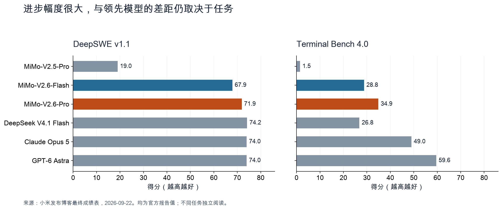
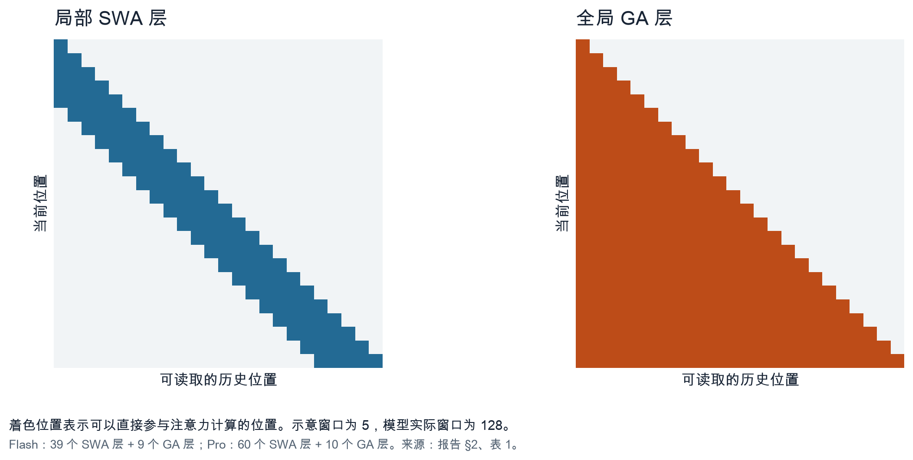
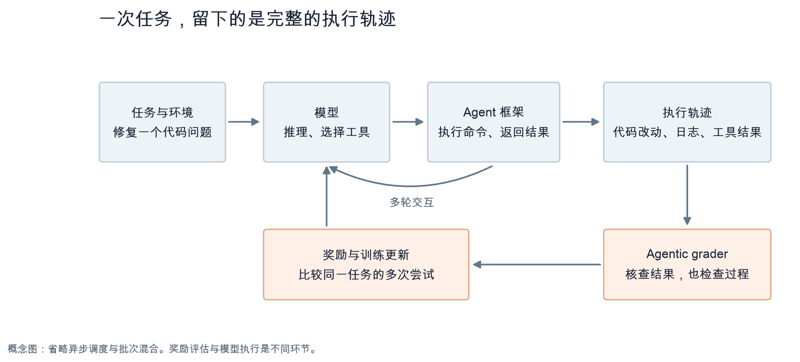
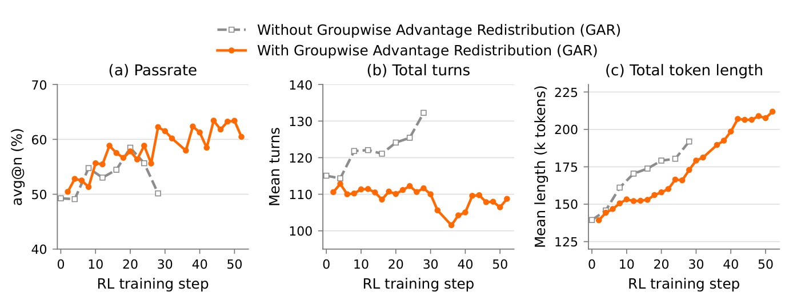
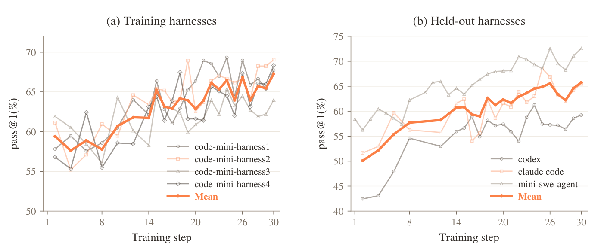
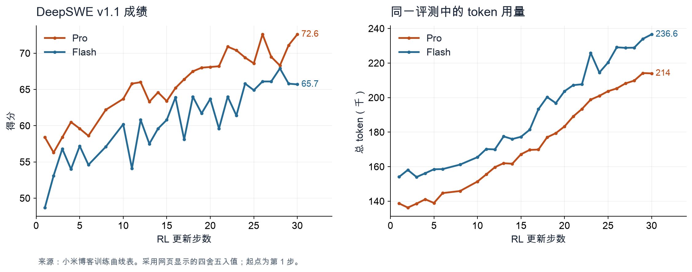

这两天，小米刚发布的 MiMo-V2.6 引起了不少关注。9 月 22 日，小米推出 Pro 和 Flash 两款模型，并开放了模型权重。按照发布博客给出的成绩，Pro 在 Artificial Analysis 智能指数上拿到了 46.32 分，位列开放模型首位。[1]

两款模型都能接收文本、图像、视频和音频输入，支持百万 token 上下文。小米还公布了一份 44 页的技术报告，详细记录了强化学习的训练过程，连中间遇到的故障也写了进去。这些材料让我们有机会从最终成绩往回看，弄清楚这一代模型是怎样练出来的。[2]

Sebastian Raschka 在发布当天的帖子里提到了一个有意思的细节：取得这些成绩的 MiMo-V2.6，用的仍然是相当常规的注意力设计。他认为，这再次说明模型的许多进步来自数据和后训练配方。[3] 我也想顺着这个问题看看，所谓训练配方的改进，具体改在了哪里。

下面先聊聊 MiMo-V2.6 的表现，再把它的架构和训练过程拆开来看。其中会多花一些篇幅讲奖励评估：模型尝试了很多种做法之后，系统怎样判断哪一种更好，又怎样让它从这些尝试中学到东西。

## 先看成绩，也看它还差在哪里

MiMo-V2.6 的两款主模型都是混合专家模型，简称 MoE。模型保存大量参数，但每个 token 只调用其中一部分专家参与计算。Pro 的总参数约为 1.02 万亿，每个 token 激活约 420 亿；Flash 总参数约为 3100 亿，激活约 150 亿。[2，表 1]

| 配置 | MiMo-V2.6-Flash | MiMo-V2.6-Pro |
| --- | ---: | ---: |
| 总参数量 | 310B | 1.02T |
| 每 token 激活参数量 | 15B | 42B |
| 主干 Transformer 层数 | 48 | 70 |
| 局部注意力层／全局注意力层 | 39／9 | 60／10 |
| 每个 MoE 层的专家总数／每 token 选中数 | 256／8 | 384／8 |

这里的 B 是十亿，T 是万亿。参数按报告表 1 列出；Flash 的模型卡标为 309B，本文用约 310B 描述其规模。层数不包含额外的多 token 预测模块。激活参数量有助于理解计算开销，部署时所需的权重存储仍要按完整模型考虑。[2][6]

成绩上，相比 MiMo-V2.5-Pro，这次提升相当明显。在衡量长流程软件开发能力的 DeepSWE v1.1 上，Pro 从上一代的 19.0 分提高到 71.9 分，Flash 达到 67.9 分。Terminal Bench 4.0 要求 Agent 在终端环境里完成复杂任务，Pro 得到 34.9 分，上一代是 1.5 分。[1][2，表 3]

*图 1：根据小米发布博客的最终成绩表重绘。图中均为官方报告值；两种评测衡量的任务不同，分数应分别比较。*

这张图也说明，MiMo-V2.6 与领先模型的距离取决于任务。在 DeepSWE 上，Pro 已经接近图中几款模型；到了 Terminal Bench 4.0，它与 GPT-6 Astra 的 59.6 分仍有明显差距。用“全面超越”概括，会把这些差别抹掉。

Artificial Analysis 提供了另一种观察角度。小米引用的是发布时的 v4.3 指数及 46.32 分；截至本文核对时，AA 模型页显示的整数分数是 46，方法说明已标为 v4.3.2。该页把它列为同类开放权重模型中的第一名，排名有明确的比较范围。[1][4]

综合指数能帮助我们筛选模型，具体用哪一个，还得回到自己的任务。尤其是 Agent，模型之外的工具、上下文管理和执行框架都会影响结果。这一点，后面的实验会讲得更清楚。

## 128 个 token 的窗口，怎样处理百万上下文

先把 Raschka 所说的“架构简单”讲清楚。MiMo-V2.6 没有只靠一种局部注意力处理所有信息，它把局部注意力层与全局注意力层交替排列。[2，§2.1]

注意力可以理解为模型在处理当前位置时，从哪些位置读取信息，以及各读多少。全局注意力允许当前位置直接读取此前的全部上下文；滑动窗口注意力则把直接读取范围限制在附近的一段历史。MiMo-V2.6 的局部窗口是 128 个 token。

*图 2：局部层只直接读取附近位置，全局层可以读取更早的上下文。为了便于展示，图中把窗口缩为 5，模型实际窗口为 128。根据技术报告 §2 和表 1 绘制。*

沿着网络往上看，局部层负责较近位置的信息交互，全局层定期把更远的信息引入当前位置的表示。Flash 有 39 个局部层和 9 个全局层；Pro 有 60 个局部层和 10 个全局层。因此，128 描述的是局部层的直接注意力范围，不能拿它当成整个模型的上下文上限。

分组查询注意力，即 GQA，解决的是另一部分开销。常规多头注意力会为每个查询头配备键和值；GQA 让多个查询头共享一组键和值，从而减少需要保存和读取的 KV 缓存。KV 缓存保存历史位置的键和值，供模型生成后续 token 时复用。

例如，Pro 的主干注意力有 128 个查询头、8 个 KV 头，也就是每 16 个查询头共享一组 KV。把 GQA 和局部窗口结合起来，可以降低长序列的缓存及注意力开销，同时保留一部分全局层来处理远距离信息。[2，表 1]

这些都是已有的设计思路，但“常规”并不等于不重要。MiMo-V2.6 要在强化学习里反复生成很长的任务轨迹，推理省下来的计算和内存，可以用于更多尝试。架构效率会影响训练规模，训练规模又会影响最终能力。报告没有提供相同数据、相同算力下替换架构的对照，因此我们还不能量化架构对这次提升贡献了多少。

模型还包含视觉与音频编码器，以及采用 DFlash 思路的推测解码器。后者先提出多个候选 token，再交给主干并行验证。这里可以确认它在做推理加速，但不能仅凭这个模块，推导出官网 UltraSpeed 模式“最高 20 倍”的全部来源。[2，§2.2 至 §2.4]

## 强化学习之前，模型已经学过怎样做任务

报告的标题是《Scaling Reinforcement Learning Towards Self-Improvement》，重点确实在强化学习。不过，RL 接手的是已经训练过的模型。

MiMo-V2.6 先进行纯文本预训练，再接入视觉和音频编码器，联合训练多模态能力。Flash 的预训练数据总量为 48T token，Pro 为 30T token。两者模型规模和数据配比不同，不能仅凭训练 token 更多，就判断 Flash 应该更强。[2，§3.1]

接下来是 mid-training，可以理解为预训练与后续大规模 RL 之间的继续训练阶段。小米在这里加入面向 Agent 的数据，包括真实任务轨迹、仓库级代码以及多模态资料，并把上下文从 256K 扩展到 1M。[2，§3.2]

为什么需要这一步？假设我们让模型修复一个软件问题。如果它连如何读仓库、调用工具、理解报错都不熟悉，大量尝试可能只会得到失败。先让模型具备一定的做事能力，RL 才更容易从不同尝试里找到可比较的结果。

因此，后面的训练曲线，展示的是在已有基础上继续改善任务表现。官网披露的约 85 万美元和 262 万美元，分别对应 Flash 和 Pro 这一次 RL 运行，也不应当被写成两个模型从零训练的全部成本。[1][2，§4.1]

## 一次 RL 更新，包含约两万五千次尝试

我们用修复代码的任务，走一遍训练流程。

模型接到任务后，先查看文件，提出修改，再通过工具运行测试。工具把日志和结果送回来，模型继续调整。这一连串推理、工具调用和环境反馈，构成一条执行轨迹，训练文献通常称为 rollout。

*图 3：Agent 强化学习的概念流程。一次尝试可能包含很多轮交互，收集多条轨迹后，系统才据此更新模型。根据报告 §4 绘制，省略异步调度细节。*

MiMo-V2.6 每次更新采样 1568 个任务提示，每个提示生成 16 条轨迹。因此，一次更新对应：

`1568 × 16＝25,088 条轨迹`

报告给出的每步训练 token 量为 27 亿至 37 亿，单条序列平均约 11 万至 15 万 token。官网所说的 30 次更新，累计约对应 75 万条轨迹；“只训练了 30 步”很容易让人低估实际工作量。[1][2，§4.1]

同一任务为什么要多次尝试？这里采用的是 GRPO，一种通过组内相对表现来形成学习信号的强化学习方法。对于同一个任务，有些尝试成功，有些失败，有些虽然成功但实现较差。比较这些尝试，模型才能知道哪些行为更应该保留。16 是这次运行采用的组大小，报告并未证明它对所有任务都最合适。

训练任务也有明确侧重。Agent 编程与竞赛编程合计占 68%，通用工具使用占 12%，美学设计占 13%，其余是上下文遵循和网络安全任务。[2，§5.1]

这种训练的困难，是不同任务需要的时间差别很大。报告统计的 25 个数据源中，平均生成 token 数相差约 90 倍，平均活跃执行时长相差约 66 倍。如果只按“谁先做完就先训练”，短任务就更容易进入批次，实际训练配比会逐渐偏离预设目标。Sample Mixer 因此需要结合耗时和样本保留率，调整各数据源的并发与调度。[2，§6.3]

长任务还可以分段续跑。收集训练批次时，尚未结束的轨迹先暂停，后续再继续，这叫 partial rollout。但它有代价：策略更新后，续跑需要重新预填充历史上下文，重建 KV 缓存。大批次有助于摊薄这部分重算开销，所以批次大小与续跑策略需要一起选择。[2，§4.1]

MoE 的路由器也带来了稳定性问题。路由器负责选择每个 token 使用哪些专家。报告的对照实验发现，让它在 RL 中继续更新，会使负载逐渐集中到少数专家上；恢复初始路由参数后，负载平衡恢复，评测成绩却没有下降。因此，团队在主训练里固定路由器参数，让模型的其他可训练权重继续学习。固定路由器的实验中，专家负载保持平稳，评测成绩仍能提高。[2，§5.4]

固定的是路由器参数。其他层仍在学习，送进路由器的隐藏表示也可能变化，因此不能把它理解成每个 token 的专家选择从此不变。

一个很能说明成本结构的数字是：在 Pro 这次 RL 运行里，生成轨迹占成本的 43.8%，训练更新占 43.5%，评分占 12.7%。判断模型做得好不好，本身已经是一项需要认真投入算力的工作。[2，图 3]

## 测试通过了，还需要判断代码是否改对了

假设同一个任务产生两份都能通过测试的补丁。一份定位到错误，只改必要的代码；另一份加入大量兼容分支，放宽检查，甚至吞掉异常。只给“通过／失败”两种奖励，模型就很难从这些差别中学习。

MiMo 团队为此引入 agentic grader，也就是能够使用工具、检查执行环境的评估 Agent。它能查看仓库和补丁，结合执行轨迹与测试结果判断质量，必要时再运行有针对性的测试。[2，§4.3]

报告把这件事分成两种做法，用在不同的代码任务子集上。

对于一部分通过率较高的任务，先离线收集多条轨迹，分析其中的有效做法和常见问题，生成任务专用的评分标准，称为 rubric。标准既看实现是否满足要求、处理了边界情况，也看模型是否收集证据、检查改动的影响。

这些标准必须以任务本身为依据。某项必要检查即便所有采样都没做到，也可以写入标准；某个成功解采用的具体写法，则不应自动成为其他解必须遵循的要求。这样，评估仍然允许不同的正确解法。[2，§4.3.1]

正式训练时，评估 Agent 按标准给每条轨迹打分，再把测试结果、实现质量和做事过程的质量相乘：

`最终奖励＝测试奖励 × 实现质量得分 × 行为质量得分`

这叫 Groupwise Reward Synthesis，简称 GRS。测试没通过，奖励就是零。通过之后，再根据质量拉开差别。即便一组尝试全部通过，模型仍有机会学到哪一种做法更好。[2，§4.3.1]

另一种方法叫 Groupwise Advantage Redistribution，简称 GAR。它在线比较一组成功和失败轨迹，把成功方案按质量排序，再将更多正向学习信号分配给质量较高的方案。

这里的 advantage，指某次尝试相对于组内平均表现的优劣程度。在 GAR 里，评估结果主要用于重新分配成功轨迹之间的正向 advantage。如果发现某条轨迹确实依赖泄露答案，系统会先把它的有效奖励归零，再重新计算组内统计。[2，§4.3.2]

用四条轨迹举个例子。两条通过、两条失败，平均奖励为 0.5，各自的原始 advantage 就是奖励减去这个均值。假设两条成功轨迹的质量因子分别为 1 和 0.5，先按质量缩放，再把成功轨迹的正向 advantage 总量归一化回原值：

| 轨迹 | 测试奖励 | 原始 advantage | 重分配后 |
| --- | ---: | ---: | ---: |
| 较高质量的成功解 | 1 | 1/2 | 2/3 |
| 较低质量的成功解 | 1 | 1/2 | 1/3 |
| 失败解甲 | 0 | −1/2 | −1/2 |
| 失败解乙 | 0 | −1/2 | −1/2 |

*这是依据报告公式 3 构造的算术示例，假设未触发缩放上限，不是实验数据。*

成功轨迹的正向总量仍为 1，但高质量方案得到更多学习信号。为什么还要归一化？只压低正向 advantage，会改变它与负向信号的平衡。报告用重新归一化来抑制策略熵过度增长，也就是避免输出分布变得过于分散。

上面这一步不改动失败轨迹。实际实现还限制缩放幅度，最后对成功与失败轨迹一起减去组均值，失败轨迹的最终 advantage 也可能随之改变。[2，§4.3.2]

GAR 的评估者能检查代码和运行结果，并比较当前采样到的方案。在线评估让它接触到最新轨迹，但不能保证评估能力始终跟得上模型行为的变化。遇到不熟悉的策略或具有误导性的证据，它仍可能误判；报告没有证明这消除了分布变化或奖励投机问题。

*图 4：技术报告图 8。橙线使用 GAR，灰线未使用。这个对照实验只训练代码任务，使用 Flash、128 的训练批次、token-mean 损失聚合，以及三次评测的平均通过率；它与前面的主训练运行有不同设置。*

这组实验里，未使用 GAR 的模型交互轮数增长很快，token 用量也随之增加，通过率难以持续改善。使用 GAR 后，交互轮数相对稳定，通过率能够继续提高。[2，图 8]

团队还从代码维护的角度审查了补丁。未使用在线评分的模型更常出现吞掉异常、放宽校验等做法；使用在线评分的模型则倾向于做更小、更精确、符合任务范围的修改。这为评分方法提供了曲线之外的证据，但还不能把收益单独归因于“代码写得少”：评估同时考虑了正确性、改动范围和实现质量。[2，§4.3.2]

请留意最右侧：橙线的 token 长度依然在增长。所以，更准确的结论是，这种评分方式有助于控制失控的长度增长，并支持训练继续改善。把结果改写成“加上评估 Agent，回答就会越来越短”，就超出了图里的证据。

## 奖励可信，还要检查任务环境

评分标准再细，也可能遇到另一种问题：模型找到了现成答案。报告表 2 记录了仓库修复任务中的案例，包括从更新版本的包或上游仓库取得已完成的修复。这些实验要求模型依据 bug 报告和指定版本完成任务，取回现成补丁即使通过测试，也不能证明它学会了所要评估的修复能力。[2，§4.2.6]

小米因此把防止奖励投机延伸到了环境准备。训练前，团队清理可能泄露解法的构建产物与 Git 历史，限制获取外部答案的路径，再让一个专门的 Agent 检查是否还有遗漏。找到新问题就修改环境，重复检查；训练开始后，仍然定期审查执行轨迹，处理新出现的取巧行为。

这补充了前面的评分机制：测试负责检查结果，环境与轨迹审查还要确认结果是怎样得到的。报告记录的两款模型已确认投机轨迹占比，在整个运行中都低于 2%。这个数字是检出的比例，不能据此给未检出的投机行为设定同样的上限。[2，图 6]

任务能否被准确核查，还取决于验证器的设计。例如，漏洞复现任务要确认模型触发了指定漏洞，仅仅让程序崩溃并不够。小米从同一份运行时错误报告中提取漏洞类型和崩溃位置，同时用于生成任务描述和核对执行结果。这里采用确定性的规则匹配，让任务要求与验收标准来自同一份证据，无需把每次判定都交给模型。[2，§4.2.4]

## 换一个 Agent 框架，学到的能力还在吗

使用过不同编程 Agent 的人，往往有这种感受：底层模型相同，换一套工具，效果也会变化。

原因之一是 harness，也就是围绕模型组织执行的 Agent 框架。它决定模型能调用哪些工具、怎样收到工具结果、历史信息如何保留，以及任务什么时候结束。这些安排会改变模型实际面对的问题。

如果训练一直使用同一套框架，模型可能熟悉了它特有的提示和工具行为。小米把这种差异也纳入训练：从最小 Agent 循环出发，把系统提示、工具和上下文管理做成可组合的部分，再构造不同的 mini-harness。[2，§4.2.5]

为什么不直接使用几套现成产品来训练？报告认为，生产框架里的附加指令和工作流，有些并未进入任务奖励，难以判断模型有没有学会；模块之间的耦合也妨碍单独改变一个交互机制。采用可组合的小框架，便于控制训练差异。这是训练设计上的考虑，不代表真实产品里的保护与约束没有价值。

报告中的专门实验，在四套 mini-harness 上训练，再拿训练中未使用的 Codex、Claude Code 和 mini-swe-agent 检查效果。

*图 5：技术报告图 10。左边是训练时使用的四套框架，右边是留出的三套框架；橙色粗线表示各自的平均通过率。*

三套留出框架的 DeepSWE 平均 pass@1，从约 50% 提高到约 66%。pass@1 看的是一次尝试的成功率；这里再对几套框架的结果取平均。它说明，至少在这些任务和框架上，训练收益能够迁移。[2，§5.3]

我认为，这是比单个产品里的高分更有用的结果。开放权重模型会被接入很多不同的工具系统，跨框架能力直接影响它能否在别人搭建的环境里工作。

不过，这组曲线没有单独回答“相同算力下，多框架训练比单框架训练多提升了多少”。要量化这部分净收益，还需要对应的对照实验。我们可以确认迁移发生了，至于每项训练改动贡献多少，仍需更细的拆解。

## 能力提高了，token 也可能用得更多

前面介绍 GAR 时，我们看到它有助于控制执行过程的长度。把视线拉回大规模主训练，又会看到另一件事：随着模型成绩提高，若干评测的总 token 用量也增加了。报告在 §5.3 明确描述了这一点。

*图 6：根据小米博客的 DeepSWE 训练曲线数据重绘，采用网页显示的四舍五入值。两张图对应同一训练过程，起点为第 1 步。*

以 Pro 为例，图中的 DeepSWE 分数从 58.4 提高到 72.6，对应 token 用量从约 13.87 万增加到 21.4 万。Flash 也有相似趋势。[1][2，图 9]

这不意味着训练无效。模型可能学会了坚持处理更复杂的任务，也可能做了更多检查。仅凭总 token 数，我们无法判断新增计算里有多少有效。它提醒我们，讨论“更省”时，需要明确比较对象：是相同准确率下更省，还是一次任务的实际消耗更少。

推理价格又是另一件事。根据 9 月 23 日核对的官方定价，国内实时 API 的费用如下，单位为人民币／百万 token。[5]

| 型号 | 输入，缓存命中 | 输入，缓存未命中 | 输出 |
| --- | ---: | ---: | ---: |
| MiMo-V2.6-Flash | 0.02 元 | 1 元 | 2 元 |
| MiMo-V2.6-Pro | 0.025 元 | 3 元 | 6 元 |
| MiMo-V2.6-Pro-UltraSpeed | 0.25 元 | 30 元 | 60 元 |

小米表示常规版本延续 V2.5 的价格，UltraSpeed 则以更高单价提供最高 20 倍输出速度。这里的速度是官方上限声明。Agent 还要等待工具执行、网络请求和环境响应，输出快 20 倍，并不意味着整项工作必然快 20 倍。[1][5]

Flash 也值得放进实际选型的候选名单。在 AutomationBench 上，它与 Pro 分别为 52.3 和 53.1；在 MiMo Visual Coding 上，分别为 71.5 和 72.3。在这些评测中，两者差距较小，Flash 的 API 单价却更低。[2，表 3][5]

具体用起来，我会更关心完成一件工作需要多少次尝试、总共花多少钱，以及什么时候拿到可用结果。如果自行部署，还要测量目标硬件上的吞吐和利用率。仅凭激活参数量较少，尚不足以判断部署性价比。

## 最终模型还经过了多教师蒸馏

前面的主训练大量使用可以核查结果的任务。到了设计、开放式研究和复杂场景构建，奖励往往更难写清楚。小米在混合 RL 之后加入 MOPD2，即 Multi-Prefix Multi-Teacher On-Policy Distillation，用多教师蒸馏进一步扩展能力。[2，§5.6]

我们可以用一个正在开发游戏的 Agent 来理解它。一个完整任务有很多轮交互，每轮之前都留有一段历史：用户要求、已经写好的代码、工具结果，以及模型此前的决定。把某个决策点之前的完整历史保留下来，学生模型就能从这个位置继续生成一轮，而不必从第一步重跑。

随后，负责相应领域的教师模型，在相同历史和学生已生成内容的条件下，提供 token 级别的监督。多个教师可以分别传授擅长的能力。对于难以可靠核查的开放任务，小米还使用根据高质量示范训练出的 SFT 教师。

这里有一个容易混淆的细节：示范轨迹提供的是起始上下文，后续内容由学生自己生成，再接受教师指导。它保留了 on-policy 蒸馏的关键特点，让学生在自己实际走出的路径上学习。[2，图 13]

这也解释了为什么阅读发布材料时，要分清训练曲线和最终评估。前文 Pro 的 RL 曲线终点约为 72.6，发布表里的 DeepSWE 分数为 71.9；Flash 分别约为 65.7 和 67.9。报告在介绍 MOPD2 之后给出最终成绩表，但没有逐项归因这些分数差异。稳妥的做法，是把它们保留为不同阶段的结果。

官网的演示同样要按实际过程理解。模型在仿真里操作机械臂，说明它能结合视觉反馈完成特定交互；这距离真实机器人部署还有一段距离。材料研究个案筛选出了计算上有希望的候选材料，后续仍需湿实验。Lean 形式化案例则包含研究者制定探索策略，以及后续修订与整合。[1]

这些案例展示了能力可能用在哪里。判断可靠程度，还需要看重复运行的结果和失败记录。

## 开放资源，让下一轮验证更具体

MiMo-V2.6 这次开放的意义，还在于给出了继续研究 Agent RL 的入口。截至本文核对时，官方 Hugging Face 集合列出了 Pro-RL、Flash-RL 和 Distill-Qwen-9B 三个模型，模型卡均标注 MIT 许可证。[6]

代码也已经可以查看。小米公开的 `verl` 分支包含编程、通用任务、设计和音乐等训练配方，代码任务的配置还列出了不同 mini-harness。另一个 `uni-agent` 仓库提供 Agent 执行与训练集成组件，使用 Apache-2.0 许可证。[7][8]

其中，MiMo-V2.6-Distill-Qwen-9B 从 Qwen3.5-9B 出发，使用 MiMo 生成的数据进行监督微调。它是后续 RL 实验的共同起点。因此，报告里经过领域专用 RL 得到的更高成绩，不能直接当作这个下载检查点的表现。[2，§7.1、表 6]

较小模型也给出了继续训练的实际结果：代码任务的 RL 实验中，SWE-bench Verified 的三次评测平均分从 61.1 提高到 66.2；另一个通用任务 RL 实验中，Terminal Bench 2.1 从 37.1 提高到 52.8。它们来自不同领域的专用检查点，说明这个 SFT 起点仍有提升空间，尚不能合并成一款模型同时取得所有成绩的结论。[2，表 6]

技术报告还列出约 7000 个主要任务，另有约 1000 个音乐生成任务。但在本次查看的训练配方中，数据仍需通过外部 Parquet 文件路径提供，我没有确认到这些完整任务包的下载入口。这里能核实的是权重、框架和训练配方已经可见，任务包的具体取得方式仍需进一步核对。[2，表 5、§7.2][7]

9B 的起点比复现万亿参数模型的完整训练更容易接近。研究者可以据此检查，更换验证器能否减少投机性的修改，以及跨框架能力能迁移到哪些任务。

预训练语料、主训练使用的全部任务和运行配置，都会影响复现程度。另外，公开模型卡未明确说明 `-RL` 下载检查点是否与上线 API 使用的最终权重完全相同。我们可以沿着已经公开的资源继续验证，暂时还不宜把它写成完整训练过程都已复现。[1][2][6]

读完这份报告，我最想继续看的，是社区使用这些资源做出的对照实验。MiMo-V2.6 已经展示：在常规注意力架构上，把任务、执行过程和反馈认真组织起来，Agent 能力仍有很大的提升空间。接下来，更有价值的问题是，这些改进分别在哪些条件下有效，成本如何变化，又能迁移到多小的模型上。

Raschka 强调训练配方的重要性，我认为这次发布确实为这个判断补上了具体证据。架构让长轨迹训练跑得动，任务决定模型有机会练什么，奖励决定哪些尝试会被强化。理解它们怎样一起工作，比给某一个技术名词独占功劳更有用。

---

资料核对截至 2026 年 9 月 23 日。架构、训练机制和实验设置依据小米技术报告及公开资料；文中的小米实验结果与演示均为官方报告，未在本文中独立复现。Artificial Analysis 的页面单独标明，其当前版本与发布博客引用的版本有所不同。

参考资料：

1. [小米，Introducing MiMo-V2.6 series](https://mimo.xiaomi.com/mimo-v2-6)，2026 年 9 月 22 日。
2. [MiMo-V2.6: Scaling Reinforcement Learning Towards Self-Improvement](https://huggingface.co/XiaomiMiMo/MiMo-V2.6-Pro-RL/blob/main/MiMo_V2_6_technical_report.pdf)，技术报告。
3. [Sebastian Raschka 关于 MiMo-V2.6 的帖子](https://x.com/rasbt/status/2102394156731535413)，2026 年 9 月 22 日。
4. [Artificial Analysis，MiMo-V2.6-Pro 模型页](https://artificialanalysis.ai/models/mimo-v2-6-pro)。
5. [小米 MiMo API 定价](https://mimo.mi.com/docs/price/pay-as-you-go)。
6. [XiaomiMiMo，MiMo-V2.6 模型集合](https://huggingface.co/collections/XiaomiMiMo/mimo-v26)。
7. [XiaomiMiMo/verl，mimo-oss 分支的训练配方](https://github.com/XiaomiMiMo/verl/tree/mimo-oss/recipes)。
8. [XiaomiMiMo/uni-agent，mimo-oss 分支](https://github.com/XiaomiMiMo/uni-agent/tree/mimo-oss)。
